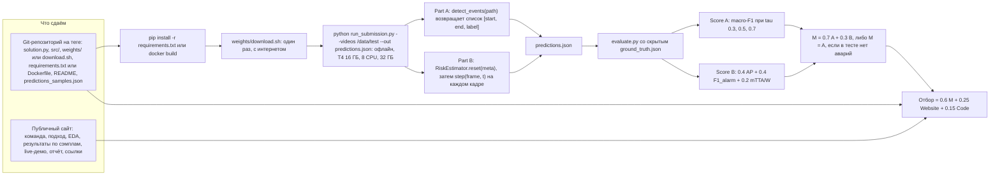
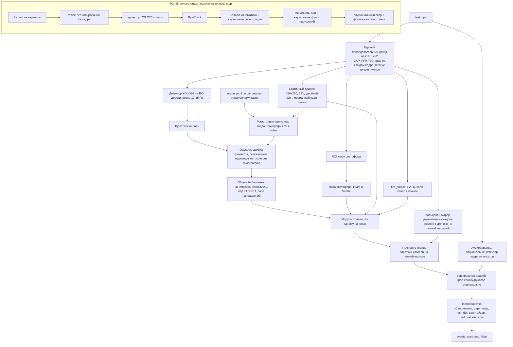

# Анализ задания WIUT Hackathon 2026 — CV Track (отборочный этап)

> Документ для команды из трёх человек. Дата: 2026-09-25.
>
> **На чём основан анализ:**
> - PDF задания (11 страниц);
> - стартовый кит организаторов `wiut_cv_scripts.zip` (`run_submission.py`, `evaluate.py`, `solution.py`, `README.md`, `examples/`);
> - метаданные четырёх сэмплов, прочитанные из хвостов MP4 по ссылкам из `Videos.pdf`;
> - проверенный исследовательский корпус: 8 направлений и 4 отчёта, закрывающих пробелы. Каждое утверждение в них прошло верификацию, и где верификатор нашёл ошибку, здесь использована исправленная версия.
>
> **Условные обозначения:**
> - **(оценка)** — число получено расчётом или экстраполяцией и не измерено на целевом железе;
> - **(не подтверждено)** — первоисточник не удалось проверить;
> - **[camera.md]** — решение зависит от описания сцены или от просмотра сэмплов;
> - **[орг.]** — нужен ответ организаторов (раздел 14).
>
> Все пороги задаются **в секундах и метрах, никогда в кадрах**. Частота кадров сэмплов — 29.97, а не 25, и тест может оказаться другим.
>
> Финальная проверка: исправлено 51 утверждение по коду кита и первоисточникам (2026-09-25).

### Что известно сверх PDF

Исходная посылка «у команды есть только PDF» устарела: на рабочем столе уже лежат стартовый кит и список сэмплов.

| Факт | Откуда | Что из этого следует |
|---|---|---|
| Кит на диске: `C:\Users\Cicada\Desktop\WestHack\wiut_cv_scripts.zip` (распакован в scratchpad `kit\wiut_cv_scripts\`). Список сэмплов — `Videos.pdf` (4 ссылки Google Drive). | файлы на рабочем столе | Решения о поведении харнесса принимаем **по коду** `run_submission.py` и `evaluate.py`, а не по догадкам |
| Сэмплы C3896, C3897, C3902, C3905: камера Sony ILCE-6700, **3840×2160, 29.97p**, H.264 High 4:2:2 10-bit (`AVC140_3840_2160_H422P@L51`), около 140 Мбит/с, GOP 30, гамма rec709, звук LPCM 48 кГц стерео | XML Sony в конце файлов | В PDF написано «25 fps», фактически 29.97 fps и 4K. Бюджет времени пересчитан (раздел 3) |
| Длительности 340.3 / 317.8 / 317.8 / 127.6 с (10200 / 9525 / 9525 / 3825 кадров). Всего около 18.4 мин и 20.3 ГБ | метаданные | Нужны облако или внешний диск: на C: свободно 11 ГБ |
| Съёмка 2026-09-18. C3896–C3897: 12:18–12:30. C3902–C3905: 17:58–18:24 по часам камеры; солнце низко, закат в Ташкенте около 18:28 (оценка) | CreationDate, таймкод | Две сессии и, вероятно, две установки штатива. Сцену нужно регистрировать отдельно для каждого видео (раздел 5) |
| Таймкод в режиме Rec-Run. Под пропущенными номерами записано: C3898–C3901 — 370 с, C3903–C3904 — 653 с | расчёт по таймкоду | Тест, вероятно, около 17 мин ≈ 0.28 ч (оценка) [орг.] |

---

## 0. TL;DR — ключевые выводы и решения

1. **Главный риск — не качество модели, а запуск и время.**
   - Если пакет не запустился, M обнуляется. В типичном сценарии это −0.26 отбора (26 баллов из 100; для сравнения live-демо — 7.5), больше любого выигрыша от моделей.
   - Реальные сэмплы: 4K, 29.97p, H.264 4:2:2 10-bit. Один только проход харнесса `cv2.read()` для Part B занимает 0.84–1.0× длительности видео на 8-vCPU ноутбуке под Linux. На AWS g4dn.2xlarge (ближайший аналог спецификации «8 CPU cores»; там 8 vCPU = 4 физических ядра) это около 1.4–2.1× (оценка). Если в спецификации 8 физических ядер, будет заметно быстрее [орг.].
   - NVDEC на T4 этот формат декодировать не может.
   - Первые шаги: спросить организаторов о формате тестовых файлов и о CPU, затем замерить всё на T4.
2. **Один закон бюджета:** `T_A = 3·dur − 1.2·(стоимость Part B, включая декод харнесса) − 0.2·dur`.
   - План строится из `meta` и таблицы стоимостей, измеренной на T4. Настенные часы используются только как аварийный тормоз.
   - Модели загружаются и прогреваются **при импорте** `solution.py`: это время не входит в бюджет видео.
3. **Score A — macro-F1 по множеству C = (классы в GT) ∪ (классы в наших предсказаниях).**
   - Класс, которого нет в тесте, но который мы хоть раз предсказали, добавляет в среднее ноль.
   - Правило включения класса: **p·f > (1−p)·q·S̄**; число классов |C| сокращается.
   - Стартовый набор: `stopped_vehicle`, `jaywalking`, `wrong_way`, `congestion` (строгая гипотеза H1), `accident`. Остальные классы включаем, только если camera.md даёт нужную геометрию или светофор, а число ложных срабатываний в час на сэмплах низкое.
4. **F1 при IoU 0.7 определяется точностью границ.**
   - Допустимый сдвиг для события длиной 2 с — 0.35 с, для 5 с — 0.88 с.
   - Границы привязываем к геометрическим моментам: касание, пересечение стоп-линии, вход в полигон.
   - Для классов с окном подтверждения (`stopped_vehicle`, `congestion`) старт переносим назад, к моменту начала события.
5. **Постобработка стоит больше, чем подбор моделей.** Порядок: интервалы по трекам → объединение по классу → склейка разрывов (gap-merge) → минимальная длительность → санитайзер.
   - Харнесс **выбрасывает** более поздний перекрывающийся сегмент того же класса, а не сливает его.
   - Событие короче 1 мс после округления превращается в `[x, x]`, и `evaluate.py` отвергает **весь файл**. Поэтому санитайзер требует длительность ≥ 0.05 с, округляет до 3 знаков и ограничивает конец значением `floor(duration, 3)`.
6. **Part B весит 0.18 отбора (18 баллов из 100), но только если в тесте есть аварии.** Если аварий нет, M = Score A.
   - Главный рычаг — F1 тревог, то есть их точность. Время упреждения (mTTA) почти ничего не даёт.
   - Сигнал двухканальный: ранжирующий канал ≤ 0.4999 и тревога ≥ 0.5 только при уверенном неизбежном конфликте.
   - Тревоги короткие, максимум 8 с. После контакта пара подавляется не дольше 10 с.
   - Порог 0.5 выбирается по бюджету ложных тревог: ≤ 1.8 в час при тесте около 0.28 ч.
   - Part B использует **собственную** каузальную перцепцию. Использовать выходы Part A запрещено.
7. **Стек восприятия.**
   - YOLO26 (AGPL-3.0): m для Part A, s для Part B. Запасной вариант — RF-DETR размеров N–L (Apache-2.0; детекторы XL/2XL — под PML 1.0, их не брать).
   - ByteTrack без ReID и без компенсации движения камеры (GMC).
   - PyTorch FP16 без TensorRT.
   - Буферы трекера задаются в секундах через единый модуль; при stride 3 нужен `fuse_score=False`.
   - Декодирование только на CPU через OpenCV `CAP_FFMPEG`: `grab()` на каждом кадре, `retrieve()` только на обрабатываемых.
8. **Геометрия сцены.**
   - `scene.yaml` рисуется на эталонном медианном кадре.
   - Гомография строится методом наименьших квадратов (`method=0`) по ≥ 8 точкам, невязки проверяются в метрах.
   - Для каждого видео выполняется регистрация сцены. При её провале хрупкие классы отключаются.
9. **`accident` и `near_miss` строятся на парной кинематике:** зазор между следами на земле, TTC/PET, Δv за 1 с, hinge-fit для момента начала.
   - Опционально: кроп-верификатор X3D (Apache-2.0).
   - VLM по умолчанию выключен.
   - Звуковая дорожка — условно полезный сигнал только для Part A: уточняет старт аварии.
10. **Dev-set собираем в первые 2–3 дня.**
    - Каждый сэмпл размечают двое независимо. Согласие меряем официальным `evaluate.py`, пороги проверяем по схеме leave-one-video-out.
    - Для классов, которых нет в сэмплах, пишем синтетические тесты.
    - Размечаем на прокси 1080p/720p, где сохранены все кадры и частота 29.97.
11. **Сайт даёт 25% отбора, одно только live-демо — 7.5 балла** (эквивалент +0.18 к Score A).
    - Статический сайт на GitHub Pages плюс Gradio-бэкенд на HF Space. С июля 2026 создание Gradio/Docker Space требует платного плана (PRO); исключение — бесплатный аккаунт может держать до 2 Gradio Space на ZeroGPU. Тариф CPU Upgrade стоит $0.03/ч. Альтернатива — Modal.
    - Исходники по 1–2 ГБ загружаются из браузера напрямую в R2.
    - Всё по сэмплам предрасчитано из `predictions_samples.json`.
12. **Воспроизводимость.**
    - pip-зависимости: `torch==2.14.0+cu126`, `opencv-python-headless==4.13.0.92`, `lap`, маркеры версий для Python 3.10. Dockerfile как запасной путь.
    - Переменные офлайн-режима выставляются до любых импортов. Проверочный прогон с `--network none`.
    - Два прогона подряд и сравнение результатов.
    - Веса в git или в Release assets, без Git LFS.
13. **Тест — вероятно, клипы C3898–C3901 и C3903–C3904** (оценка по таймкоду), часть из них вечером у заката.
    - Приоритет — низкое солнце, автоэкспозиция, длинные тени.
    - Ночь, ИК и дождь — в конец плана.
14. **Порядок работ: сначала рабочая сдача, потом улучшения.**
    - D0: скачать сэмплы в обход квоты Drive, сделать прокси, прогнать бенчмарк декодирования, поставить тег v0.1 с работающим шаблоном и страницей команды.
    - Затем вехи M1–M5 (раздел 15).
15. **Сразу задать организаторам вопросы из раздела 14.** Самые важные: формат тестовых видео, CPU машины для оценки, сохраняются ли события при исключении в `RiskEstimator`, конвенции разметки `congestion` и `stopped_vehicle`, дедлайн.

---

## 1. Суть задания в одной схеме

**Задача.** Фиксированная CCTV-камера. Для каждого `.mp4` нужно:
- **Part A** (обязательно): вернуть список событий `[start_sec, end_sec, label]` по 14 официальным классам;
- **Part B** (бонус): на каждом кадре вернуть вероятность того, что авария **начнётся** в ближайшие 5 с, используя только уже полученные кадры.

**Что сдаём:**
1. Публичный Git-репозиторий на теге. Решение должно запускаться одной командой, с весами.
2. Публичный сайт: команда, подход, EDA, результаты по сэмплам, live-демо.
3. Короткий технический отчёт (может быть страницей сайта).



**Как харнесс обрабатывает одно видео** (по коду `run_submission.py`):

```
импорт solution.py (load_solution): загрузка моделей, ДО любых таймеров, не учитывается
для каждого видео по очереди:
  t0 = perf_counter();  budget = 3 * CAP_PROP_FRAME_COUNT / CAP_PROP_FPS
  events = detect_events(path)                # Part A; читает файл как угодно; НИКТО её не прерывает
  если Part A уже вышла за бюджет -> Part B пропускается
  est = sol.RiskEstimator(); est.reset(meta)  # новый объект на каждое видео, уже внутри таймера
  cv2.VideoCapture(path): read() КАЖДОГО кадра -> step(frame, idx/fps)
                                               # дедлайн проверяется раз в 100 кадров
  если total > budget          -> events = [], risk = []   (Part A тоже теряется!)
  исключение в detect_events   -> events = []
  исключение внутри step       -> risk = [] для всего видео, events сохраняются
  step вернул не скаляр/None   -> 0.0 для этого кадра;  NaN -> 0
predictions.json пишется один раз, после ВСЕХ видео (segfault или OOM-kill убивает весь прогон)
```

**Поведение харнесса и `evaluate.py` по коду и что из этого следует:**

| Поведение | Решение |
|---|---|
| `load_solution()` вызывается до цикла по видео и до `t0` | Загружаем все модели, контекст CUDA, cuDNN и делаем прогон-прогрев **при импорте** |
| `RiskEstimator()` создаётся заново на каждое видео, внутри таймера | Модели — синглтоны на уровне модуля. В `reset()` только состояние текущего видео |
| `t = idx/fps` (fps = `CAP_PROP_FPS`); `duration = CAP_PROP_FRAME_COUNT/fps` | Та же база времени везде: Part A, разметка, сайт. PTS используем только для проверок в EDA |
| `clean_events`: приводит через `float()`/`str()`, ограничивает `end` значением `duration`, проверяет `0 ≤ s < e` **до** округления, потом округляет до 3 знаков | Санитайзер: длина ≥ 0.05 с → округление → `end ≤ floor(duration, 3)` |
| Один класс: сортировка по (label, start); сегмент с `s < last_end` выбрасывается. Касание `[5,8]`+`[8,9]` допустимо. При равных `start` остаётся первый в списке | Перекрытия объединяем сами |
| Риск записывается как `round(clip(score), 4)`; NaN → 0 | Вне тревоги не отдавать ≥ 0.49995 (превращается в 0.5). Возвращать только `float` |
| Исключение внутри `step` → вся кривая риска `[]` | `try/except` внутри `step`. При ошибке — затухающий счёт или 0.0, никогда не держать ≥ 0.5 |
| Нет `signal`/`kill`; Part A не прерывается никогда | Собственный watchdog внутри `detect_events` — единственная защита |
| `evaluate.py` сначала проверяет формат: любая ошибка → `exit 1`, ничего не считается. Допуск `end ≤ duration + 0.5` | В CI гонять `evaluate.py --validate-only --gt dev_gt.json` на `predictions_samples.json`: без `--gt` проверки `end ≤ duration + 0.5` и наличия всех видео не выполняются |
| M = Score A, если в GT нет аварий | Part B — условный бонус |
| В `predictions.json` есть блок `log` (тайминги) и поле `team` (`unnamed-team` по умолчанию) | При сравнении двух прогонов игнорировать `log`. Упомянуть в README |
| `requirements.txt` кита: `numpy>=1.24`, `opencv-python-headless>=4.8`. Сегодня это разрешается в OpenCV 5.0.0.93 | Пинить `opencv-python-headless==4.13.0.92` |

**Ограничения:**
- 1× NVIDIA T4-класса (16 ГБ), 8 ядер CPU, 32 ГБ RAM. Организаторы могут изменить это до дедлайна.
- Без интернета при оценке.
- Веса ≤ 5 ГБ.
- Python 3.10+.
- Время на видео (A + B) ≤ 3× длительности видео.
- Только open-weights модели, никаких платных API на инференсе.
- Нарушение правил → дисквалификация.

---
## 2. Разбор метрики и что из неё следует

`evaluate.py` в ките — это и есть официальная метрика («Do not modify»). Её векторизованная копия совпала с официальным Score B с точностью 2.2e-16 на 40 случайных случаях. AP в коде считается так же, как `sklearn.metrics.average_precision_score`, включая обработку одинаковых значений.

### 2.1 Откуда берутся очки

При наличии аварий в тесте: Отбор = 0.6·M + 0.25·Web + 0.15·Code = **0.42·A + 0.18·B + 0.25·Web + 0.15·Code**. Если аварий нет, то M = A и формула становится **0.6·A + 0.25·Web + 0.15·Code**.

| Составляющая | Баллы отбора (из 1.0) | Эквивалент в Score A (при наличии аварий) |
|---|---|---|
| Score A целиком | 0.42 (0.60 без аварий) | — |
| +0.10 к Score A | 0.042 | 0.10 |
| Score B целиком | 0.18 (0 без аварий) | — |
| +0.10 к Score B | 0.018 | 0.043 |
| Сайт: live-демо (30%) | **0.075** | **0.18** |
| Сайт: визуализации сэмплов (20%) | 0.050 | 0.12 |
| Сайт: EDA (15%) | 0.0375 | 0.09 |
| Сайт: подход и отчёт (15%) | 0.0375 | 0.09 |
| Сайт: команда (10%) | 0.025 | 0.06 |
| Сайт: дизайн, UX, extras (10%) | 0.025 | 0.06 |
| Code: runs as submitted (40%) | 0.060 | 0.14 |
| Code: reproducibility (25%) | 0.0375 | 0.09 |
| Code: structure (20%) | 0.030 | 0.07 |
| Code: engineering judgement (15%) | 0.0225 | 0.05 |

**Сценарий: A = 0.40, B = 0.20, Web = 0.8, Code = 0.85.**
- Итог 0.532.
- Если пакет не запустился, итог 0.268. Потеря 0.264, и это нижняя оценка: вместе с запуском, скорее всего, пропадают и баллы за воспроизводимость.
- Полный отказ от Part B стоит 0.02–0.05.

**Выводы:**
1. Надёжный запуск и сайт — это приоритет, а не «доделать в конце».
2. Страница команды — лучшее соотношение отдачи к затратам: 2.5 балла примерно за 1.5 часа.
3. Демо, которое не падает, стоит примерно 40% идеального Part B.

### 2.2 Score A: macro-F1 и что из него следует

**Вычисление:**
1. Для каждого класса c и порога τ ∈ {0.3, 0.5, 0.7} считается temporal IoU между всеми парами GT и предсказаний одного видео.
2. Жадное сопоставление по убыванию IoU. Пара засчитывается, если IoU ≥ τ и оба сегмента ещё свободны.
3. TP, FP и FN суммируются по всем видео, после этого считается F1_c(τ).
4. **Score A = (1/|C|)·Σ_c (1/3)·Σ_τ F1_c(τ)**, где **C = классы GT ∪ классы наших предсказаний**. В коде это `classes = GT labels ∪ predicted labels`.

#### Размывание (dilution): когда вообще предсказывать класс

Обозначения:
- p — вероятность, что класс есть в тесте;
- f — ожидаемый F1 на этом классе, если он есть;
- q — вероятность хотя бы одного ложного срабатывания на всём тесте, если класса нет;
- S̄ — средний F1 остальных N классов.

Тогда:
- Если класс есть, он попадает в C при любом нашем решении. Предсказание даёт +f/(N+1) и **никогда не вредит**.
- Если класса нет, то с вероятностью q одно ложное срабатывание добавляет в C класс с нулём и отнимает S̄/(N+1). Сотня ложных срабатываний вредит ровно столько же, сколько одно.
- Проверено на официальном скорере: 0.5556 → 0.4167 при одном ложном `fire_smoke` и столько же при трёх.

**Решающее правило: предсказывать класс, если p·f > (1−p)·q·S̄.** Число классов |C| сокращается. Порог p\* = q·S̄/(f + q·S̄):

| f \ q·S̄ | 0.05 | 0.10 | 0.20 | 0.30 | 0.40 |
|---|---|---|---|---|---|
| 0.1 | 0.33 | 0.50 | 0.67 | 0.75 | 0.80 |
| 0.2 | 0.20 | 0.33 | 0.50 | 0.60 | 0.67 |
| 0.3 | 0.14 | 0.25 | 0.40 | 0.50 | 0.57 |
| 0.5 | 0.09 | 0.17 | 0.29 | 0.37 | 0.44 |

**Перевод частоты ложных срабатываний в q:** q = 1 − exp(−λ·T), где λ — ложных событий в час, T — длительность теста в часах. При T ≈ 0.28 ч (оценка, раздел 13):

| λ, FP/ч | 0.1 | 0.5 | 1 | 2 | 5 |
|---|---|---|---|---|---|
| q | 0.03 | 0.13 | 0.25 | 0.43 | 0.75 |

**Ограничение аудита на сэмплах.** Ноль ложных срабатываний за 18.4 мин (0.31 ч) доказывает лишь λ < 3/0.31 ≈ 10/ч (95%, «правило трёх»). Так нельзя подтвердить целевые 0.05–0.5/ч. Поэтому q для редких классов считаем **неопределённой**. `fire_smoke` и путь «статичный блоб» в `road_obstacle` включаем только при нескольких независимых сигналах и проверке на внешнем банке негативов. По умолчанию они выключены.

**Пороги для каждого класса отдельно.** Чем меньше уверенность, что класс встретится в тесте, тем выше порог уверенности. На игрушечном детекторе оптимальный порог рос так: p = 0.9 → 0.55, p = 0.5 → 0.60, p = 0.3 → 0.65, p = 0.1 → 0.75.

**Стартовые наборы классов** (окончательное решение принимается по правилу выше, с FP/ч, измеренными на сэмплах):

| Набор | Классы | Условие |
|---|---|---|
| Включены по умолчанию | `stopped_vehicle`, `jaywalking`, `wrong_way`, `congestion` (H1), `accident` | Для `wrong_way` нужны направления полос [camera.md]; если регистрация сцены не удалась, берётся самокалиброванное поле направлений. `accident` включён, потому что наличие Part B делает аварии в тесте вероятными, но работаем с приоритетом точности |
| Только если сцена поддерживает | `red_light`, `stop_line` (виден светофор или надёжно выводится фаза), `failure_to_yield` (есть переход), `solid_line_crossing` (есть сплошные), `illegal_turn` / `illegal_u_turn` (есть запреты), `near_miss` | [camera.md]. Если предпосылки нет, f ≈ 0 и класс нужно выключить. В `solution.py` его можно просто убрать из `CLASSES` (FAQ это разрешает) |
| Редкие, по умолчанию выключены | `fire_smoke`, `road_obstacle` | Включать только при многосигнальном подтверждении и очень высокой точности |

`near_miss`: правило игнорирования кадров вокруг near-miss в Part B — это общий механизм метрики. Из него **не следует**, что `near_miss` есть в тесте. Поэтому класс проходит тот же фильтр p·f и включается только в режиме высокой точности.

#### Правило для отдельного кандидата (исправленное)

F1 = 2TP/(G+P). Кандидата стоит выдавать, если **Σ_τ P(совпадёт при τ)/3 > F1_c/2**. Это правило Липтона–Элкана–Нараянасвами о пороге F1\*/2, применённое к каждому τ.

Практический смысл:
- Если кандидат точно реальный, но совпадёт только при τ = 0.3 (IoU от 0.3 до 0.5), он **повышает** F1, пока F1_c < 0.67. Для нашего ожидаемого диапазона 0.3–0.6 его стоит выдавать.
- Лучшая стратегия — сначала исправить границы, а отбрасывать кандидата только если это не удалось.
- Проверка на размывание класса — отдельная, её правило для кандидата не заменяет.

#### Допуск IoU по границам

Максимальная ошибка d, при которой пара ещё засчитывается; L — длина GT-сегмента:

| Тип ошибки | формула | τ = 0.3 | τ = 0.5 | τ = 0.7 |
|---|---|---|---|---|
| сдвиг (оба конца в одну сторону) | L(1−τ)/(1+τ) | 0.538L | 0.333L | 0.176L |
| расширение на d с каждой стороны | L(1−τ)/(2τ) | 1.167L | 0.5L | 0.214L |
| **сужение** на d с каждой стороны | L(1−τ)/2 | 0.35L | 0.25L | **0.15L** |
| один конец удлинён | L(1−τ)/τ | 2.33L | 1.0L | 0.43L |
| один конец укорочен | L(1−τ) | 0.7L | 0.5L | 0.3L |

**Допустимый сдвиг в секундах:**

| L | τ = 0.3 | τ = 0.5 | τ = 0.7 |
|---|---|---|---|
| 2 с | 1.08 | 0.67 | **0.35** |
| 3 с | 1.62 | 1.00 | **0.53** |
| 5 с | 2.69 | 1.67 | **0.88** |
| 10 с | 5.4 | 3.3 | 1.8 |
| 30 с | 16 | 10 | 5.3 |
| 120 с | 65 | 40 | 21 |

Для 5-секундного события сужение с обеих сторон допустимо только до 0.75 с. Уже при 0.8 с IoU = 0.68, и τ = 0.7 не проходит.

**Ожидаемая доля кредита (в среднем по τ) при гауссовой ошибке σ на каждой границе:**

| L \ σ | 0.25 с | 0.5 с | 1 с | 2 с | 4 с |
|---|---|---|---|---|---|
| 2 с | 0.97 | 0.77 | 0.45 | 0.20 | 0.07 |
| 3 с | 1.00 | 0.91 | 0.64 | 0.34 | 0.14 |
| 5 с | 1.00 | 0.99 | 0.85 | 0.56 | 0.27 |
| 10 с | 1.00 | 1.00 | 0.99 | 0.85 | 0.55 |
| 30 с | 1.00 | 1.00 | 1.00 | 1.00 | 0.96 |

**Выводы:**
- **Короткие события** (`accident`, `near_miss`, `red_light`, `failure_to_yield`, `solid_line_crossing`, 1–5 с): нужна ошибка каждой границы σ ≤ 0.3–0.5 с (суммарный сдвиг при τ = 0.7 — не больше 0.18·L). Границы берём от геометрии, а не от плато вероятности классификатора.
- **Длинные события** (`congestion`, `stopped_vehicle`, `fire_smoke`, `road_obstacle`) терпят секунды ошибки. Для них главный враг — фрагментация и позднее начало из-за окна подтверждения.
  - Пример: если выдавать «стоит» в момент, когда 10-секундный критерий выполнен, а не в момент остановки, то IoU = (L−10)/L. Для L = 15 с это 0.33.
- Слишком длинный сегмент стоит дешевле слишком короткого. Если σ около 0.5–1 с, расширяйте каждую сторону примерно на σ/2.
- В примере GT организаторов границы стоят на целых секундах. Если реальная разметка такая же грубая, шум аннотатора (±0.5 с) уже ограничивает F1@0.7 для событий в 2–3 с [орг.].

#### Фрагментация, склейка, дубликаты

TP/FP/FN при τ = 0.3 / 0.5 / 0.7, проверено официальным сопоставителем:

| Случай | 0.3 | 0.5 | 0.7 | средний F1 |
|---|---|---|---|---|
| идеально GT [0,10] | 1/0/0 | 1/0/0 | 1/0/0 | 1.000 |
| разрез [0,5] + [5.5,10] (дыра 0.5 с, IoU первой части ровно 0.5) | 1/1/0 | 1/1/0 | 0/2/1 | 0.444 |
| симметричный разрез [0,4.75] + [5.25,10] | 1/1/0 | 0/2/1 | 0/2/1 | 0.222 |
| разрез 70/30 | 1/1/0 | 1/1/0 | 1/1/0 | 0.667 |
| разрез на 3 части | 1/2/0 | 0/3/1 | 0/3/1 | 0.167 |
| два GT [0,5] и [7,12] склеены в [0,12] | 1/0/1 | 0/1/2 | 0/1/2 | 0.222 |
| лишний блип 0.5 с рядом с идеальным совпадением | 1/1/0 | 1/1/0 | 1/1/0 | 0.667 |
| авария 3 с выдана окном 60 с | 0/1/1 | 0/1/1 | 0/1/1 | 0.000 |
| выданы [0,3] и [2,10] → харнесс оставит [0,3] | 1/0/0 | 0/1/1 | 0/1/1 | 0.333 |

**Игрушечная симуляция** склейки разрывов (g) и минимальной длительности (m):
- Короткие события: F1 вырос с 0.28 до 0.93 при g = 1–2 с, m = 1–1.5 с.
- Длинные события: F1 вырос с 0.03 до 0.93 при g = 6–10 с, m = 10–15 с.

Величины здесь задаёт модель симуляции, поэтому на реальных данных их нужно подбирать заново. Эмпирическое правило: **g ≈ 3–5 × типичная длина выпадения, но меньше типичного интервала между отдельными событиями; m ≈ ⅓–½ самого короткого правдоподобного события.**

**Защита от поломки:** больше примерно 10 событий одного класса на 5 минут почти наверняка означают сломанное правило (мерцание, дрожание камеры). FP суммируются по всем видео, так что одно плохое видео портит класс для всех.

#### Малые выборки

Monte Carlo при recall 0.7, IoU ~ Beta(6,2), около 1 FP на тест:

| GT в тесте, n | средний F1 | sd | P(F1 = 0) |
|---|---|---|---|
| 1 | 0.45 | 0.36 | 0.30 |
| 2 | 0.55 | 0.26 | 0.09 |
| 3 | 0.59 | 0.21 | 0.03 |
| 5 | 0.63 | 0.16 | ≈ 0 |
| 10 | 0.67 | 0.11 | 0 |

- Одно редкое событие может весить целую долю 1/|C| от Score A.
- При 3–10 событиях на класс в dev-set разброс F1 составляет sd ≈ 0.11–0.21. Разницу меньше примерно 0.1 на dev считать шумом.
- Предпочитать изменения, обоснованные механизмом (определение границы, точность), а не мелкий перебор порогов.

### 2.3 Score B: механика и оптимальная форма сигнала

**Разметка кадров** (порядок проверок в `frame_label`):
1. Кадр внутри аварии [s, e] (концы включены) → игнорируется.
2. Иначе кадр в [s−5, s) → **позитивный**. Это правило сильнее игнорирования у near-miss.
3. Иначе кадр в [s_nm−5, e_nm] вокруг near_miss → игнорируется.
4. Всё остальное → негатив.

**AP** — пошаговая AP (как в sklearn), кадры всех видео объединяются, затем нормируется на случайный уровень: AP = max(0, (AP_raw − r)/(1 − r)). Константный или случайный скор даёт 0.

**Тревоги:**
- Тревога — максимальная серия кадров со скором ≥ 0.5.
- Серии сливаются, если начало следующей минус последний кадр предыдущей выше порога < 2.0 с.
- **Слияние происходит до** отбрасывания тревог, начавшихся на игнорируемых кадрах.
- Для каждой аварии, по порядку, сопоставляется самая ранняя свободная тревога с началом в [s−10, s). Все остальные тревоги ложные.
- F1_alarm = 2m/(A + N), где m — совпавшие тревоги, A — все тревоги, N — аварии.
- TTA = s − начало совпавшей тревоги (0, если не совпала); mTTA усредняется по всем авариям.
- **Score B = 0.4·AP + 0.4·F1_alarm + 0.2·min(1, mTTA/10).**

**Пример: одно видео 60 с, авария [30, 36], near_miss [45, 47].** Точная метрика:

| Кривая риска | AP | F1 | mTTA | Score B |
|---|---|---|---|---|
| 0.9 только на [25, 30) | 1.00 | 1 | 5.0 | 0.900 |
| монотонный рост 0.5 → 0.9 на [20, 30) | 1.00 | 1 | 10.0 | **1.000** |
| плоско 0.9 на [20, 30) | 0.44 | 1 | 10.0 | 0.776 |
| поздно: 0.9 на [29, 30) | 0.20 | 1 | 1.0 | 0.500 |
| тревога стартует в момент контакта s | 0 | 0 | 0 | **0.000** |
| держится 6 с после e | 0.22 | 1 | 3.0 | 0.547 |
| **ловушка слияния**: блип [18, 18.5) + истинная [20.3, 30), зазор 1.8 с | 0.43 | 0 | 0 | 0.172 |
| то же, зазор 2.8 с | 0.43 | 0.67 | 9.7 | 0.632 |
| 0.49 на [25, 30) (работает только AP) | 1.00 | 0 | 0 | 0.400 |
| 0.49996 на [25, 30): округляется до 0.5 | 1.00 | 1 | 5.0 | 0.900 |
| устойчивая тревога 0.9 на [s−15, s) | 0.25 | 0 | 0 | 0.102 |

**Ловушки:**
1. **Опоздание смертельно.** Тревога, начавшаяся в момент контакта или позже, но до конца аварии e, падает на игнорируемые кадры и выбрасывается; начавшаяся после e (вне окна near-miss) засчитывается как ложная. Если аннотатор отметил контакт на 0.3 с раньше, тревога за 0.1 с до контакта тоже пропадёт. Цель: начало тревоги за ≥ 0.5–1 с до контакта.
2. **Слияние с ранней ложной тревогой.** Любая серия ≥ 0.5 менее чем за 2 с до истинной тревоги переносит её начало раньше. Если начало уходит раньше s−10, совпадения нет.
3. **Слияние с серией, начавшейся на игнорируемых кадрах.**
   - Серия, начавшаяся внутри аварии [s, e] или в окне near-miss [s−5, e], за которой менее чем через 2 с идёт настоящая предаварийная тревога, сливается с ней. Слитая тревога получает игнорируемое начало, **выбрасывается целиком**, и авария остаётся без тревоги.
   - Эффекты этих игнорируемых окон бесплатны, только если такие серии изолированы.
4. **Длинные тревоги не работают.** Тревога, начавшаяся раньше s−10, не совпадёт ни с чем и не даёт начаться новой.
5. **Вторая тревога перед той же аварией** считается ложной.
6. **Высокие скоры после e** — это негативы для AP. После контакта скор нужно сбросить.
7. **Любая тревога в видео без аварии** — ложная, кроме начавшихся в окне near-miss [s−5, e]: они отбрасываются.

**F1_alarm при малом числе аварий** (recall 0.6, k — ложных тревог на весь тест):

| аварий n | k = 0 | 1 | 2 | 3 | 5 | 10 |
|---|---|---|---|---|---|---|
| 1 | 0.75 | 0.46 | 0.33 | 0.26 | 0.18 | 0.10 |
| 3 | 0.75 | 0.62 | 0.53 | 0.46 | 0.37 | 0.24 |
| 10 | 0.75 | 0.71 | 0.67 | 0.63 | 0.57 | 0.46 |

При 1–3 авариях каждая ложная тревога стоит 0.05–0.3 F1, то есть с коэффициентом 0.4 в Score B.

При N = 10 предельные величины такие:
- одна ложная тревога: −0.018 Score B при recall 0.6 и без других ложных тревог (−0.0095, если ложных уже около 6);
- одна дополнительная совпавшая тревога: +0.033;
- +1 с упреждения: +0.002.

**Оптимальная форма сигнала:**
1. **Два канала.**
   - Ранжирующий канал ≤ 0.4999 работает всегда и нужен для AP. Он плавно растёт по мере приближения конфликта.
   - Тревожный канал ≥ 0.5 включается только при уверенном и неизбежном конфликте.
   - Замечание: при схеме `score = 0.5 + 0.4999·r` (тревога) / `0.4999·r` (нет тревоги) все кадры с тревогой ранжируются выше всех кадров без неё. Поэтому форма тревог (удержание, мосты) влияет и на AP. Тревоги нужно делать короткими.
2. **Монотонность по неизбежности.** Скор растёт по мере падения предсказанного времени до контакта. Тогда негативы из [s−10, s−5) ранжируются ниже позитивов из [s−5, s).
3. **Физические, одинаковые для всех видео шкалы:** TTC в секундах, скорость сближения. Никакой нормировки по видео, потому что AP объединяет кадры всех видео.
4. **Лёгкое сглаживание (порядка 0.2 с), без задержек подтверждения.** В игрушечной модели тяжёлое сглаживание и «подтверждение N кадров» сдвигали начало за s. Константы брать как отправную точку и подбирать на своих данных.
5. **Сброс после контакта** с подавлением конкретной пары не дольше 10 с. Цепные столкновения не глушить.
6. **Ограничение возраста тревоги 8 с без принудительного повторного срабатывания.** Принудительный провал с повторным включением создаёт вторую, ложную тревогу.
7. **Порог 0.5 — по бюджету ложных тревог**, а не по «вероятности 0.5».
   - По правилу Липтона F1-оптимальный порог соответствует калиброванной вероятности совпадения около F1\*/2, то есть примерно 0.15–0.3.
   - Цель: ожидаемое число ложных тревог на тесте ≤ 0.5. При T ≈ 0.28 ч это **≤ 1.8/ч** на сэмплах вне окон near-miss.
   - Это сознательное отступление от совета организаторов («0.5 = вероятно в течение 5 с»). В README его нужно задокументировать.
8. **mTTA не гнаться.** Рост mTTA с 0.3 до 2 с даёт около +0.03 Score B.

При малом числе аварий разброс Score B около 0.1, и результат во многом дело удачи. Part B ограничиваем примерно одной человеко-неделей.

### 2.4 Распределение усилий команды

| Направление | Доля ценности (оценка) | Доля инженерных усилий |
|---|---|---|
| Part A: детектор, трекер, геометрия, правила, постобработка | около 42% отбора (60% без аварий) | около 45% |
| Сайт: демо, визуализации, EDA, отчёт, команда | 25% | около 25–30% |
| Упаковка, воспроизводимость, бюджет | 15% (плюс защита всего M) | около 15% |
| Part B | ≤ 18%, условно | около 10–15% (≤ 1 человеко-неделя) |

В первые ~15% времени все трое делают две вещи:
- размечают сэмплы по официальным конвенциям;
- собирают «ходячий скелет»: харнесс проходит, `--validate-only` чист, установка на чистой машине проверена, у сайта есть каркас и страница команды.

---
## 3. Рекомендуемая архитектура решения и бюджет времени

### 3.1 Конвейер

Part A работает офлайн: может смотреть в будущее, делать несколько проходов и обращаться к файлу в любом порядке. Part B строго каузален и **не использует никаких выходов Part A**. Общими могут быть только веса и код.



**Ключевые принципы:**
1. **Одно декодирование на Part A.** Все потребители кадров берут их из одного прохода. При 4K любое повторное чтение окон стоит 0.4–0.5× длительности и больше. Окна уточнения собираем из кольцевого буфера во время основного прохода. Произвольный доступ PyAV используем только для профиля 1080p или при явном запасе по бюджету.
2. **Кэш для разработки:** детекции и треки каждого сэмпла сохраняем в `.npz`, ключ — хэш видео плюс хэш конфигурации. Перезапуск правил занимает секунды, и можно подбирать пороги против dev-разметки через `evaluate.py`. В сабмишене этот кэш не используется.
3. **Part A не создаёт `RiskEstimator` внутри себя.** Это повторно оплатило бы декодирование (0.5–1.3× при 4K). Те же признаки TTC и конфликтов Part A считает по своим трекам почти бесплатно, около 0.005×. FAQ такое использование разрешает.
4. **Хуки для сайта** закладываем сразу:
   - `detect_events(path, fast=False, on_progress=None)`;
   - сброс треков, зон и `track_ids` для каждого события.

### 3.2 Бюджет времени при реальном формате

При 29.97 fps лимит 3× даёт **100 мс на один исходный кадр на Part A и Part B вместе**. Для C3896 (10 200 кадров) это 1 021 с.

**Измерено** под WSL2 Ubuntu (8 vCPU из i5-12450H, Python 3.10, `opencv-python-headless==4.13.0.92`, `av==17.1.0`). Шум ±25%, потому что ноутбук был загружен другими задачами:

| Путь (4K 4:2:2 10-bit, если не указано иное) | мс на исходный кадр | Кратность длительности |
|---|---|---|
| **`cv2.read()` харнесса, Linux-колесо OpenCV** | 28–33 | **0.84–1.0×** |
| `cv2.read()`, Windows-колесо (FFmpeg 4.4, swscale в один поток) | 45–60 | 1.35–1.8× |
| `cv2.grab()` без конвертации | 21.8 | 0.65× |
| `grab()` на каждом кадре + `retrieve()` на каждом 2-м / 3-м | 29.2 / 27.0 | 0.87 / 0.81× |
| PyAV, только декод, `thread_type="AUTO"` | 20–21 | 0.60–0.64× |
| PyAV с потоками по умолчанию (SLICE) | 99 | 3.0×, **ловушка** |
| PyAV + `skip_loop_filter` | 18.5 | 0.55× |
| PyAV + `reformat(1280×720, bgr24)` на каждом 2-м кадре, + `skip_loop_filter` | 21.1 | 0.63× |
| 1080p25 4:2:0: `read()` харнесса / PyAV декод | 4.1 / 1.8 | 0.10 / 0.05× |

Факты, которые определяют стратегию:
- **NVDEC на Turing (T4 и GTX 1650) декодирует H.264 только до High (8 бит, 4:2:0).** 4:2:2 10-bit появляется только в Blackwell. Проверено локально: `-hwaccel cuda` пишет «Failed setup for format cuda» и молча переходит на CPU.
- torchcodec требует отдельно установленный FFmpeg. Под Windows по умолчанию ставится CPU-версия, CUDA-колёса ставятся только через `--index-url` PyTorch. NVDEC на Turing всё равно не декодирует H.264 4:2:2. **Путь через NVDEC исключаем.**
- **Дороже всего конвертация YUV → BGR, а не декодирование.** Не вызывайте `retrieve()` на кадрах, которые не будут обработаны.
- **В long-GOP H.264 stride не уменьшает объём декодирования.** Декодируется каждый кадр; stride экономит только конвертацию и время модели.
- **Время харнесса зависит от сборки OpenCV.** Linux-колесо 4.13.0.92 включает FFmpeg 8.0.1 и многопоточный swscale, Windows-колесо примерно в 1.4–2 раза медленнее. Поэтому пиним `opencv-python-headless==4.13.0.92`.
- `OPENCV_FFMPEG_CAPTURE_OPTIONS` харнесс не ускоряет. С ключом `avdiscard` он сломает временные метки `idx/fps`. Не трогать.

**Перенос на машину для оценки (оценка).** В PDF написано: «1 × NVIDIA GPU, 16 GB VRAM (T4-class), 8 CPU cores, 32 GB RAM», и организаторы могут это изменить. Ближайший облачный аналог — AWS g4dn.2xlarge, но там 8 vCPU — это всего 4 физических ядра Xeon P-8259L. Если «8 CPU cores» означает 8 физических ядер, декодирование будет заметно быстрее и выводы для g4dn ниже слишком пессимистичны. Уточнить у организаторов [орг.]. По PassMark ожидаемый множитель к ноутбуку: 1.5× (оптимистично), 1.9× (центрально), 2.3× (пессимистично).

**Модель `budget.py` для клипа 300 с, в кратностях длительности:**

| Сценарий | Декод харнесса (фиксирован) | Part B, n@640, stride 3 | Нижний предел Part A: skip_loop_filter / NONREF | Самая богатая конфигурация, укладывающаяся в 2.4× |
|---|---|---|---|---|
| Ноутбук, Linux (измерено) | 0.93 | 0.93 | 0.64 / 0.48 | A: m@1280 s2 + окна + все опции; B: s@960 s2 → 2.38× |
| Современный 8-ядерный CPU (×0.8) | 0.74 | 0.75 | 0.52 / 0.38 | то же → 2.15× |
| g4dn, оптимистично (×1.5) | 1.39 | 1.40 | 0.97 / 0.71 | A: m@1280 s3 NONREF; B: s@960 s2 → 2.37× |
| **g4dn, центрально (×1.9)** | **1.77** | **1.77** | **1.22 / 0.91** | **С Part B ничего не укладывается.** Сохранить Part B можно примерно за 2.75× (A: m@640 s6 NONREF) |
| g4dn, пессимистично (×2.3) | 2.14 | 2.15 | 1.48 / 1.10 | Только без Part B |
| 1080p25, g4dn центрально | 0.19 | 0.20 | 0.11 / 0.09 | A: m@1280 s2 + 40 окон + все опции; B: s@960 s2 → 1.05× |

Ещё два наблюдения из модели:
- **При 4K GPU загружен лишь на 15–25%** даже с YOLO26m@1280 при stride 2. Крупная модель почти бесплатна. Дорого увеличивать размер входа и резать на тайлы: это время swscale на CPU.
- Если тест вопреки PDF (сэмплы «same resolution, frame rate … as the test set») окажется транскодированным в 1080p 4:2:0, декодирование станет дешёвым, узким местом станет GPU, а NVDEC снова будет доступен для Part A.

### 3.3 Единый закон бюджета

**Жёсткая остановка Part A:**

```
T_A = 3·dur − 1.2·(Part B, включая декод харнесса) − 0.2·dur
```

По модели выше при 4K (Part B = n@640, stride 3) это около 1.7× на ноутбуке (Linux), около 1.1× на g4dn в оптимистичном сценарии и около 0.7× в центральном. Последнее меньше минимума Part A (0.91–1.22×), поэтому в центральном сценарии g4dn остаётся только уровень T3.

**Правила:**
1. **План строится только из `meta`** (fps, width, height, n_frames) и таблицы стоимостей, измеренной на T4 и CPU, похожем на оценочный. Из плана выводятся: stride, размер входа, число окон уточнения и включённые опции. Такой план детерминирован.
2. **Этапы Part A упорядочены по ценности:** базовая детекция и трекинг → правила → уточнение границ → тайлинг → верификаторы (VLM). При срабатывании отсечки первыми выпадают уточнение, тайлы и VLM.
3. **Настенные часы — только аварийный тормоз.** Если он сработал, в лог пишется громкое сообщение. При измеренном запасе он не должен срабатывать никогда. Потеря детерминизма в этом случае всё равно лучше пустого видео.
4. **Аварийная проверка по времени.** В начале `detect_events` 60 кадров читаются через `cv2.VideoCapture` так же, как это делает харнесс. Получаем `h`, стоимость харнесса в долях длительности; это стоит 2–4 с.
   - Если `h` больше значения из таблицы стоимостей более чем на 30%, выбирается более лёгкий уровень плана и это логируется.
   - Уровень можно переопределить переменной окружения `WIUT_TIER` для воспроизводимых прогонов.
   - Пороги держим далеко от реального `h` машины, когда оно станет известно.
5. **Уровни плана:**

| Уровень | Условие по стоимости харнесса h | Part A | Part B |
|---|---|---|---|
| T0 (богатый) | h ≤ 0.8 | skip_loop_filter, YOLO26m@1280 на ROI дороги, stride 2 (15 Гц), до 40 окон по 8 с на полной частоте, статичный движок 5 Гц, огонь 1 Гц | s@960, stride 2, с перекрытием |
| T1 (стандарт) | 0.8 < h ≤ 1.2 | s@1280 или m@960, stride 3 (10 Гц), около 20 окон, статичный движок | n@640, stride 3 |
| T2 (экономный) | 1.2 < h ≤ 1.55 | NONREF (если в реальном GOP есть неопорные B-кадры) + skip_loop_filter, s@960/1280, без повторного чтения | n@640, stride 3–4 |
| T3 (жертвуем Part B) | h > 1.55 | Part A получает до 2.4× (m@1280, stride 2) | `reset()` выбрасывает исключение, харнесс пишет `risk=[]` и **сохраняет события** |

   Поведение T3 проверено по коду харнесса. PDF говорит «crash … scored as empty prediction for that video», поэтому **до ответа организаторов T3 считаем неприемлемым и не планируем на него** [орг.]. Граница 1.55 взята примерно на 8% ниже точки пересечения h ≈ 1.69 минимума Part A (0.435·h + 0.15) и остатка после Part B (2.95 − 1.224·h, запас 0.05·dur). По закону T_A из п. 3.3 (запас 0.2·dur, остаток 2.8 − 1.224·h) пересечение около 1.60, и граница 1.55 ниже него лишь на 3%.

6. **Защита Part B.** Каждые 32 вызова `step()` оценивает `now + оставшиеся_кадры × EMA(dt)`. Если прогноз выходит за `дедлайн − 5 с`, стоимость снижается: stride удваивается и сразу возвращается последний скор. Это событие логируется. Stride не уменьшает декодирование в харнессе (`cap.read()` на каждом кадре). Если прогноз выходит за дедлайн даже при нулевой стоимости `step()`, `step()` выбрасывает исключение. По коду харнесса это даёт `risk=[]`, а события сохраняются. Таймаут обнуляет обе части. В PDF падение в `step` названо пустым предсказанием [орг.]. Передавать между Part A и Part B через модульный словарь по `video_id` можно только **время** (`t0`), и никогда содержимое видео.
7. **Всё тяжёлое делается при импорте** (не учитывается в бюджете): загрузка всех моделей, создание контекста CUDA, инициализация cuDNN, прогоны-прогревы.
8. **Part B с фиксированным лагом.** Рабочий поток выполняет детектор, трекер и TTC для кадра t. Вызов `step(t + L·stride)` при L = 3 ждёт готовности результата.
   - Решение остаётся каузальным и детерминированным, в отличие от «вернуть то, что успело посчитаться».
   - Работа GPU перекрывается с декодированием в харнессе, потому что OpenCV и CUDA отпускают GIL.
   - Цена — 0.1–0.3 с TTA, пренебрежимо мало.
9. **В `step()` не копировать 4K-кадр** (копирование стоит 9 мс). Сразу `cv2.resize` (INTER_LINEAR, 1–2 мс) в заранее выделенный буфер.

**Прочие статьи бюджета (оценка):**

| Статья | Стоимость |
|---|---|
| Регистрация сцены | 1–1.5 с на видео |
| Аудио (декодирование + онсеты) | ≤ 2 с на минуту видео |
| Статичный движок 480×270 | около 5 мс на вызов |
| Отслеживание дрейфа фазовой корреляцией | около 6 мс на вызов |
| VLM: 20 запросов × 3–8 с = 60–160 с | 0.10–0.27× для 10-минутного клипа, но **1.0–2.7× для минутного**. Поэтому VLM по умолчанию выключен, а лимит запросов пропорционален длительности |

---

## 4. Стек восприятия: детектор, трекер, светофор

### 4.1 Детекторы

| Семейство | COCO mAP50-95 | T4 TensorRT FP16, batch 1, мс | Вход | Лицензия | Роль |
|---|---|---|---|---|---|
| **YOLO26** n / s / m / l / x (январь 2026) | NMS-free (e2e): 40.1 / 47.8 / 52.5 / 54.4 / 56.9. С NMS: 40.9 / 48.6 / 53.1 / 55.0 / 57.5 | 1.7 / 2.5 / 4.7 / 6.2 / 11.8 | 640 | **AGPL-3.0** / Enterprise | **Основной**: m для Part A, s или n для Part B |
| YOLO11 n–x | 39.5 / 47.0 / 51.5 / 53.4 / 54.7 | 1.5 / 2.5 / 4.7 / 6.2 / 11.3 | 640 | AGPL-3.0 | Уступает YOLO26 |
| YOLO12 s / m | 48.0 / 52.5 | 2.61 / 4.86 | 640 | AGPL-3.0 | Преимуществ нет |
| **RF-DETR** N / S / M / L | 48.4 / 53.0 / 54.7 / 56.5 | 2.3 / 3.5 / 4.4 / 6.8 | 384 / 512 / 576 / 704 | **Apache-2.0** (XL/2XL — PML 1.0) | **Запасной**, полностью пермиссивный стек вместе с `trackers` и `supervision` |
| D-FINE N–X | 42.8 / 48.5 / 52.3 / 54.0 / 55.8 | 2.12–12.89 | 640 | Apache-2.0 (у чекпойнтов на Objects365 свои условия) | Альтернатива |
| RT-DETRv4 S–X | 49.8 / 53.7 / 55.4 / 57.0 | 3.66–12.90 | 640 | Apache-2.0 | Альтернатива |
| DEIMv2 | 43.0–57.8 | 2.32–13.75 | 640 | Собственная лицензия | Избегать |

- Задержки TensorRT и PyTorch сравнивать нельзя. PyTorch FP16 с пред- и постобработкой, по оценке, медленнее в 1.2–2 раза: YOLO26m@1280 займёт около 13–22 мс на кадр. Задержки YOLO26 в таблице измерены для NMS-free головы (`nms=False`). `predict` в Ultralytics по умолчанию использует голову one-to-many с NMS: точность как в колонке «С NMS», плюс время NMS.
- Локальная GTX 1650 имеет архитектуру sm_75, как T4, но **без тензорных ядер**. Скорость измеряем только на T4 (Kaggle, Colab, облако).
- При переходе на NMS-free разница RF-DETR-S и YOLO26s составляет 53.0 против 47.8. Но RF-DETR опубликован для входа 512 px, а на наших кадрах его ViT-бэкбон заметно дороже (оценка). Переходить на него стоит, только если на dev-наборе он явно лучше на мелких объектах.

**Размер входа при 4K:**
- Вход: `frame.reformat` или `resize` до 1280 по длинной стороне, после кропа по ограничивающему прямоугольнику проезжей части из camera.md.
- Вокруг бордюров и переходов оставляем запас: иначе пропадёт момент, когда пешеход «шагает на дорогу».
- Автомобиль шириной 60 px в 4K после масштабирования займёт около 20 px, этого достаточно.
- Размер выбираем по измеренным размерам дальних объектов: 5-й перцентиль роста дальнего пешехода после масштабирования должен быть ≥ 12 px (эвристика) [camera.md].
- Тайлинг: только один тайл дальней зоны на 5 Гц, если дальние пешеходы меньше примерно 16 px. Сетка 2×2 не нужна: она умножает стоимость swscale.

**Суперклассы и трекинг без учёта класса:** `vehicle` (car, bus, truck), `two_wheeler` (motorcycle, bicycle), `person`, `animal`. Класс трека определяется голосованием по его детекциям.
- **Ловушка для `jaywalking`:** COCO помечает райдера как `person`. Человека выбрасываем, если его бокс перекрывается с двухколёсником и ступни внутри бокса двухколёсника, либо если медианная скорость больше 3.5 м/с в течение 2 с и дольше.
- До трекинга удаляем дубликаты без учёта класса при IoU 0.7: NMS-free голова иногда выдаёт на один объект и car, и truck.

**Дообучение (стоит того):** тестовые видео сняты той же камерой, поэтому лучшие данные — псевдоразметка сэмплов.
1. Учитель: YOLO26x на 1920 с TTA.
2. Фильтр временной согласованности: бокс должен иметь пару с IoU > 0.5 в соседнем кадре.
3. Около 300 кадров исправить вручную, одно видео отложить.
4. Дообучить s и m на суперклассах и светофоре с `seed=0, deterministic=True`. Добавить 10% grayscale, HSV-jitter и 20–30% кадров UA-DETRAC.
5. Оценивать по **событийному F1 на dev**, а не только по mAP.

### 4.2 Трекер

| Трекер | Библиотеки (лицензия) | Вердикт |
|---|---|---|
| **ByteTrack** | Ultralytics (AGPL), Roboflow `trackers` (Apache-2.0), FoundationVision (MIT) | **Основной**. Вторая ассоциация по детекциям с низкой уверенностью вытаскивает машины, перекрытые в очереди |
| OC-SORT | `trackers`, BoxMOT (AGPL) | Запасной, лучше на нелинейном движении |
| BoT-SORT без GMC и ReID | Ultralytics, `trackers` | Допустимо (`gmc_method: none`) |
| Deep OC-SORT, StrongSORT | BoxMOT | Не нужны: требуют ReID, камера неподвижна |

**Параметры** (стартовые, настраиваются на dev):
- порог уверенности детектора 0.10;
- `track_high_thresh` 0.40, `track_low_thresh` 0.10, `new_track_thresh` 0.50;
- `match_thresh` 0.8;
- `gmc_method: none`, `with_reid: False`;
- правила используют только треки длиной ≥ 0.5–1 с со средней уверенностью ≥ 0.4.

**Ловушки трекеров:**

1. **`fuse_score`.** В Ultralytics по умолчанию `fuse_score=True`, поэтому на первом этапе условие не IoU ≥ 0.2, а IoU × score ≥ 0.2. Новорождённые треки проходят только при IoU × score ≥ 0.3 (зашитая стоимость 0.7), и их положение предсказывается с нулевой скоростью.
   - Пример: автомобиль на 60 км/ч при stride 3 и частоте 25 fps даёт сырой IoU 0.38. При score 0.6 это 0.23, меньше 0.3, и трек никогда не подтверждается.
   - При 29.97 fps stride 3 даёт около 10 Гц, это близко к stride 2.5 при 25 fps. Использовать его можно только с одной из правок: `fuse_score=False`, либо `trackers` (там IoU не умножается на score, а `minimum_iou_threshold` по умолчанию 0.1), либо пониженный порог рождения трека.
   - На сэмплах обязательно проверить ассоциацию быстрых машин.
2. **Буферы считаются по-разному.**
   - Ultralytics: `max_frames_lost = track_buffer` в **обработанных обновлениях**, без масштабирования по fps.
   - FoundationVision и `trackers`: `buffer = frame_rate/30 · track_buffer`.
   - Решение: один модуль `tracker_config.py`. Буферы задаются в секундах и переводятся под конкретную библиотеку. Пример: 3 с при 29.97/stride 2 (15 Гц) — это 45 обновлений в Ultralytics, а в `trackers` — `track_buffer = 90` при `frame_rate = 15`.
3. Трекер создаётся заново на каждое видео. `persist=True` между видео не использовать.

**Офлайн-ремонт треков (только Part A), единый модуль сшивки:**
- **Движущиеся объекты:** зазор ≤ 2–4 с; |p_A + v_A·Δt − p_B| ≤ 2 м + 0.5·|v|·Δt; тот же суперкласс; отношение площадей в [0.5, 2]. Опционально — сходство HSV-гистограмм. Решение ищется венгерским алгоритмом.
- **Стоящие объекты:** зазор ≤ 30 с при совпадении положения в пределах примерно 1.5 м. Плюс «ghost-боксы»: потерянный стоящий трек живёт, пока ≥ 40% его бокса статично или ≥ 60% остаётся передним планом долгого фона (§6, `stopped_vehicle`).
- **Разрез по неправдоподобным скачкам** (ускорение > 8 м/с², поворот курса > 90° за 0.2 с) вне окон кандидатов в аварию. Разрезать безопаснее, чем склеивать.
- **Сглаживание:** фильтр Хампеля, интерполяция разрывов ≤ 1 с, затем Savitzky–Golay (порядок 2) или RTS-сглаживание.
- Параметры настраиваются по числу переключений ID на dev-клипах.
- Переключения ID порождают ложные `wrong_way`, `illegal_u_turn` и `solid_line_crossing`, поэтому нужна защита «подозрительное окно»: в таком окне правила с разворотом курса и скачками Δv не срабатывают.

### 4.3 Светофор [camera.md]

**Если сигнал виден:**
1. Для каждой лампы задаётся ROI в `scene.yaml` (центр и радиус), переносимая в каждое видео через регистрацию. Затем локальный NCC-поиск шаблона корпуса светофора в пределах ±40 px в 4K. Лампа размером около 20 px в 4K — самый хрупкий элемент сцены (оценка).
2. **Признаки:**
   - 90-й перцентиль V в диске лампы;
   - медианная S в кольце вокруг;
   - циркулярная медиана оттенка по насыщенным пикселям.
3. **Калибровка по видео.** Part A: 2-means по V за всё видео даёт порог «горит / не горит». Part B: пороги с сэмплов, затем скользящая история.
4. **Положение важнее цвета.** Горящая лампа — argmax яркости относительно её базового уровня; оттенок только подтверждает. Это переживает сдвиг баланса белого на закате.
5. **Мерцание LED:** горящая лампа может выглядеть погасшей, обратное почти невозможно. Поэтому берём максимум по окну из 3–5 отсчётов и сдвигаем переходы назад на w/2. Длину выпадений измеряем в EDA.
6. **Декодирование фазы:** HMM и Viterbi с минимальными длительностями фаз для Part A, каузальный фильтр или гистерезис для Part B.
   - Красный+жёлтый трактуем как красный [орг.].
   - При блике (все лампы яркие и ненасыщенные) состояние «неизвестно», удерживаем предыдущее.
   - В Ташкенте встречаются табло обратного отсчёта и адаптивное управление, поэтому фиксированный цикл не предполагаем.

**Если сигнал не виден:** фаза выводится из поведения потока.
- Для каждого подхода считаем очередь у стоп-линии и число пересечений стоп-линии за последние 5 с.
- Начало зелёного ≈ отъезд головы очереди минус 1–1.5 с (оценка; стандартная задержка старта по HCM — 2.0 с).
- Только в Part A: длина цикла по автокорреляции потока.
- Правила, зависящие от красного, в этом режиме работают только с высокой точностью и низкой полнотой.

### 4.4 Бэкенд инференса и декодирование

| Выбор | Решение |
|---|---|
| Декодирование | Только CPU. OpenCV `cv2.VideoCapture(path, cv2.CAP_FFMPEG)` — тот же бэкенд, что у харнесса. Последовательный проход: `grab()` на каждом кадре, `retrieve()` на обрабатываемых. PyAV 17.1.0 (последняя версия с колёсами cp310; 18.x требует Python 3.11+) с `thread_type="AUTO"` и `frame.reformat(w, h, "bgr24")` — только если бенчмарк покажет явный выигрыш **и** пройдёт проверка совпадения пикселей и числа кадров с cv2. Иначе PyAV только для произвольного доступа к окнам. `decord` заброшен (2021), не использовать |
| Инференс | PyTorch FP16 (`half=True`), `cudnn.benchmark=False`, фиксированный размер батча с дополнением последнего |
| TensorRT | Не в пути по умолчанию. Engine привязан к устройству и версии; режим `kAMPERE_PLUS` исключает Turing (есть `kSAME_COMPUTE_CAPABILITY`). Сборка идёт минутами, выбор тактик зависит от замеров, между сборками возможна недетерминированность. Допустим только при сборке в `download.sh` на оценочной машине, если организаторы это разрешат [орг.] |
| `torch.compile` | Нет: компиляция идёт при первом вызове и попадает в бюджет, если не прогреть её при импорте на всех формах входа; перекомпиляции на новых формах добавляют изменчивость |
| Запасной путь на CPU | PyTorch CPU с теми же `.pt`, без новых зависимостей: YOLO26n и больший stride. ONNX Runtime не использовать: версии ≥ 1.24 не имеют колёс cp310, а начиная с 1.27 GPU-сборки собраны под CUDA 13. ONNX и OpenVINO — только внутри демо-Space |
| Сегментация | Не в основном цикле (+25–42% GPU). YOLO26s-seg или RF-DETR-Seg — только в окнах уточнения, если dev покажет ошибки границ > 0.5 с |

**Итог по стеку:**

| Слой | Основной | Запасной |
|---|---|---|
| Детектор Part A | YOLO26m (дообученный), вход 1280, ROI дороги, около 15 Гц | RF-DETR-S/M |
| Детектор Part B | YOLO26s на 960 (или n на 640 на уровнях T1–T2), около 10–15 Гц | RF-DETR-N |
| Трекер | ByteTrack без ReID и GMC + офлайн-сшивка в Part A | OC-SORT |
| Светофор | ROI ламп, относительная яркость, max-pool против мерцания, Viterbi | Маленькая CNN на кропах 32×96, только если HSV не справится |
| Огонь и дым | YOLO26n, дообученный на D-Fire (CC0) + негативы сцены, 1–2 Гц | YOLO26s, если не хватит полноты на тестах со вставками |
| Препятствия | Двойной фон (статичные блобы) + верификатор YOLOE-26 с промптами, зашитыми при экспорте | OWLv2 (Apache-2.0) на кропах |

---
## 5. Геометрия сцены из camera.md и общая инфраструктура правил

Хардкодить факты о сцене из camera.md (направления полос, положение стоп-линий) разрешено и ожидается. Хардкодить ответы для сэмплов бессмысленно.

### 5.1 `scene.yaml`

Все координаты храним **нормированными (0–1)**, чтобы одинаково работать с 4K, с 1080p-прокси и с загрузками в демо. Слои рисуем на **медианном кадре** (медиана по кадру раз в 2 с): на нём видна чистая разметка без машин.

```yaml
reference: {video: C3896, plate: weights/scene/ref_plate_960.png, mask: weights/scene/ref_mask_960.png}
homography_pts: {img: [[u,v], ...], world_m: [[x,y], ...]}     # >= 8 точек на плоскости дороги
carriageway: [poly, ...]
non_carriageway: {sidewalk: [...], island: [...], parking_bay: [...], bus_stop: [...]}
lanes: [{id: N1, poly: [...], approach: N, dir: centreline_polyline, allowed: [through, left]}]
separators: [{id: s1, polyline: [...], type: solid|dashed|double_solid|solid_dashed, crossable_from: left|right|none}]
stop_lines: [{approach: N, polyline: [...], signal_group: G1}]
crossings: [{id: X1, poly: [...], signalized: true, curb_zones: [poly_a, poly_b]}]
intersection_box: poly
gates: {entry: {...}, exit: {...}}                             # для OD-матрицы
movements_prohibited: [{from: N, move: left}]                  # знаки 3.18.x [camera.md]
u_turn: {prohibited: [poly], allowed: [poly]}                  # знак 3.19, двойная сплошная
right_on_red: {N: false}                                       # true только если виден знак 5.42
signals: [{group: G1, lamps: {red: roi, yellow: roi, green: roi}, housing: roi}]
static_ignore: [poly]                                          # оверлей времени, деревья, небо
```

**Правила Узбекистана** (тест, вероятно, снят в Ташкенте, но это предположение):
- поворот направо на красный разрешён только при знаке 5.42;
- останавливаться нужно перед стоп-линией (п. 41 ПДД);
- жёлтый запрещает движение, кроме случаев по п. 42.

Метки ставятся **по определениям классов из задания, а не по ПДД**. Проезд на жёлтый — это не `red_light`.

### 5.2 Гомография плоскости земли

- **Точки.** Не меньше 8 точек на плоскости дороги, кликнутых вручную: углы разметки, концы стоп-линий, углы полос перехода. Метрические координаты берём из измерений: ширина полосы (если не измерить — 3.5 м), шаг пешеходного перехода. Длину штрихов разметки не использовать как эталон: по стандарту она зависит от разрешённой скорости (в Узбекистане действует O'z DSt 3419; редакция 2022 г., вероятно, заменила 3419:2019, не подтверждено).
- **Подгонка:** `cv2.findHomography(img, world, method=0)`, то есть метод наименьших квадратов. **Не RANSAC с порогом 3.0**: порог задаётся в единицах точек назначения, при координатах в метрах это 3 м, и такой RANSAC ничего не отсеивает.
- **Проверка:**
  - невязка каждой точки ≤ 0.1–0.2 м;
  - разделители полос после проекции параллельны;
  - ширины полос совпадают в пределах 10%;
  - распределение длин автомобилей около 4.5 м;
  - скорость свободного потока правдоподобна.
- **Масштаб по ширине машин** (м/px в зависимости от строки изображения) применяем только к прокси-клипам с чужих камер. Линейный масштаб строки s(y) не годится для движения вдоль дороги: из-за перспективы продольные скорости занижаются примерно в Z/h раз (множитель h/Z < 1).
- **Зона, где кинематика надёжна.** Число пикселей на метр ppm считаем **вдоль направления движения** (минимальное сингулярное значение якобиана H⁻¹), а не усреднённое.
  - При ppm 8 и окне SG 1.5 с шум ускорения σ ≈ 0.3–0.5 м/с². При ppm 4 и окне 1 с он около 2–2.7 м/с². Это оценки при белом шуме 1.5 px; реальный шум детектора коррелирован.
  - Правила с торможением (`near_miss`, шок при `accident`) работают только там, где ppm ≥ 8 (оценка).

### 5.3 Регистрация сцены под каждое видео (обязательна)

**Зачем.** Сэмплы сняты двумя сессиями с разницей 5.5 ч, штатив, вероятно, ставили дважды. Кроме того, камеру задевают кнопкой REC, может работать стабилизатор IBIS, на закате меняются экспозиция и баланс белого.

**Прототип:** `register_scene.py` в scratchpad `reg\`.

**Алгоритм для Part A** (можно использовать всё видео):
1. Медианный кадр по 48 кадрам, взятым раз в ~6.7 с из основного прохода. Стоит около 0.35 с, отдельного декодирования не нужно.
2. CLAHE (clip 2.0, тайлы 8×8) на эталонном и текущем кадре.
3. AKAZE (порог 5e-4) внутри маски стабильных структур. BF-Hamming с тестом отношения 0.8. `findHomography` с RANSAC, порог 2.0 px в рабочем масштабе 960×540.
4. Уточнение через ECC `MOTION_HOMOGRAPHY`, стартуя от найденной гомографии: 480×270, затем 960×540.
5. **Жёсткие проверки:**
   - inliers ≥ 40;
   - доля inliers ≥ 0.25;
   - RMSE RANSAC ≤ 1.5 рабочих px;
   - ECC ≥ 0.60;
   - оценки по признакам и по ECC расходятся не больше чем на 12 px в 4K.
6. **Мягкие проверки** (снимаются, если inliers ≥ 150 и ECC ≥ 0.90): смещение ≤ 240 px в 4K, |√det A − 1| ≤ 0.06.
7. Смещение < 4 px → тождественное преобразование.
8. Детектор скачка по фазовой корреляции на 0.2 Гц. Если скачок найден, считается кусочная H(t).

**Как переносить элементы сцены:**
- полигоны и линии: `perspectiveTransform` с H в 4K, где H4k = S·H·S⁻¹ и S = diag(4, 4, 1);
- маски: `warpPerspective` с ближайшим соседом;
- гомография земли: G_cur = G_ref·H4k⁻¹;
- ROI ламп: дополнительно локальный NCC-поиск.

**Синтетическая проверка** на 4K-сцене: сдвиги до 134 px и зум 3%, включая сумерки, перемещённые тени и 60% статичных пробок, восстанавливаются с ошибкой ≤ 1.3 px. Чужая сцена правильно отвергается. Стоимость около 1–1.5 с на видео.

Реальные смещения между сэмплами **ещё не измерены**: Drive отдал только хвосты файлов. Команда, когда файлы будут локально:

```
python measure_alignment.py --videos samples --ref C3896.MP4 --out reg_out --plate-every 2
```

**Если регистрация не прошла** (допуски в px 4K — оценка):

| Элемент или класс | Допуск | Действие |
|---|---|---|
| ROI ламп (`red_light`, `stop_line`) | 5–8 | Отключить эти классы |
| Сплошная (`solid_line_crossing`) | 8–10 | Отключить |
| Полигон перехода (`failure_to_yield`) | 20–30 | Отключить |
| Полосы (`illegal_turn`, `illegal_u_turn`) | 30–50 | Отключить |
| `wrong_way` | нужны направления, а не точные линии | Оставить на самокалиброванном поле направлений по собственным трекам видео |
| Проезжая часть (`stopped_vehicle`, `congestion`, `jaywalking`, `road_obstacle`) | около 50 | Оставить, маска дороги — из тепловой карты движения самого видео |
| `accident`, `near_miss`, `fire_smoke` | от геометрии не зависят | Оставить |

Перед этим стоит посчитать ECC между эталонным и текущим кадром без преобразования: если он ≥ 0.90, камера не сдвигалась.

**Каузальный вариант для Part B (`CausalRegistrar`):**
- 4 кадра с шагом 0.4 с, готовность через 1.2 с, около 1 px ошибки на синтетике;
- проверка дрейфа раз в 30 с;
- до готовности регистрации геометрические признаки риска получают меньший вес.

Гомографию из Part A в Part B **не передавать**: она вычислена по будущим кадрам.

### 5.4 Общие библиотеки: следы на земле, полосы, кинематика, конфликты

**След на земле.**
- Нижняя середина бокса — ближайшая к камере точка следа.
- Ориентированный прямоугольник по классу (оценка): car 4.5×1.8 м, van 5.5×2.0, truck 8–9×2.5, bus 12×2.5, motorcycle 2.0×0.8, bicycle 1.8×0.6, пешеход — диск 0.5 м.
- Из него получаем **переднюю и заднюю точки**. Они нужны `red_light`, `stop_line` и `failure_to_yield`: ошибка положения переда в 4.5 м при 15 м/с даёт 0.3 с, то есть весь допуск IoU 0.7 для 2-секундного события.
- Для каждой полосы вычитаем медианное боковое смещение точек контакта (поправка на высокие машины). Для `solid_line_crossing` это обязательно.
- Флаги надёжности:
  - бокс у края кадра (≤ 3 px) — обрезан, его положение не используем;
  - бокс перекрыт другим, стоящим ближе к камере, — вес понижается.

**Полосы с гистерезисом.** Новая полоса фиксируется, если она держится ≥ 0.5 с и центр отошёл от разделителя на ≥ 0.5 м. Пересечение разделителя — смена знака расстояния со значениями |d| ≥ 0.3 м по обе стороны не менее 0.4 с.

**Кинематика** (одна библиотека на всех):
- Part A: фильтр Хампеля, RTS-сглаживание или центрированный SG. Part B: фильтр Калмана с постоянной скоростью.
- Курс считаем только при скорости > 1 м/с, иначе держим последний.
- Поворот влево — положительное Δθ в правой системе координат плоскости (ось y вверх); ось y изображения направлена вниз.
- Словарь скоростей:

  | Состояние | Критерий |
  |---|---|
  | стоит | < 0.5 м/с и смещение < 1 м за 2 с |
  | ползёт | < 2 м/с |
  | едет | > 3 м/с |

- **Резкое торможение:** Δv за 1 с ≤ −3 м/с при v_до ≥ 4 м/с.
  - Offline момент начала — hinge-fit, то есть подгонка двухсегментной кусочно-линейной модели v(t).
  - Для Part B — скорость по Калману.
  - Мгновенное ускорение не пороговать. После SG(1.5 с) реальное торможение длительностью 0.5 с не доходит до −3.4 м/с². Если onset берётся по SG, в нём систематическое смещение раньше примерно на −0.25 с; его вычитаем как известную поправку.

**Модуль конфликтов** (общий для `accident`, `near_miss` и Part B; причинный и офлайн-режимы):
- **TTC:** модель постоянной скорости; первый момент τ ∈ [0, 5] с (шаг 0.1 с), когда капсулы следов (+0.3 м) пересекаются.
- **Согласованность TTC:** доля последних 0.8 с, в которых TTC падал примерно на 1 с за секунду. Это главный фильтр, отличающий курс на столкновение от следования за машиной впереди.
- **PET, T2 для пересекающихся траекторий, DRAC = Δv²/(2·зазор), скорость сближения, минимальная дистанция.** MTTC — только для пар в одной полосе и при следовании: авторы метрики не рекомендуют её для перекрёстков.
- **Стартовые пороги конфликта:** TTC ≤ 1.5 с (значение по умолчанию в SSAM) или PET ≤ 1.5 с (исследование CAIT). Порог PET 1.0 с источником не подтверждается. DRAC 3.35 м/с² — это Archer (2005) со ссылкой на PIARC, а не значение FHWA.
- Статичные объекты сцены (опоры, отбойники, островки из camera.md) добавляем как неподвижные капсулы, чтобы ловить столкновения с неподвижным объектом.

**Поле направлений.** Сетка по плоскости земли (1 м) или по изображению (64 px): гистограмма курсов и доминирующее направление по всем трекам. Оно проверяет нарисованные вручную направления полос и служит вторым голосом и запасным путём для `wrong_way`.

---

## 6. Разбор всех 14 классов

### 6.1 Сводная таблица

| Класс | Сигнал и метод | Начало / конец | Сложность (1–5) | Приоритет, включать ли |
|---|---|---|---|---|
| `stopped_vehicle` | Трек стоит (< 0.3–0.5 м/с, смещение < 0.7–1 м за 2 с) ≥ 10 с на проезжей части и не в очереди у светофора. Ghost-боксы при перекрытии | Старт = момент остановки (перенос назад). Конец = устойчивое движение ≥ 1 с или исчезновение (фон вернулся) | 2 | P1, включён по умолчанию |
| `jaywalking` | Ступни в зоне «проезжая часть − (переходы + 1 м) − островки − тротуары»; отступ max(0.4 м, 0.1·рост), гистерезис 0.6 с; без райдеров | Старт и конец = интерполированные моменты пересечения нуля расстоянием до бордюра | 2 | P1, включён |
| `wrong_way` | Курс против направления полосы (< −0.5) и против поля направлений (< −0.5), скорость > 1.5 м/с, ≥ 1.5 с и ≥ 8 м; защита от смены ID | Старт = въезд на встречную (пересечение разделителя) или первая детекция. Конец = возврат или выезд из кадра | 2 | P1, включён [camera.md] |
| `congestion` | По направлению: все полосы с занятостью ≥ 0.3 и скоростью ≤ 2 м/с; медиана 5 с; гистерезис; H1 по умолчанию | Старт = остановка очереди (перенос назад). Конец = скорость > 4 м/с или занятость < 0.15 в течение 10 с | 3 | P1–P2, включён H1; H2 — переключатель [орг.] |
| `accident` | Контакт пары на плоскости земли + шок (Δv, рыскание) + неподвижность после; удар об объект; кроп-верификатор | Старт = первый видимый контакт. Конец = max по участникам от min(t_stop, t_exit) | 5 | P2, включён, приоритет точности |
| `near_miss` | Конфликт (TTC ≤ 1.5 или PET ≤ 1.5 с) + уклонение (Δv ≤ −3 м/с за 1 с или смещение ≥ 0.8 м) + нет контакта | Старт = hinge-onset уклонения. Конец = зазор ≥ max(2 м, 1.5·минимум) и растёт, либо TTC > 3 с | 5 | P3, только если проходит правило гейтинга при высокой точности |
| `red_light` | Передняя точка пересекает стоп-линию на красном (фаза через ROI + Viterbi) | Старт = пересечение фронтом (субкадрово). Конец = выезд из перекрёстка или из кадра | 3 (сигнал виден) / 4–5 (фаза выводится) | P3, только если виден сигнал [camera.md] |
| `stop_line` | Стоит ≥ 1 с, перед за линией > 0.3 м, в перекрёсток не въехал, красный | Старт = остановка. Конец = **включение зелёного** | 3–4 | P3, если известна фаза [camera.md] |
| `failure_to_yield` | ТС проезжает переход, пока пешеход на нём (≤ 6 м от траектории) или шагает на него | Старт = перед въехал. Конец = зад выехал | 3 | P2, если переход в кадре [camera.md] |
| `solid_line_crossing` | Знаковое расстояние скорректированного следа до сплошной; полный переход с отклонением ≥ 0.6 м | Старт = колесо на линии (\|d\| = w/2). Конец = машина полностью в новой полосе | 3 | P2, если в кадре есть сплошные [camera.md] |
| `illegal_turn` | Манёвр (пара въезд–выезд) не разрешён для полосы у стоп-линии | Старт = начало рыскания (> 5°/с). Конец = курс выровнен по выезду | 4 | P4, только при видимых запретах [camera.md] |
| `illegal_u_turn` | Δθ ≥ 150° за ≤ 20 с, полосы до и после встречные, вершина дуги в зоне запрета | Старт и конец по скорости рыскания | 3 | P4, только при запрете [camera.md] |
| `road_obstacle` | (а) животные COCO на проезжей части ≥ 1 с; (б) статичный блоб двойного фона + верификатор | Появление (поиск назад по кадрам) → удаление | 4 | P5, по умолчанию выключен (оба пути только после аудита FP) |
| `fire_smoke` | YOLO26n на D-Fire + негативы сцены; персистентность 5 с; место; не привязан к едущей машине; мерцание или рост | Первое видимое проявление → исчезновение или конец видео | 3 | P5, по умолчанию выключен |

### 6.2 Подробности по классам

**`stopped_vehicle`**
- Алгоритм:
  ```
  stat = (v < 0.5) & (disp_2s < 1.0)                         # в метрах через гомографию
  runs(stat, fill_gap=1–3 с, min_dur=10 с)
  на проезжей части, не в parking_bay
  не in_signal_queue ≥ 50% прогона                            # спецификация исключает только очередь у сигнала
  ```
  `in_signal_queue`: машина в зоне очереди подхода, фаза красная или жёлтая (либо прошло < 8 с с начала зелёного), и она у стоп-линии (< 3 м) или за стоящей машиной, которая сама в очереди.
- **Старт — момент остановки**, а не +10 с. Пример: GT [0, 25], выдача [10, 25] → IoU 0.6, τ = 0.7 не проходит.
- Конец: смещение > 1 м при скорости > 0.5 м/с в течение ≥ 1 с. Если трек пропал, а фон вернулся — это «убран».
- **Перекрытие проезжающим транспортом.** Ghost-бокс живёт, пока ≥ 40% бокса статично или ≥ 60% остаётся передним планом долгого фона. Заканчивается, когда покрытие < 0.2 держится ≥ 1 с.
- Статичный движок (двойной фон):
  - короткий MOG2 поглощает остановившийся объект за T_abs ≈ 0.105/(α·f) с. Это верно, **только если** передавать `learningRate=α` в каждый `apply()`. По умолчанию (history 500) поглощение занимает около 11 с;
  - долгий фон — выборочно обновляемое среднее. Инициализация — медиана по кадрам, где в этом пикселе **нет** детекций. Наивная медиана по всему видео «съедает» длинные остановки;
  - защита от глобальных изменений: > 40% дороги меняется за 1 с (автоэкспозиция, облако) → переинициализировать фон и заглушить статичные события на 10 с.
- **Решения по спорным случаям:**
  - после аварии `stopped_vehicle` **выдаём** (классы могут перекрываться, и буквальное определение выполнено);
  - подавление внутри `congestion` — за переключателем, до ответа организаторов;
  - автобусы на остановке и такси по умолчанию считаются по буквальному определению, размеченные парковочные карманы исключаются [орг.].

**`jaywalking`**
- Детекция мелких людей: кроп дороги на 1280 и тайл дальней зоны, если полнота на объектах < 20 px плохая.
- Рост выше 0.7·ожидаемый рост h_exp(y). Регрессия роста по строке y защищает от ступней, спрятанных за машиной.
- Условие входа: ступни внутри ROAD на d ≥ max(0.4 м, 0.1·рост) в течение 0.6 с. Выход: d < 0 в течение 0.6 с. **Затем границы переносятся назад к интерполированным пересечениям нуля.** Если стартовать по порогу 0.4 м, начало запаздывает примерно на 0.3 с, а с подтверждением 0.6 с — почти на 1 с. Для 5-секундного события это съедает большую часть допуска IoU 0.7 (около 0.9 с при сдвиге сегмента).
- Минимальная длина 1–1.2 с, объединение по людям, склейка разрывов ≤ 1 с.
- Спорно [орг.]: люди, выходящие из машины (обычно доходят до бордюра за 2 с), полиция, дорожные рабочие.
- Весь перекрёсток целиком не исключать: там бывает реальное диагональное пересечение.

**`wrong_way`**
- Порог, стартовые параметры и защита — в таблице выше. Внутри перекрёстка не срабатывает.
- Манёвры задним ходом и парковка отсекаются условиями: скорость ≤ 2 м/с и путь < 8 м.
- На дуге разворота выравнивание около 0, поэтому класс срабатывает только если машина продолжает ехать по встречной.
- Сочетания: обгон через сплошную = `solid_line_crossing` + `wrong_way`; поворот на одностороннюю навстречу = `illegal_turn` + `wrong_way`.

**`congestion`**
- Занятость считается как **пиксельная** доля полосы, покрытая следами. Счётчики объектов не годятся: при плотных перекрытиях детектор недосчитывает. Скорость — медиана по трекам, при < 3 треках — медиана DIS-потока.
- Условие: **все** полосы направления забиты, с допуском на перекрытие для каждой полосы. Объединение по направлениям даёт **одну** временную шкалу класса: одновременные события одного класса — это один сегмент, как в FAQ.
- **H1 (по умолчанию):** очередь у сигнала засчитывается, только если она:
  - не рассасывается на зелёном ≥ 10 с, **или**
  - доходит до края зоны или в перекрёсток, **или**
  - длится > 1.5 × самого длинного красного из EDA (без сигнала — 45 с).
- **H2 (переключатель):** любая остановка всех полос ≥ 20 с.
- Размечаем сэмплы в двух вариантах. Dev-метки не могут разрешить спор, потому что в них записана наша же конвенция [орг.].
- Старт — первый отсчёт застоя с переносом назад. Минимальная длительность 20–30 с, склейка разрывов 10–15 с.

**`red_light`** [camera.md]
- Условие: `t_c − red_onset ≥ 0.3 с`, скорость > 1 м/с, курс в пределах 45° от направления подхода.
- Поворот направо на красный исключается, только если `right_on_red[a]` (знак 5.42).
- Если фаза выводится из потока (сигнал не виден): дополнительно требуем ≥ 2 пересечений на конфликтующем подходе за ±3 с и чтобы собственная очередь стояла.
- **Машина, заехавшая за линию на красный и остановившаяся до перекрёстка, — только `stop_line`** (по умолчанию). Определение `stop_line` описывает ровно этот случай, а конец `red_light` («покидает перекрёсток») подразумевает, что машина в него въехала [орг.].

**`stop_line`** [camera.md]
- Условие: заступ d_over > 0.3 м.
- Несколько машин в одном красном → один сегмент, от первой остановки до зелёного.
- Только ближняя и средняя зона: в дальней ppm не хватает для точности 0.3 м.
- Без видимого сигнала конец = отъезд головы очереди минус около 1.5 с (оценка, калибровать).

**`failure_to_yield`** [camera.md]
- Считаем для машин со скоростью > 1 м/с.
- Пешеход на переходе на расстоянии ≤ 6 м в сторону от траектории, либо в бордюрной зоне и двигается к дороге быстрее 0.5 м/с, в окне [t_in − 0.5, t_out].
- Длительность 0.5–3 с, поэтому точная модель перед/зад обязательна.
- Пешеход, переходящий на свой красный, пока машина едет на зелёный: политика по dev и ответу организаторов [орг.].

**`solid_line_crossing`** [camera.md]
- Работаем по нижним углам бокса, спроецированным на землю: центр бокса ошибается на 0.5–1 с (оценка).
- Считается только полное пересечение: удержание ≥ 1 с на новой стороне и отклонение ≥ 0.6 м.
- Для линии «сплошная–прерывистая» — только со стороны сплошной.
- Мотоциклы, едущие между рядами, — проверить на dev.
- Разворот или поворот через сплошную — двойная метка? [орг.]

**`illegal_turn` / `illegal_u_turn`** [camera.md]
- Нужны запреты в кадре и уверенно различимые полосы.
- `illegal_u_turn` исключает `illegal_turn` для того же манёвра.
- Разворот требует непрерывной скорости > 1 м/с на дуге, чтобы отсечь развороты в три приёма.
- Начало — момент, когда скорость рыскания поднялась выше 5°/с при курсе в пределах 15° от полосы въезда. Конец — курс в пределах 15–20° от полосы выезда при рыскании < 5°/с.

**`road_obstacle`**
- Путь (а), животные (COCO 15–19, уверенность ≥ 0.4, ступни на проезжей части ≥ 1 с), стоит **за тем же аудитом FP**: на CCTV часто бывают ложные мелкие «dog», «horse», «cow».
- Путь (б), статичный блоб:
  - площадь 0.05–6 м², ≥ 70% внутри проезжей части, держится ≥ 3–5 с;
  - не объясняется боксами (IoU < 0.1 для ≥ 80% времени жизни);
  - текстурный тест против теней;
  - верификатор на кропе: YOLOE-26 с промптами, зашитыми при экспорте, или OWLv2. Florence-2 годится только как grounding или open-vocabulary детектор, свободной VQA у него нет.
- Минимальные длительности: около 1 с для животных, 3–5 с для блобов.
- Долгий фон замораживается **до** появления объекта, иначе объект, лежащий больше примерно минуты, «впитается» и конец наступит рано.
- Конусы и ограждения [орг.].

**`fire_smoke`**
- YOLO26n дообучить на D-Fire (21 527 изображений, CC0) плюс 10–15% кадров-негативов сцены; работает на 1–2 Гц.
- Подтверждения:
  1. присутствие в 7 из 10 отсчётов за 5 с (уверенность: дым 0.35, огонь 0.45);
  2. на дороге (с запасом 3 м) или на машине, не на небе, не больше 25% кадра;
  3. **не привязан к машине, едущей быстрее 2 м/с, дольше 3 с** — отсекает фары и выхлоп;
  4. для огня — мерцание в полосе 3–12 Гц и вариация площади (CV ≥ 0.1); для дыма — нежёсткий поток вверх;
  5. для огня — R > G > B.
- Старт — перенос назад по трассе детектора с низким порогом (0.15). Если конец в пределах 5 с от конца видео, конец = длительность.
- По умолчанию выключен, пока нет доказательств из нескольких независимых сигналов и внешних негативов.

**Порядок подбора параметров** (классы зависят друг от друга, поэтому не чисто покоординатно):
1. `congestion`
2. `stop_line` / `red_light`
3. `stopped_vehicle`
4. `accident`
5. `near_miss`

Для каждого класса подбираем 2–4 физически осмысленных параметра на грубой сетке и берём середину плато.

**Синтетические тесты траекторий** для каждого класса: вручную заданный трек в координатах плоскости земли должен давать ровно один сегмент с ожидаемыми границами. Это единственная проверка для классов, которых нет в сэмплах. По спецификации в тесте есть события, отсутствующие в сэмплах.

---
## 7. accident и near_miss: датасеты, подходы, VLM, звук

### 7.1 Почему им нужна отдельная обработка

- Организаторы прямо пишут, что обученные модели полезнее всего именно для этих двух классов.
- Модуль парных взаимодействий обслуживает `accident`, `near_miss`, весь Part B и частично `failure_to_yield` и `jaywalking`. Это код с наибольшей отдачей в проекте.
- Сегмент аварии (от первого контакта до остановки всех участников) длится, вероятно, 2–6 с (оценка). Значит, для IoU 0.7 суммарный сдвиг границ должен быть ≤ 0.18·L: ≈ 0.35 с для 2-секундного и ≈ 1.0 с для 6-секундного события. Такую точность может дать только траектория, а не классификатор.
- **Конвенции разметки:**
  - `accident`: START = первый кадр, на котором виден контакт; END = все участники остановились или покинули кадр.
  - В ACCIDENT impact time — **медиана** отметок 3–5 аннотаторов. Согласие людей высокое: 0.979 при σ = 1 с.
  - В A3D и DoTA старт стоит на моменте «авария неизбежна», то есть раньше контакта. Для настройки границ такие клипы нужно переразмечать.
  - END у всех размечается хуже, чем START. Смещение END учим по своей разметке.

### 7.2 Датасеты: CCTV против видеорегистраторов, лицензии

| Датасет | Вид | Объём | Временная разметка | Лицензия (проверено) | Как используем |
|---|---|---|---|---|---|
| **ACCIDENT** (CVPR 2026 challenge) | **Фиксированные CCTV** + синтетика CARLA | 2 027 реальных + 2 211 синтетических клипов. Длина 1–114 с (медиана 26.8), 4–50 fps (медиана 15) | Impact time **для всех 2 027 реальных** клипов в `metadata-real.csv`. У синтетики есть боксы, маски, треклеты | Аннотации CC BY 4.0, код Apache-2.0, видео — по лицензиям исходных клипов, только для исследований (arXiv 2604.09819, прил. B); лицензия на Kaggle `picekl/accident` не подтверждена | Источник №1: позитивы, proxy-dev, синтетические треклеты для кинематической модели. START берём опубликованный, END размечаем сами. До удара медиана всего 4.67 с контекста: ≥ 5 с есть у 46% клипов, ≥ 10 с — у 9%. Клипов без аварий нет |
| TAD | Наблюдение | 500 видео, 25 ч; 7 типов аномалий, в том числе аварии и выезд на встречную | Train — только на уровне видео. Покадровые метки теста в репозитории могут отсутствовать | Не указана | Позитивы, много нормальных CCTV-негативов |
| CADP | CCTV (YouTube) | 1 416 сегментов, 205 размечены в пространстве и времени | Для 205 | Только некоммерческие исследования | Дополнительные позитивы (переразметить границы) |
| UCF-Crime RoadAccidents | Наблюдение | 150 видео (127 train + 23 test) | Временная — только для test | Для исследований | Позитивы, много компиляций |
| TU-DAT | CCTV + новости + симуляция | около 210 реальных видео (не подтверждено) | Ключевые кадры, траектории | Не указана | Позитивы |
| TUM Traffic Accid3nD | Придорожные камеры + LiDAR | 111 945 кадров, 25 Гц, треки | Мало сценариев с авариями | **CC BY-NC-SA 4.0** (CC BY 4.0 — это лицензия статьи) | Проверка кинематических признаков |
| AI City 2021 Track 4 | CCTV на трассе | 100 + 150 видео по ~15 мин, 800×410 | Train: начало и конец аномалии; в тесте оценивается только время начала | Доступ через онлайн-форму запроса (с января 2023 так и для прошлых челленджей); условия не указаны | Больше для `stopped_vehicle` |
| DoTA / CCD / DAD / A3D / MM-AU / Nexar | **Видеорегистратор** | DoTA 4 677 клипов; Nexar 1 500 (аварии и почти-аварии вперемешку) | Окна аварий | DoTA: MIT на разметку, видео с YouTube; Nexar Open Data License | Только общее предобучение. **Не** для финального верификатора: камера движется, другая точка съёмки |

**Правила работы с данными:**
- Не собирать записи с той же камеры другими путями.
- Все датасеты и их лицензии перечислить в README.
- Кадры из датасетов «только для исследований» на сайте не показывать. Можно показывать только свои сэмплы и собственные рендеры.

### 7.3 Подходы

**(а) Ядро: траектории и кинематика (рекомендуется).** Признаки в метрах через гомографию сцены (§5.2):
1. **Геометрия контакта.**
   - Зазор между прямоугольниками следов ≤ 0.5 м при скорости сближения ≥ 1.5 м/с за предыдущую секунду.
   - Защита от перекрытия в кадре: нижние кромки боксов согласованы по глубине (|Δy_bottom| ≤ 0.15·h) или зазор на плоскости земли мал. Пересекающиеся в кадре боксы обычно значат, что одна машина стоит за другой.
2. **Шок** в окне [−0.3, +0.8] с от контакта:
   - Δv за 1 с ≤ −max(2.5 м/с, 0.35·v_до); **или**
   - поворот курса ≥ 25° за 0.5 с при v ≥ 3 м/с вне зон поворота; **или**
   - боковой скачок ≥ 0.8 м относительно прогноза; **или**
   - передача импульса: стоявший участник внезапно смещается.
3. **После удара:** участники стоят (v < 0.5 м/с) ≥ 2–3 с вне обычных зон остановки и не в очереди.
4. **Уязвимые участники:** отношение h/w бокса пешехода или двухколёсника падает на > 40% за 0.5 с (падение), райдер отделяется от мотоцикла, трек человека обрывается под машиной.
5. **Одна машина против неподвижного объекта:** Δv ≥ 5 м/с за ≤ 0.5 с рядом с краем дороги, опорой или островком, без других участников в радиусе 3 м.
6. **Патология треков:** трек обрывается вдали от края кадра, или два ID сливаются в один блоб, в пределах 2 с от сигналов 1–2.

**Границы:**
- START — первый кадр с зазором ≤ 0.2 м (или контактом масок) в окне [t_c − 1, t_c + 0.5] после **повторного трекинга окна на полной частоте**. Трекинг на прореженных кадрах путает ID около столкновения (источник не указан, не подтверждено; проверить на своих сэмплах). Если геометрия ненадёжна, START = t_шок − 0.1 с.
- **END = max по участникам i от min(t_stop_i, t_exit_i)**. Здесь t_stop — начало устойчивой остановки (1 с — только окно подтверждения), t_exit — выход из кадра. Формула «min(все остановились, последний уехал)» неверна при смешанных исходах: один стоит, другой уехал. Ограничиваем длительностью видео.

**(б) Кроп-верификатор** (подтверждает кандидата, но **никогда не задаёт границы**):

| Модель | Стоимость | Лицензия | Замечание |
|---|---|---|---|
| **X3D-S / X3D-M** (PyTorchVideo) | 2.96 / 6.72 GFLOPs на вид, 3.8 M параметров | Apache-2.0 | Лучшее соотношение цены и качества. Последний релиз PyTorchVideo на PyPI (0.1.5) вышел в январе 2022 (в GitHub коммиты идут до 2026 г., но новых релизов нет), а `torch.hub` требует интернет, поэтому **код модели вендорим**, чекпойнт кладём в `weights/` |
| **VideoMAEv2 ViT-S / ViT-B distilled** | 22 M / 86 M параметров; K400 83.7 / 86.6% | **Apache-2.0** (HF `OpenGVLab/VideoMAE2`). У версий в формате transformers — CC-BY-NC-4.0 | Признаки сильнее, чем у X3D |

- Вход: кроп 1.5–2× объединённого бокса пары, 160–224 px, 16 кадров (около 1.3 с). Выход — три класса: норма / удар / последствия.
- Позитивы: окна [s − 0.5, s + 1.5] из ACCIDENT, CADP, TAD, UCF-Crime.
- **Трудные негативы — все срабатывания правил на наших сэмплах, которые авариями не являются.** Это самые ценные данные проекта.
- Обучение: focal loss, калибровка температурой на proxy-dev.
- Опциональная страховочная сетка: полный кадр + тайлы 2×2 с шагом 1 с по уже декодированным кадрам. Её срабатывание только создаёт кандидата.

**(в) VLM — по умолчанию выключен.**
- Ограничения:
  - лимит весов 5 ГБ: Qwen3-VL-2B занимает 4.26 ГБ, InternVL3.5-2B — 4.71 ГБ, InternVL3.5-1B — 2.12 ГБ;
  - у T4 нет bf16;
  - время запросов съедает бюджет коротких клипов.
- Точность времени у VLM на CCTV плохая:
  - Molmo-7B zero-shot — 0.343 против 0.979 у людей;
  - пайплайн Qwen3-VL-32B + YOLO11x/BoT-SORT — 0.549 при 40–90 с на клип на H100;
  - хостинговый пайплайн запаздывает в среднем на +1.55 с (медиана +0.37 с).
  - MAE 1–2 с соответствует σ ≈ 1.25–2.5 с. Для 3-секундного события это ожидаемо лишь 0.29–0.58 совпадения.
- Если тестировать, то **один** общий верификатор: InternVL3.5-1B или Qwen3-VL-2B через transformers в fp16 с SDPA и NaN-guard.
  - Ответ yes/no, скор — жадные логиты «yes» против «no».
  - На кадрах рисуем красную и синюю рамку вокруг двух участников.
  - Число запросов пропорционально длительности видео.
- Ограничение vLLM с Qwen3-VL на Turing, судя по всему, устарело (в v0.30 есть SDPA-фолбэк), но нужен тест. Qwen3.5-2B по умолчанию работает без режима «размышления».
- В сабмишен VLM идёт только при приросте accident F1 ≥ 0.05 на proxy-dev без NaN и в рамках бюджета. Иначе VLM используем офлайн для разметки прокси-клипов; скрипты и метки коммитим.

**(г) Атлас нормальности по сэмплам.** По ячейкам сетки: гистограмма направлений, распределение скоростей, **вероятность остановки** (стоп-линии, остановки, очереди). Остановка в ячейке, где никто не останавливается, — сильный признак аварии или `stopped_vehicle`. Остановки в обычных зонах — трудные негативы.

### 7.4 near_miss

1. **Конфликт:** TTC ≤ 1.5 с для пар, чьи диски следов (половина ширины + 0.3 м) сходятся, или PET ≤ 1.5 с для пересекающихся траекторий. Пары машина–пешеход включены; пересечение с `jaywalking` и `failure_to_yield` допустимо, классы разные.
2. **Уклонение** хотя бы одного участника в окне [t_minTTC − 2 с, t_minTTC + 0.5 с]:
   - торможение Δv за 1 с ≤ −3 м/с при v_до ≥ 4 м/с (≈ 0.3 g — порог для кандидатов; 0.5 g ≈ 4.9 м/с² — уровень высокой уверенности по исследованию 100-Car, не подтверждено);
   - **или** боковое смещение ≥ 0.8 м за 1.5 с, не объяснимое начатой ранее сменой полосы;
   - **или** резкая остановка или шаг назад пешехода.
3. **Нет контакта:** минимальный зазор > 0.3 м, нет шока, на той же паре нет кандидата в аварию. Если контакт был — это только `accident`.
4. **Границы:**
   - START — hinge-onset v(t) или бокового смещения в [t_peak − 2, t_peak];
   - END — первый момент после сближения, когда зазор ≥ max(2 м, 1.5·минимальный зазор) и растёт, а TTC > 3 с;
   - расширение около 0.25 с с каждой стороны.
5. **Точность прежде всего.** Исключаем торможение перед красным и сжатие очереди в зонах остановки. Внутри `congestion` вес понижаем.
6. **Обучаемой модели нет:** подходящих CCTV-наборов с временной разметкой почти-аварий не найдено (не подтверждено). Кандидатов (TTC < 2 с) добываем на сэмплах и размечаем вручную.
7. Выдавать класс только если он проходит правило p·f > (1−p)·q·S̄.

### 7.5 Рабочая точка и конвейер

```
Этап 0 (офлайн, по сэмплам): атлас нормальности, карта зон остановки, масштаб, scene.yaml
Этап 1: общий детектор и трекер (~15 Гц)
Этап 2, кандидаты (с упором на полноту): контакт пары | шок | внезапная остановка вне зон остановки |
        патология трека | срабатывание сетки кроп-классификатора | пик собственного TTC-риска Part A
        -> слияние в пределах 2 с по тем же участникам
Этап 3: уточнение окна [t_c-2, t_c+6] на полной частоте (кольцевой буфер) и на большем входе
Этап 4: f_kin (логистическая регрессия или GBDT на ~15 признаках) + f_clip (X3D) [+ f_audio] -> калиброванный p_match
Этап 5: границы (§7.3), небольшое смещение, выученное на dev, обрезка по длительности
Этап 6: слить сегменты одного класса с зазором < 1 с (цепная авария = один сегмент);
        отбросить < 1.0 с (min для accident из §9.2); предохранитель <= 3 аварий на видео, если p < 0.9
```

- **Выдавать кандидата**, если Σ_τ P(совпадёт при τ)/3 > F1_c/2 (раздел 2.2), где F1_c — лучший F1, достигнутый на proxy-dev.
- Пока калибровки нет, требовать **два независимых семейства доказательств**: (f_kin ≥ 0.5 и f_clip ≥ 0.3), или f_kin ≥ 0.85, или (f_clip ≥ 0.8 и есть геометрия контакта).
- Связи с другими классами после аварии не подавлять: `stopped_vehicle` (стоят ≥ 10 с), `road_obstacle` (обломки), `fire_smoke`, пешеходы на дороге (спорно [орг.]).

### 7.6 Звуковая дорожка (только Part A, условное «да» в узкой роли)

В сэмплах есть LPCM 48 кГц стерео, это около 65 МБ из 6.2 ГБ файла. Звук используется:
1. для **подтягивания START** уже предложенной визуальной аварии к звуку удара, с поправкой на задержку звука d/343 м/с (1–7 кадров при 15–80 м) и на рассинхрон аудио и видео камеры;
2. для небольшого бонуса к уверенности.

**Звук никогда не создаёт событие сам.** Отсутствие звука не штрафует.

- **Детектор онсетов без обучения** (0.13 с CPU на минуту звука). На 106 мин реальных записей перекрёстков (CC0, Freesound):
  - «сильный» уровень: 32.9 ложных онсетов в час, вероятность попасть в случайное окно ±1 с — 0.013;
  - «слабый» уровень: 120.7 в час, 0.055.
- **Вставленные удары** (840 проб), слабый уровень находит удар в окне ±1 с в 52 / 83 / 91% случаев при отношении события к фону 0 / +5 / +10 дБ. 84–86% найденных попадают в пределы 0.1 с.
- Моделирование: при ошибке визуального старта σ = 0.5 с доля IoU ≥ 0.7 растёт с 0.845 до 0.930 (модель ошибок — допущение).
- **Классификаторы AudioSet аварии не ловят.** PANNs Cnn14_16k находит 6–19% ударов. Зато заносы находит 33–53% при 0 ложных в час: для `near_miss` это бонус +0.10. Гудки частые (9.6 в час), бонус за них не больше +0.03.
- Лицензии: PANNs — код MIT, веса CC-BY-4.0 (358.7 МБ, указать авторство в README). EfficientAT (MIT) на входах короче 4 с выдаёт мусор.
- **Условия:**
  - организаторы подтверждают, что в тесте есть звук, а код без звука тихо переходит на режим только по видео [орг.];
  - частота ложных онсетов на реальных сэмплах сопоставима с цифрами выше;
  - A/B-тест на dev не показывает потерь при IoU 0.7.
- Part B звук использовать не может: получает только кадры.

---

## 8. Part B (RiskEstimator)

### 8.1 Признаки (каузальные)

| Признак | Определение | Начальные пороги |
|---|---|---|
| TTC по капсулам | Первое τ ∈ [0, 5] с (шаг 0.1 с), при котором следы пересекаются, при постоянной скорости | 1.5 с — критично, 3.0 с — повышенный |
| Согласованность TTC | Доля последних 0.8 с, в которых TTC падал примерно на 1 с/с (±0.4) | Главный фильтр против следования в потоке |
| MTTC | TTC с учётом ускорения (ограничение [−8, +3] м/с²) | Только пары в одной полосе и при следовании |
| Минимальная дистанция d_min и время до неё | На горизонте 5 с | d_min < 1.5 м повышает риск |
| Прогнозные PET и T2 | Время прибытия в точку конфликта и время её освобождения | ≤ 2 с — повышенный, ≤ 1 с — критичный |
| DRAC | Попутное: Δv²/(2·зазор). Пересекающееся: v²/(2·расстояние до точки) | 3.35 м/с² (Archer 2005) |
| Скорость сближения | −d‖Δp‖/dt | > 8 м/с — высокая |
| Одиночные предвестники | Торможение Δv ≤ −3 м/с за 1 с (по Калману); занос (рыскание > 0.35 рад/с при > 5 м/с); проезд на красный (фаза красная, а для остановки у линии нужно замедление > 4 м/с²); встречка (> 120° от полосы ≥ 1 с); пешеход на проезжей части при TTC < 4 с; стоящий объект или машина в живой полосе с подъезжающим транспортом | Каузальные версии флагов Part A, из общей библиотеки |

**Кандидатные пары:** в пределах 40 м, хотя бы один участник быстрее 1.5 м/с, оба трека старше 0.8 с.

При смене ID (кажущееся ускорение > 8 м/с²) кинематический буфер трека сбрасывается.

Все метрические пороги требуют правильного абсолютного масштаба. TTC и PET от масштаба не зависят, но капсулы и остальные пороги зависят. Поэтому масштаб калибруем по camera.md и разметке, а не только по медианной длине машины.

### 8.2 Комбинирование и калибровка

**Стартовая логистическая модель с ручными весами для пары:**

```
u = -6.0 + 2.5*clip((3.0-TTC)/1.5, 0, 2) + 1.5*clip((DRAC-2.0)/1.35, 0, 2)
         + 1.0*clip((2.0-PETpred)/1.0, 0, 1.5) + 1.0*clip((1.5-dmin)/1.5, 0, 1)
         + 1.0*clip((v_close-3)/5, 0, 1) + 1.0*ttc_consistent + 1.0*violation_flag
         + 0.5*vru_involved + 0.5*evasive_now - 1.5*[both speeds < 2 m/s] - 1.0*min(1, conflict_age/6 s)
r = 1 - prod(1 - sigmoid(u)) по трём самым опасным парам   # все пары насыщают r в плотном потоке
```

**Откуда брать позитивы (меток аварий в сэмплах, скорее всего, нет):**
1. **Инъекция столкновений на уровне треков в нашей сцене.**
   - Сдвигаем по времени одну из двух реальных траекторий, чтобы они одновременно пришли в точку конфликта; этот момент и есть s.
   - Для удара сзади: лидер резко тормозит, последователь реагирует на 1.5 с позже.
   - Добавить случаи с резкой сменой курса за 1–2 с до удара.
   - Метки кадров — точно по правилам метрики.
2. **Клипы ACCIDENT** с моментом удара. Признаки в плоскости изображения без масштаба: TTC и PET в секундах, дистанции в длинах бокса. Учитывать, что контекста до удара мало.
3. Почти-аварии из сэмплов как прокси-позитивы, но **не как негативы**: Part B их игнорирует.

Позже веса учим логистической регрессией (8–12 признаков, L2) или LightGBM с монотонными ограничениями (`deterministic=True`, фиксированное число потоков).

- Цель ранжирующего канала — «авария в течение 5 с».
- Цель тревожного канала — «авария в течение 10 с»; оценка по эпизодам.
- Изотоническая калибровка не обязательна: для AP нужна только монотонность, для F1 — правильное положение порога 0.5.

### 8.3 Формирование тревог

| Параметр | Значение | Почему |
|---|---|---|
| Порог включения | По бюджету ложных тревог: ≤ 1.8/ч на сэмплах вне окон near-miss (ожидаемо ≤ 0.5 ложной тревоги на тесте ≈ 0.28 ч) | Правило F1\*/2; отступление от совета организаторов задокументировать |
| Отпускание | Ниже порога минус 0.5 по логиту, задержка 0.5 с | Слияние < 2 с в метрике само работает как антидребезг |
| Минимальное время включения | Нет | Любая задержка сдвигает начало тревоги к моменту контакта |
| Мосты между тревогами | Для той же пары ≤ 3 с до контакта | Экономит одну ложную тревогу |
| Максимальный возраст | 8 с, после выключения **без** принудительного повторного включения; новое включение только после падения z и нового роста | Тревога старше 10 с не может совпасть |
| После контакта | Скор пары ≈ 0.05, подавление этой пары ≤ 10 с | Кадры внутри аварии игнорируются; цепные аварии нельзя глушить |
| Защита от слияния | Серия, начавшаяся на игнорируемом кадре (внутри аварии [s, e] или в окне near-miss [s − 5 с, e]), не должна подходить ближе чем на 2 с к другой предаварийной тревоге | Слитая тревога с игнорируемым началом выбрасывается целиком |
| Прогрев | 0, пока треки моложе 0.8 с. Никакой зависимости от позиции кадра в видео | — |
| Кодирование | `0.5 + 0.4999·r`, если тревога включена, иначе `min(0.4999·r, 0.4999)`; всегда Python `float` | Устойчиво к округлению до 4 знаков |

### 8.4 Псевдокод

```python
# уровень модуля: исполняется при импорте solution.py (не тарифицируется)
from src.trafficwatch import env            # офлайн-переменные ДО прочих импортов
DET_B = load_detector(ABS / "weights/det_b.pt", half=True); DET_B.warmup(n=3)
SCENE_REF = load_scene(ABS / "configs/scene.yaml")

class RiskEstimator:
    def reset(self, meta):
        self.fps = float(meta.get("fps") or 29.97)
        self.plan = plan_from_meta(meta, COST_TABLE)             # stride_B, размер входа: детерминированно
        self.k, self.last = -1, 0.0
        self.tracker = make_tracker("bytetrack", buffer_s=1.5, fps_eff=self.fps / self.plan.stride,
                                    fuse_score=False)            # буферы в секундах
        self.kin = CausalKinematics(SCENE_REF)                    # Калман
        self.reg = CausalRegistrar(SCENE_REF, n_init=4, every_s=0.4)
        self.alarm = AlarmShaper(z_on=Z_ON, release_s=0.5, max_on_s=8.0, bridge_same_pair_s=3.0)
        self.mute = {}                                            # пара -> t_until (<=10 с после контакта)
        self.buf = np.empty((self.plan.h, self.plan.w, 3), np.uint8)
    def step(self, frame, t_sec):
        self.k += 1
        if self.k % self.plan.stride:
            return self.last
        try:
            cv2.resize(frame, (self.plan.w, self.plan.h), dst=self.buf)   # без копии 4K-кадра
            H = self.reg.update(self.buf, t_sec)
            tracks = self.tracker.update(DET_B(self.buf))
            st = self.kin.update(tracks, t_sec, H)
            pairs = candidate_pairs(st, max_d_m=40, min_age_s=0.8)
            u = hazard_logits(pairs, st, causal_flags(st, SCENE_REF, H))
            u = apply_mutes(u, pairs, self.mute, t_sec)
            r = noisy_or_top3(u)
            on = self.alarm.update(r, pairs, t_sec)
            s = 0.5 + 0.4999 * r if on else min(0.4999 * r, 0.4999)
            self.last = float(min(1.0, max(0.0, s)))
        except Exception:
            log_once()
            self.last = 0.0 if self.last >= 0.5 else float(0.5 * self.last)   # никогда не держать >= 0.5
        return self.last
```

**Инженерия Part B:**
- `torch.use_deterministic_algorithms(True, warn_only=True)`: операция без детерминированного ядра иначе выбросит исключение посреди видео.
- Stride задаётся из `meta` (единственное исключение — аварийное удвоение по часам из §3.3 п. 6): около 10–15 Гц. При 29.97 fps stride 3 допустим только вместе с исправлениями трекера из §4.2.
- Опционально — фиксированный лаг L = 3 (§3.3).
- Структура кода: `src/.../perception.py`, `kinematics.py`, `conflicts.py` (чистый numpy, покрыт юнит-тестами), `risk_model.py`, `alarm.py`. Ядро риска принимает **список треков**, поэтому кэшированные треки сэмплов можно прогонять офлайн за секунды.

### 8.5 Серая зона: использование выходов Part A

- FAQ однозначен: «Can Part A use Part B's risk curve? Yes. The reverse is not allowed.». Правила добавляют: чтение видеофайла внутри `step` или использование выходов Part A, вычисленных по будущим кадрам, — нарушение, за нарушение дисквалифицируют.
- **Решение: считаем запретом любую передачу данных из Part A в Part B**, в том числе покадровые детекции. На исключение не рассчитываем.
- Можно: общие веса, общий код, общие пороги, подобранные офлайн. Можно передавать через модульный словарь время старта видео `t0` для бюджета: это не данные видео.
- **Тест каузальности в CI:** во время стриминга подменить `cv2.VideoCapture` и `open` и убедиться, что `RiskEstimator` не открывает файл.

---

## 9. Постобработка сегментов и настройка порогов на dev-сете

### 9.1 Построитель сегментов

```
1. интервалы по каждому объекту -> 2. уточнение границ (геометрия, субкадровая интерполяция,
   перенос начала назад) -> 3. небольшая калибровка смещения по классу (медиана pred-GT на dev,
   только физически обоснованная) -> 4. объединение по классу (union перекрывающихся и касающихся)
   -> 5. gap-merge -> 6. отбросить короче min_dur, ограничить max_dur -> 7. гейтинг класса и порог
   -> 8. САНИТАЙЗЕР
```

**Санитайзер** (последний шаг, покрыт юнит-тестами):
1. метка из `CLASSES`;
2. привести к Python `float`, отбросить NaN и бесконечности;
3. `start = max(0, start)`;
4. требовать `end − start ≥ max(min_dur_c, 0.05)`;
5. округлить до 3 знаков;
6. `end = min(end, floor(duration, 3))`, где `duration = CAP_PROP_FRAME_COUNT/fps`;
7. повторно проверить `start < end`;
8. объединить перекрытия одного класса;
9. отсортировать.

Событие, которое продолжается за концом видео, получает `end = duration`, а событие, идущее с первого кадра, — `start = 0`.

### 9.2 Стартовые параметры по классам

| Класс | gap g, с | min, с | max, с | Опора для границы |
|---|---|---|---|---|
| `accident` | 1.0 | 1.0 | 30 | Первый контакт → max_i min(t_stop_i, t_exit_i) |
| `near_miss` | 0.5–1 | 0.8 | 10 | Hinge-onset уклонения → разъезд |
| `red_light` | 0.5 | 0.5–0.8 | 15 | Перед за стоп-линией → выезд из перекрёстка |
| `wrong_way` | 2 | 1.5–2 | — | Въезд на встречную → возврат или выезд |
| `illegal_u_turn` / `illegal_turn` | 1 | 1.5–2 | 20–30 | Начало рыскания → курс выровнен |
| `stopped_vehicle` | 2–5 | 10 | — | Остановка (перенос назад) → движение |
| `jaywalking` | 1 | 1–1.2 | — | Пересечения нуля расстоянием до бордюра |
| `failure_to_yield` | 0.5 | 0.4–0.5 | 10 | Перед въехал → зад выехал |
| `solid_line_crossing` | 0.5 | 0.5 | 8 | Колесо на линии → полностью в новой полосе |
| `stop_line` | 2 | 1–3 | 150 | Остановка за линией → зелёный |
| `congestion` | 10–15 | 20–30 | — | Остановка очереди (перенос назад) → рассасывание |
| `road_obstacle` | 5 | 1 (животные) / 3–5 (блоб) | — | Появление → удаление |
| `fire_smoke` | 5–10 | 3–5 | — | Первое проявление → исчезновение или конец видео |

- Gap-merge всегда меньше типичного интервала между разными событиями класса, иначе склеятся разные GT-события.
- Пока организаторы не ответили, склеиваются ли близкие неодновременные события одного класса [орг.], размечаем dev так же, как выдаём.

### 9.3 Настройка

- **Каждое изменение прогоняем через официальный `evaluate.py --gt dev_gt.json`.** F1 смотрим по каждому τ отдельно: провал именно при 0.7 означает проблему с границами, а не с детекцией.
- **Leave-one-video-out:** настраиваем на трёх видео, предсказываем четвёртое, затем объединяем все отложенные предсказания и считаем один общий скор.
- 2–4 параметра на класс, грубая сетка около 5 значений, выбираем середину плато. Порядок подбора из §6.2.
- **Строка чувствительности к границам:** сдвигаем предсказанные границы на ±0.5, ±1 и ±2 с и смотрим F1@0.7. Эта строка идёт и в абляции на сайт.
- Для каждого класса учитываем ложные срабатывания в час на сэмплах. Из них получается q для гейтинга.
- Если класса нет в сэмплах, пороги берём из физики (синтетические тесты, тесты со вставками), без подгонки.
- Калибровка смещения по dev переносит **наши** конвенции, а не конвенции организаторов. Её держим небольшой, а формат их меток сверяем с `examples/ground_truth.json`.

---

## 10. Dev-сет: разметка сэмплов, инструменты, протокол

### 10.1 Логистика данных (день D0)

**Файлы:** 4 файла, около 20.3 ГБ. На Drive сейчас «Quota exceeded»: это лимит скачиваний конкретного публичного файла.

**Надёжный обход — копирование на стороне сервера в свой Drive:**
- **Colab:** `auth.authenticate_user()`, Drive API `files().copy(...)`, затем `MediaIoBaseDownload` фрагментами по 256 МБ и сверка `md5Checksum`. Если не хватает прав (scope), вручную «Сделать копию» в интерфейсе Drive, затем `drive.mount()` и `cp`. **Не читать оригинал через ярлык**: ошибка квоты проявляется как `Input/output error`.
- **rclone:** `rclone backend copyid gd: <ID> gd:wiut/`, затем `rclone md5sum`, затем `rclone copy ... --multi-thread-streams 8`.
- **gdown 6.4.0:** `gdown <ID> --cookies-from-browser firefox --continue`. На Windows Chrome 127+ шифрует cookies так, что сторонние программы (и gdown) их не читают, поэтому README gdown советует Firefox. Локально стоит 6.1.0, её надо обновить.
- **Квота Drive:** у бесплатного аккаунта 15 ГБ, считаются только собственные файлы. Поэтому каждый участник копирует не больше двух файлов.

**Хранение:**
- приватные Kaggle-датасеты: `wiut-orig` (оригиналы, загрузка через CLI из Colab, возобновляемая) и `wiut-proxy` (прокси);
- на ноутбуке только прокси: на C: свободно 11 ГБ.

**Прокси, где сохранён каждый кадр** (проверено; цветовые теги **не** выставлять вручную — принудительный bt709 сдвигает BGR в OpenCV в среднем на 6.5–11.8 уровня):

```
ffmpeg -i C3896.MP4 -map 0:v:0 -an -vf "scale=1920:-2:flags=bicubic,format=yuv420p" -c:v libx264 -preset medium -crf 18 -g 30 -keyint_min 30 -sc_threshold 0 -bf 0 -fps_mode passthrough -video_track_timescale 30000 -movflags +faststart C3896_1080p.mp4
ffmpeg -i C3896.MP4 -map 0:v:0 -an -vf "scale=1280:-2:flags=bicubic,format=yuv420p" -c:v libx264 -preset slow -crf 23 -maxrate 2.5M -bufsize 5M -profile:v high -level:v 4.0 -g 30 -keyint_min 30 -sc_threshold 0 -bf 2 -fps_mode passthrough -video_track_timescale 30000 -movflags +faststart C3896_720p.mp4
```

- Скорость: 1080p-прокси примерно 1.5× реального времени на ноутбуке, около 8.5 мин на сэмпл.
- **Проверка:** `check_proxy.py ORIG PROXY`. Сверяет число пакетов, `r_frame_rate = 30000/1001`, совпадение `CAP_PROP_FRAME_COUNT/FPS`, покадровое выравнивание (лаг 0), цвет (≤ 3 уровня) и случайные переходы по кадрам. На неправильных прокси (`-r 25`, `-ss`, принудительный bt709) проверка проваливается.
- **Настройку цветовых порогов** (лампы светофора) делаем на кадрах, декодированных **так же, как в харнессе**, а не на прокси.

### 10.2 Инструменты разметки

| Инструмент | Плюсы | Ловушки |
|---|---|---|
| **mpv + CSV** | Быстро, точно до кадра (`.` и `,`), играет оригиналы | Ручной ввод CSV |
| **VIA 3** (BSD-2, один офлайн HTML) | Временные сегменты с атрибутами, экспорт CSV | Хранит секунды с точностью до мс и не знает fps. При экспорте привязывать к сетке кадров: `round(t·fps)/fps` |
| **Label Studio** (`<TimelineLabels>`) | Многопользовательский | **`frameRate` по умолчанию 24**: поставить 29.97002997. Кадры нумеруются с 1, поэтому `{start: s, end: e}` → `[(s−1)/fps, e/fps]` |

**Браузер:** Chrome и Edge 153 играют оригиналы 4:2:2 10-bit программно, но в 4K теряют кадры, а переход по времени занимает 0.5–3.2 с. Firefox под Windows их не играет. Поэтому размечаем по прокси. Переход к кадру i делаем через `currentTime = (i + 0.5)/fps`: при `i/fps` в 16 случаях из 20 показывается кадр i−1.

**Системные ошибки опаснее случайных.** При допущении «25 fps» все времена растягиваются в 1.2 раза. При «ровно 30 fps» к 340-й секунде набегает дрейф 0.34 с. Время всегда считаем как `frame_index / CAP_PROP_FPS`, кадр 0 = 0.0 с.

### 10.3 Протокол

1. **`docs/annotation_guide.md`:**
   - конвенции начала и конца для каждого класса дословно из PDF;
   - командные уточнения (например, `stopped_vehicle` начинается с момента остановки);
   - `congestion` — единая шкала, **объединение** по направлениям;
   - спорные случаи помечаются флагом, чтобы их можно было оценить в обоих вариантах: остановка автобуса, парковка, очередь на красный (H1/H2), рабочие на дороге, человек выходит из машины, после аварии.
2. **Двойная независимая разметка каждого сэмпла.** Модель при этом не показывается. После слепого прохода можно просмотреть список кандидатов детектора, чтобы найти пропуски.
3. **Согласие:** разметка B оценивается как предсказания против A официальным `evaluate.py`. Цель — F1 ≥ 0.8 при τ = 0.5. Всё, что ниже, разбирается совместно, по итогам обновляется гайд. IoU между аннотаторами для `near_miss` показывает реальный потолок.
4. Конвертация: `tools/labels_to_gt.py` пишет `{"file.mp4": {"duration", "fps", "events"}}`. Duration и fps берутся так же, как в харнессе, и пропускаются через тот же санитайзер.
5. **Near-miss размечаем исчерпывающе:** их окна бесплатны для Part B.
6. **Proxy-сет аварий:**
   - 60–100 реальных клипов ACCIDENT с фиксированных CCTV (приоритет — городские перекрёстки сверху), затем TAD, CADP;
   - START берём опубликованный, END размечаем сами;
   - плюс ≥ 2 ч нормального трафика;
   - **деление по камере или источнику**, а не по клипам.
7. **Синтетические и инъекционные тесты** для классов, которых нет в сэмплах:
   - животные, шины, коробки, вклеенные на дорогу на 10–60 с;
   - дым из видео D-Fire поверх стоящей машины;
   - автобус, перекрывающий стоящую машину;
   - траектории, заданные вручную.
8. **Проекция на тест:** точность ≈ R·N_acc / (R·N_acc + FP_rate·T). На сайте честно показываем обе величины.

---
## 11. Инженерия и воспроизводимость

Рубрика Code: 40% — «запускается как сдано», 25% — воспроизводимость, 20% — структура, 15% — инженерные решения. Если пакет не запустился после одной попытки поправить очевидную проблему окружения, model score = 0.

### 11.1 Установка на чистой машине: requirements или Docker

**Основной путь — pip. Запасной — протестированный Dockerfile.** Оба проверяем на каждом кандидате в релиз.

```text
# requirements.txt: проверено разрешение для Linux x86_64, Python 3.10-3.13, драйвер NVIDIA >= 525
--extra-index-url https://download.pytorch.org/whl/cu126
torch==2.14.0+cu126
torchvision==0.29.0+cu126
ultralytics-opencv-headless==8.4.162     # НЕ "ultralytics": тот тянет opencv-python и libGL
opencv-python-headless==4.13.0.92        # иначе без пина встанет 5.0.0.93, а на ней ничего не тестировали
numpy==2.2.6 ; python_version < "3.11"
numpy==2.3.5 ; python_version >= "3.11"
scipy==1.15.3 ; python_version < "3.11"
scipy==1.16.3 ; python_version >= "3.11"
lap==0.5.13                              # без него трекер Ultralytics падает в офлайне
PyYAML==6.0.3
# av==17.1.0                             # только если PyAV пройдёт бенчмарк и проверку совпадения (последняя версия с cp310)
```

- **Почему cu126.** Колёса CUDA 12.6 работают с драйвером ≥ 525. Колёса CUDA 13 (на PyPI по умолчанию начиная с torch 2.11) требуют ≥ 580, а версия драйвера у организаторов неизвестна.
  - Turing (sm_75) поддерживается во всех актуальных сборках.
  - torch 2.14 — последний вышедший релиз (2.15 ожидается около 28.10.2026, после EOL Python 3.10; по RFC #190385 в 2.15 убирают и cu126). Поддержка cp310 в 2.15 не подтверждена, поэтому пин 2.14.0+cu126 обязателен.
  - Локальную метку `+cu126` пинить явно.
- **Не ставить `onnxruntime-gpu`:** с 1.27 он собран под CUDA 13, а колёс cp310 нет начиная с 1.24.
- **Транзитивные зависимости всё равно плавают.** Когда организаторы назовут версию Python, нужно заморозить `constraints-py3XX.txt` на протестированной машине. Для Python 3.10 файл ограничений делаем сразу.
- **Проверка без установки:**
  `uv pip compile requirements.txt --python-version 3.10 --python-platform x86_64-manylinux_2_28 --index-strategy unsafe-best-match`
  `pip --dry-run --python-version` для этого не годится: он проверяет маркеры по текущему интерпретатору.
- **Локальная среда:** на Python 3.14 не разрабатываем. Через `uv` уже стоят CPython 3.12.12 и 3.10.19:
  `uv venv --python 3.12 .venv && uv pip install -r requirements.txt --index-strategy unsafe-best-match`
  Для паритета с Linux используем WSL2 Ubuntu 22.04 или Docker Desktop с `--gpus all`.

```dockerfile
FROM pytorch/pytorch:2.14.0-cuda12.6-cudnn9-runtime
ENV PIP_NO_CACHE_DIR=1 PYTHONHASHSEED=0 YOLO_OFFLINE=1 YOLO_AUTOINSTALL=false \
    HF_HUB_OFFLINE=1 TRANSFORMERS_OFFLINE=1 HF_HUB_DISABLE_TELEMETRY=1 \
    NVIDIA_VISIBLE_DEVICES=all NVIDIA_DRIVER_CAPABILITIES=compute,utility
RUN apt-get update && apt-get install -y --no-install-recommends ffmpeg curl ca-certificates && rm -rf /var/lib/apt/lists/*
WORKDIR /app
COPY requirements.txt .
RUN pip install -r requirements.txt
COPY . .
RUN bash weights/download.sh
```

- Команда запуска для README: `docker run --rm --gpus all -v /data/test:/data/test -v $PWD/out:/out team python run_submission.py --videos /data/test --out /out/predictions.json`.
- Без `--gpus` Docker молча работает на CPU. Такой случай код обязан обработать: план для CPU, YOLO26n, больший stride, без VLM.

### 11.2 Офлайн-режим

**`src/<pkg>/env.py` — первый импорт в `solution.py`.** Критичные переменные выставляем **принудительно**, а не через `setdefault`:
- `YOLO_OFFLINE=1`, `YOLO_AUTOINSTALL=false` (проверка онлайна в Ultralytics выполняется при импорте);
- `HF_HUB_OFFLINE=1`, `TRANSFORMERS_OFFLINE=1`, `HF_HUB_DISABLE_TELEMETRY=1`;
- `HF_HOME` и `TORCH_HOME` указывают внутрь `weights/`;
- `YOLO_CONFIG_DIR` в `/tmp`: домашняя папка может быть только для чтения;
- `MPLBACKEND=Agg`.

**Что может неявно полезть в сеть:**
- Ultralytics:
  - загрузка весов по имени, если относительный путь не найден. Поэтому **всегда абсолютный путь** через `Path(__file__)`;
  - шрифт Arial при рисовании. Рисуем своим cv2;
  - автоустановка `lap`;
  - текстовый энкодер YOLOE при первом `set_classes()`, а также pip-установка `ultralytics/CLIP`. Промпты зашиваем при экспорте;
  - `settings.update({"sync": False})`.
- RF-DETR скачивает бэкбон, если не передать локальный чекпойнт.
- `torch.hub` и `pretrained=True` на инференсе не использовать.

**Проверка:**
- `tools/netguard/sitecustomize.py` подменяет `socket.connect`, `getaddrinfo` и `create_connection` и печатает стек вызова, если кто-то пытается выйти в сеть;
- плюс прогон `docker run --network none`.

**Веса:**
- в git — файлы < 50 МБ;
- крупнее — в GitHub Release assets (< 2 ГБ на файл, без лимита трафика);
- `download.sh` идемпотентный, со сверкой SHA-256 и зеркалом на HF;
- **Git LFS не использовать:** клоны жюри тратят квоту владельца, при её исчерпании LFS отключается;
- при импорте проверяем, что веса на месте. Если нет — внятная ошибка и пустые предсказания, а не падение;
- лимит 5 ГБ — это около 2.5 млрд параметров в FP16 на все модели вместе.

**Ловушки Windows:**
- `.gitattributes` с `*.sh text eol=lf`, иначе на Linux будет `$'\r': command not found`;
- `git update-index --chmod=+x weights/download.sh`;
- регистр путей: Linux его различает, Windows нет;
- явный `cv2.CAP_FFMPEG`.

### 11.3 Детерминизм

Требование правил: два прогона на одной машине дают одинаковый `predictions.json` с точностью до шума float.

- **Сиды:** `random`, `numpy`, `torch`.
- **Флаги PyTorch:** `cudnn.benchmark=False`, `cudnn.deterministic=True`, `use_deterministic_algorithms(True, warn_only=True)` в продакшене. В CI ставим `warn_only=False`, чтобы найти недетерминированные операции.
- `torch.utils.deterministic.fill_uninitialized_memory=False`: иначе каждая аллокация заполняется NaN, это медленно.
- `CUBLAS_WORKSPACE_CONFIG` начиная с torch 2.10 не нужен, но и не вредит.
- **Порядок обработки:**
  - только последовательное декодирование;
  - фиксированный размер батча;
  - `sorted()` везде, где порядок влияет на жадное сопоставление. От `PYTHONHASHSEED` зависит только порядок обхода `set`, словари упорядочены по вставке.
- **Никаких решений по настенным часам**, кроме аварийного тормоза (§3.3).
- Гистерезис и запас у каждого порога, чтобы шум FP16 не «включал» и не «выключал» события.
- VLM (если есть) — жадное декодирование.
- **Проверка:** `tools/compare_predictions.py run1.json run2.json` с допусками 1e-3 с на события и 1e-4 на риск, **блок `log` игнорируется**. Гонять в CI на коротком клипе и на T4 перед каждым тегом.
- `predictions_samples.json` генерируется **на T4 из тегированного коммита**. В README указать GPU, драйвер и версию torch: PyTorch не гарантирует совпадение между платформами.

### 11.4 Устойчивость к сбоям и бюджет

- **Каждый этап в своём `try/except` с накоплением частичных результатов.** При `torch.cuda.OutOfMemoryError` — `empty_cache()` и повтор с вдвое меньшим батчем.
- **Проверка здоровья CUDA перед каждым видео.** «Липкая» ошибка (illegal memory access) отравляет контекст для всех следующих видео.
- **Весь прогон теряется разом** при segfault в нативном коде, OOM-kill (32 ГБ RAM), `SystemExit` из библиотеки или зависании `detect_events`: `predictions.json` пишется только в конце. Поэтому:
  - избегаем рискованных нативных путей;
  - ограничиваем память (кольцевые буферы фиксированного размера);
  - тяжёлые опциональные этапы при необходимости выносим в подпроцесс с таймаутом.
- **Fuzz-тесты:** видео из 1 кадра, видео 0.5 с, битый файл, портретное или нестандартное разрешение, 30 fps и переменный fps, 10-минутный клип, отсутствие звука.
- **Бюджет:** план по `meta` и таблице стоимостей, аварийный тормоз, лог таймингов этапов в JSON-строках (stderr или `/tmp`, никогда не в папку теста).

### 11.5 Структура репозитория

```
solution.py                  # тонкий: CLASSES, detect_events(), RiskEstimator -> делегирует в src/trafficwatch
run_submission.py, evaluate.py   # без изменений; в CI сверка хэша со стартовым китом
requirements.txt, constraints-py310.txt, Dockerfile, .gitattributes, LICENSE (AGPL-3.0), README.md
weights/ download.sh SHA256SUMS scene/ref_plate_960.png ref_mask_960.png
configs/ scene.yaml pipeline.yaml (страйды, пороги, enabled по классам) tracker.yaml (буферы в секундах)
src/trafficwatch/
  env.py  runtime/{budget.py, safety.py, sanitize.py, logging.py}
  io/video.py                # последовательный декодер, метаданные; время = idx/fps
  perception/{detector.py, tracker_config.py, tracker.py}
  scene/{geometry.py, registration.py, signal_state.py, static_engine.py}
  features/{kinematics.py, conflicts.py, flowfield.py}
  rules/<по модулю на класс>.py     # общий интерфейс: треки + сцена -> сегменты-кандидаты
  events/postprocess.py      # union, gap-merge, min-dur, уточнение, гейтинг
  audio/onsets.py            # опционально, только Part A
  risk/{estimator.py, alarm.py, risk_model.py}   # только каузальный Part B
  viz/{render.py, timeline.py}                   # общее с сайтом и демо
tools/ labels_to_gt.py compare_predictions.py check_proxy.py measure_alignment.py budget.py dbench.py netguard/ build_site_data.py
tests/ test_rules_synthetic.py test_sanitize.py test_causality.py test_format.py test_determinism.py
training/ (скрипты и конфиги всех обученных весов, инструкции по датасетам)
notebooks/ (только EDA; ни одной логики только в ноутбуке)
dev_labels/ predictions_samples.json
```

- **CI (GitHub Actions):** ruff, юнит-тесты, CPU smoke-тест на синтетическом клипе 5 с под netguard, затем `evaluate.py --validate-only --gt dev_gt.json`.
- **Матрица репетиций перед каждым тегом:**

| Тест | Где | Что доказывает |
|---|---|---|
| `pip install` в чистых `python:3.10-slim` и `3.12-slim` | Docker или Actions | Разрешение зависимостей, нет компиляции, нет libGL |
| Чистый клон тега → venv → `download.sh` → прогон сэмплов без сети | WSL2 + `--network none` | Настоящий офлайн, регистр путей, CRLF |
| То же на T4 | Kaggle или Colab | Время против 3×, поведение FP16 |
| То же на g4dn.2xlarge spot (желательно) | AWS | CPU-сторона бюджета: у Kaggle другой CPU |
| Два прогона + `compare_predictions.py` | T4 | Детерминизм |
| `evaluate.py --validate-only --gt dev_gt.json` | Везде | Формат, длительности, все видео на месте |

---

## 12. Сайт и live-демо

Сайт даёт 25% отбора: демо 7.5, визуализации сэмплов 5.0, EDA 3.75, подход и отчёт 3.75, команда 2.5, дизайн и extras 2.5 балла. Оценка трудозатрат — 50–60 человеко-часов.

### 12.1 Архитектура хостинга (состояние на сентябрь 2026)

```
[GitHub Pages: статический сайт] <- все результаты по сэмплам предрасчитаны; ~70% рубрики без бэкенда
      | (только страница Demo)
      +-- @gradio/client (пин версии) -> HF Space A (Gradio 6.28.0), api_name "/analyze", "/ping"
      +-- при error/stopped ----------> резерв: Modal (или Space B в другом аккаунте)
      +-- если всё упало -------------> "Попробовать сэмпл" (мгновенно, предрасчитано) + ссылка на UI Space
Загрузки 1-2 ГБ: браузер -> Cloudflare R2 (multipart по 64 МБ, presigned) -> бэкенд берёт по ссылке
Медиа сайта: R2 или HF dataset repo (range requests, бесплатный egress)
```

| Площадка | Факты | Роль |
|---|---|---|
| HF Space CPU Basic | 2 vCPU / 16 ГБ, засыпает через 48 ч простоя. **С июля 2026 создание Gradio и Docker Space требует PRO ($9/мес)**. Что будет со Space, созданными раньше, в документации не сказано (не подтверждено) | Если у кого-то есть старый Space — проверить, что он запускается и принимает коммиты |
| **HF Space CPU Upgrade** | 8 vCPU / 32 ГБ, $0.03/ч, не засыпает. На платном железе есть нативные реплики | **Лучший выбор на время судейства** (около $0.72/день плюс PRO $9/мес: без него Gradio/Docker Space не создать) |
| HF T4 small | 4 vCPU, $0.40/ч | Не нужен: NVDEC не декодирует 4:2:2, а декодирование доминирует |
| HF ZeroGPU (бесплатно) | До 2 Space на аккаунт старше 30 дней с подтверждённой почтой. Только Gradio. **Допуск считается по запрошенной `duration`, квота принадлежит посетителю**: без логина 2 мин/день. Реплика в другом аккаунте не спасает | Только с маленькой или динамической `duration` и CPU-фолбэком как основным путём при ошибке квоты |
| Modal | $30/мес кредитов; T4 $0.000164/с плюс CPU и RAM; тело запроса до 4 ГиБ; HTTP-таймаут 150 с, поэтому схема spawn + poll | Резервный или основной GPU-бэкенд |
| GitHub Pages | Сайт ≤ 1 ГБ, мягкий лимит 100 ГБ/мес; файлы > 100 МиБ блокируются; LFS не отдаёт | Статический сайт |
| Cloudflare R2 | 10 ГБ бесплатно, egress бесплатно; presigned PUT, до 10 000 частей; CORS с `ExposeHeaders: ETag`; тело запроса в Workers ≤ 100 МБ (файл через Worker не гонять); правило удаления загрузок через 1 день | Загрузки и медиа |
| Vercel Hobby / Render Free / Netlify | Функции ≤ 4.5 МБ / засыпание через 15 мин / жёсткая пауза по кредитам | Только статика |

**Лицензия AGPL-3.0 (YOLO26).** Модель отдаётся по сети, поэтому §13 требует предложить пользователям исходный код. **Код демо-сервера лежит в публичном репозитории, ссылка на него — на странице демо.** Режим «protected» у Space допустим, только если исходники при этом доступны.

**Эксплуатация:**
- заморозить теги `site-v1` и `space-v1` за 48 ч до дедлайна;
- пины: Gradio 6.28.0, `@gradio/client` 2.7.0, ECharts — фиксированная версия; никогда не грузить «latest» из CDN;
- на платном железе keep-alive не нужен. Иначе пинг не чаще раза в сутки. Пинг каждые 2 мин закончился блокировкой, хотя причина там была не только в частоте. GitHub отключает cron-воркфлоу в неактивных публичных репозиториях через 60 дней;
- UptimeRobot (бесплатно, интервал 5 мин; на Free нет notify seats, поэтому оповещение всех троих — через общую интеграцию: Telegram, Discord или Slack);
- веса зашиты в образ Space, модель загружается и прогревается при импорте.

### 12.2 Демо: поток, лимиты, защита

1. **Приём файла.** «MP4 или MOV (H.264 или HEVC, включая 4K 4:2:2 10-bit), до 2.5 ГБ; анализируются первые 120 с». Размер проверяется в браузере через `File.size` до загрузки.
   - Подсказка пользователю: `ffmpeg -i input.MP4 -t 120 -map 0:v:0 -c copy clip.mp4`.
   - 2 минуты оригинала весят около 2.1 ГБ. При 20, 50 и 100 Мбит/с на отдачу загрузка займёт около 14, 5.6 и 2.8 мин.
2. **Загрузка.** Основной путь — прямо в R2 multipart с возобновлением (ID загрузки в `localStorage`). Запасной — Gradio `launch(max_file_size="2560mb")` одним POST, без возобновления (дробное "2.5gb" Gradio 6.28 не разбирает: при запуске `ValueError: Invalid file size unit: .5GB`). На вход `gr.File(file_types=[".mp4",".mov",".avi",".mkv"])`: принимает только перечисленные расширения (проверка идёт и на сервере, без учёта регистра, так что `.MP4` проходит), ничего не перекодирует и не строит превью.
3. **Проверка на сервере через `ffprobe`:**
   - есть декодируемый видеопоток;
   - длительность ≥ 5 с;
   - разрешение от 640×360 до 4096×2304;
   - если > 120 с — `-t 120 -c copy` с предупреждением, а не отказ.
4. **Один проход декодирования, который раздваивается:** кадры для анализа и 720p H.264 превью (`libx264 -pix_fmt yuv420p -movflags +faststart`; mp4v от OpenCV браузеры не играют).
   - Для превью — ffmpeg-бинарь из пакета `ffmpeg`. В `imageio-ffmpeg` нет `ffprobe`.
   - Запускается тот же код `solution.py` с флагом `DEMO_FAST=1` (меньше модель, больше stride). Разница указывается на странице.
   - `RiskEstimator` тоже прогоняется, чтобы показать кривую риска.
5. **Время обработки** 2-минутного 4K-оригинала (оценка): около 2.5–4 мин на 8 vCPU, 7–10 мин на 2 vCPU. Для 1080p H.264 — меньше минуты.
6. **Прогресс:** этап и % кадров с ETA через `progress_data` или опрос `/jobs/{id}` раз в 2 с. Статусы пробуждения Space (`sleeping`/`building`) показываем плашкой.
7. **Надёжность:**
   - `queue(max_size=8, default_concurrency_limit=1)` (или 1 задача и 3 в очереди);
   - жёсткий таймаут 8 мин;
   - любое исключение превращается в дружелюбный `gr.Error`;
   - файлы удаляются в `finally`, папки задач — через 1 ч.
8. **Выход:** `events.json` в точном формате соревнования (проверен тем же санитайзером), `risk.json`, `tracks.json` (сжатые, около 0.2–0.4 МБ gzip на 5 мин), превью.
9. **Общий режим.** Если кадр не совпадает с эталоном камеры (NCC или гомография ниже порога), отключаем классы, зависящие от сцены, и показываем баннер. Остаются `accident`, `near_miss`, `stopped_vehicle`, `congestion`, `road_obstacle`, `fire_smoke` без зон.
10. **Три встроенных сэмпла с кэшированными результатами** — мгновенный показ, даже если у жюри медленная сеть.

**Тестовая матрица перед судейством** (всегда результат или внятное сообщение, никогда падение): клип 1 с; клип без событий; ровно 120 с; 5 мин (путь с обрезкой); 4K 4:2:2 10-bit оригинал; портрет; HEVC; переменный fps; 30 и 60 fps; ночь; битый MP4; `.txt`, переименованный в `.mp4`; две загрузки одновременно; загрузка в спящий Space; iOS Safari и Android Chrome; отказ основного бэкенда.

### 12.3 Визуализации сэмплов (компонент Player)

**Одна страница на сэмпл, генерируется автоматически** скриптом `tools/build_site_data.py` из `predictions_samples.json`, dev-меток, вывода `evaluate.py` и дампов треков и зон. В подвале — хэш коммита и sha256 `predictions_samples.json`: рубрика Code проверяет совпадение.

**Player переиспользуется на страницах Results, Demo и Dashboard.** В нём:
1. **Видео** (720p-прокси) плюс canvas-оверлей, синхронизированный через `requestVideoFrameCallback` (`mediaTime`, совпадение кадров проверено). Переключатели: боксы, хвосты треков, зоны, баннер активного события. Перерисованный заново MP4 держим отдельной ссылкой для скачивания и на случай, если оверлей не работает на телефоне.
2. **Шкала событий** (ECharts custom series): по строке на класс, GT контуром и предсказание заливкой.
   - Совпадения, FP и FN окрашиваются **с переключателем τ ∈ {0.3, 0.5, 0.7}**: одна и та же пара может быть TP при 0.3 и FP при 0.7.
   - Клик перематывает на `start − 1 с` (перемотка по клику прямо названа в extra credit, сдвиг −1 с — наш выбор).
3. **Кривая риска:**
   - линия θ = 0.5, серии тревог со слиянием < 2 с;
   - вертикальные линии аварий, полосы [s−5, s) и [s−10, s), штриховка игнорируемых кадров;
   - **тревоги, начавшиеся на игнорируемых кадрах, рисуем как отброшенные**;
   - AP показываем **общий по dev** (на видео без аварий он не определён), по видео — только тревоги и TTA.
4. **Таблица событий** с перемоткой по клику. Горячие клавиши: пробел, J/L — к следующему или предыдущему событию, ←/→ — на 1 с.

**Галерея по классам:** 1–3 клипа по ≤ 8 с на класс. Для отсутствующих классов честно пишем «не встречено в сэмплах». **Разбор ошибок:** не меньше 4 случаев — клип, что пошло не так, почему, план исправления.

**Медиа:** четыре 720p-прокси при ≤ 2.5 Мбит/с — ≤ 412 МБ, клипы событий — около 100 МБ, всего около 0.55 ГБ. Файл 340 с при 2.5 Мбит/с весит около 101 МиБ, то есть больше лимита GitHub, поэтому медиа держим в R2 или HF dataset.

### 12.4 EDA: карточки «Находка → Решение»

Каждая карточка: график, одна фраза-находка, одна фраза-**решение** (какой параметр или правило она задала) и ссылка на скрипт.

| # | Анализ | Какое решение задаёт |
|---|---|---|
| 1 | Аудит контейнера: ffprobe, 29.97p, 4:2:2 10-bit, GOP, битрейт, звук | База времени `idx/fps`, стратегия декодирования, бюджет |
| 2 | Стабильность камеры: фазовая корреляция по времени, гироданные из `rtmd` через `exiftool -ee` | Нужна ли H(t), маскировать ли первые и последние 1.5 с (нажатие REC) |
| 3 | Медианный кадр полудня и вечера, регистрация между сессиями | Эталонные кадры, `scene.yaml` |
| 4 | Освещение: яркость по секундам, полдень против заката, скачки автоэкспозиции | Относительные признаки ламп, переинициализация фона |
| 5 | Число объектов по классам во времени | Диапазоны плотности, кандидаты в `congestion` |
| 6 | Размер объекта в зависимости от строки изображения, доля объектов < 20 px | Размер входа и кроп, тайл дальней зоны |
| 7 | Тепловая карта движения | Маска проезжей части |
| 8 | **Поле направлений** и энтропия направлений | `wrong_way`, зоны поворотов |
| 9 | Траектории и OD-матрица | Разрешённые манёвры |
| 10 | Скорость по полосам | Пороги «стоит» и «ползёт» |
| 11 | **Карта времени стоянки** (≥ 3 и ≥ 10 с) | Очереди против `stopped_vehicle` |
| 12 | Горячие точки пешеходов вместе с полигонами переходов | Зоны `jaywalking` |
| 13 | Фаза светофора, если виден, и мерцание ламп | `red_light` / `stop_line` |
| 14 | **Абляция stride:** фрагментация, смены ID, время | Выбор stride |
| 15 | **Распределение TTC** между парами | Калибровка Part B, бюджет тревог |
| 16 | **Статистика dev-меток и IoU между аннотаторами** | min-dur, gap, потолок при τ = 0.7 |
| 17 | Звук: онсеты и ложные срабатывания в час | Включать ли звуковой модуль |

### 12.5 Подход, отчёт, команда, extra credit

**Страница подхода** (читатель должен суметь пересобрать конвейер):
- Mermaid-диаграмма, та же, что в README. На ней видно, что Part B не зависит от Part A.
- Таблица моделей и датасетов с лицензиями.
- Для каждого класса — что обучено, а что правило, и карточка правила: входы, логика, пороги со ссылкой на EDA-карточку, границы, известные сбои.
- Таблица параметров и точные команды.

**Отчёт на одну страницу:**
1. TL;DR с цифрами на dev;
2. конвейер;
3. что сработало, с дельтами из абляций;
4. **что не сработало, с цифрами**;
5. режимы отказа;
6. время против бюджета 3× (T4 и CPU);
7. что дальше;
8. воспроизводимость.

Честно указать: метки наши, а не организаторов, выборка мала.

**Команда** — сделать в день 1:
- карточка на каждого: роль, ссылки на GitHub, LinkedIn и портфолио, 2–3 прошлых проекта;
- матрица «кто что сделал», совпадающая с README.

**Extra credit** (с реальными числами из dev):
- таблица абляций: детектор n/s/m, вход 640/960/1280, stride 1/2/3, трекер, постобработка вкл/выкл, строка сдвига границ;
- разбор ошибок: F1 по каждому τ, гистограмма смещений границ, временная «путаница» классов;
- дашборд оператора: события в час по классам и зонам, лента тревог, «живой повтор» с датчиком риска. Кривая каузальна, поэтому повтор честный;
- опционально — превью с веб-камеры в отдельном Space;
- опционально — редактор зон.

**Приватность:**
- без распознавания номеров и лиц, без ре-идентификации, без увеличенных кропов лиц и номеров;
- загрузки удаляются;
- спросить, можно ли публиковать сэмплы целиком [орг.].
- По ЗРУ-547 (ст. 26) биометрические данные — это данные об анатомических и физиологических особенностях человека; изображение лица прямо не названо, но может так трактоваться (не подтверждено).

**Дизайн:**
- навигация повторяет обязательные разделы: Team · Approach · EDA · Results · Demo · Report · Links;
- Lighthouse mobile ≥ 90;
- видео с `muted playsinline preload="none"` и постером;
- светлая и тёмная темы;
- цвета классов по семействам, всегда с текстовой подписью.

**Стек:** Astro (статика) + ECharts (Apache-2.0) + Mermaid (MIT). Если в команде нет веб-опыта — Quarto.

---
## 13. Риски и ловушки, лицензии и соблюдение правил

### 13.1 Реестр рисков

| # | Риск | Вероятность | Последствие | Как снизить |
|---|---|---|---|---|
| 1 | На оценочной машине тестовые видео в формате 4K 4:2:2 10-bit, а CPU уровня 4 физических ядер: одно декодирование харнессом занимает ~1.8×, общий бюджет превышен | Высокая, если тест в исходном формате | Видео засчитывается пустым, пропадает и Part A | Вопрос организаторам сразу. Бюджет по формуле T_A. Уровни T0–T2. Бенчмарк на g4dn.2xlarge. Линуксовое колесо OpenCV 4.13.0.92. Не делать повторных чтений |
| 2 | Установка падает: CUDA или драйвер, нет колеса под их Python, libGL, пакет требует компиляции | Средняя | **Фатально** | cu126, headless OpenCV, маркеры для 3.10, constraints, проверка в `python:3.10-slim` / `3.12-slim`, Docker как запасной путь, спросить версии |
| 3 | Скрытый выход в интернет: веса по имени, шрифт, `lap`, CLIP для YOLOE, HF | Средняя | Падение или зависание | `env.py`, абсолютные пути, пин `lap`, netguard, `--network none` |
| 4 | Исключение, NaN или субмиллисекундное событие | Средняя | Видео пустое или **весь файл отвергнут** | Этапы в try/except, санитайзер, fuzz-тесты, `--validate-only` в CI |
| 5 | Segfault, OOM-kill, «липкая» ошибка CUDA, зависание | Низкая–средняя | **Весь прогон потерян** | Проверка здоровья CUDA, ограничение памяти, подпроцесс для рискованных этапов, свой watchdog |
| 6 | Недетерминизм | Средняя | Минус в Reproducibility, возможно нарушение правил | Флаги, сиды, сортировка, никаких решений по часам, двойной прогон с diff |
| 7 | Предсказан класс, которого нет в тесте | Высокая | −1/(\|C\|+1) от Score A за каждый | Гейтинг p·f > (1−p)·q·S̄, выключатели по классам |
| 8 | Границы не совпадают с конвенциями (промахи при τ = 0.7) | Высокая | Заметная часть Score A | Гайд повторяет конвенции, геометрические опоры, перенос начала назад, уточнение на полной частоте |
| 9 | Переобучение на 4 сэмплах | Высокая | Слабый результат на тесте | Leave-one-video-out, физические параметры, синтетические тесты |
| 10 | Сдвиг камеры между сессиями | Высокая | Ложные срабатывания геометрических классов | Регистрация под каждое видео и отключение хрупких классов при провале |
| 11 | Нарушение каузальности Part B | Низкая | **Дисквалификация** | Изолированный модуль, тест каузальности, никаких данных из Part A |
| 12 | Скачивание весов падает или превышен лимит 5 ГБ | Низкая–средняя | Фатально | Веса в git и Release, SHA-256, зеркало, без LFS, VLM по умолчанию нет |
| 13 | Демо спит, упало или отвергло загрузку жюри на 2 ГБ | Средняя | До 7.5 балла | CPU Upgrade, загрузка в R2, обрезка, сэмплы в кэше, резервный бэкенд, тестовая матрица |
| 14 | Сэмплы не скачиваются из-за квоты Drive, а на диске C: мало места | Уже случилось | Потеря дней | Копирование на стороне сервера (Colab, rclone), приватные датасеты на Kaggle, работа на прокси |
| 15 | Неверная база времени (25 fps или PTS) | Средняя | Сдвиг всех границ | Везде `idx/CAP_PROP_FPS`, проверка прокси, Label Studio `frameRate` |
| 16 | Низкое солнце, тени, автоэкспозиция на закате | Средняя–высокая | Ложные блобы, промахи по лампам | Относительные признаки, защита от глобальных изменений, эталонный кадр для вечера |

### 13.2 Лицензии (таблица для README)

| Компонент | Лицензия | Замечание |
|---|---|---|
| Ultralytics YOLO26, YOLO11, YOLOE (код и дообученные веса) | AGPL-3.0 | Репозиторий под AGPL-3.0; код демо-сервера публичный |
| RF-DETR N–L | Apache-2.0 | XL/2XL — PML 1.0, не брать |
| ByteTrack (FoundationVision) / `trackers` / `supervision` / SAHI | MIT / Apache-2.0 / MIT / MIT | BoxMOT — AGPL |
| X3D (PyTorchVideo) | Apache-2.0 | Код вендорим |
| VideoMAEv2 distilled S/B (`OpenGVLab/VideoMAE2`) | Apache-2.0 | Версии в формате transformers — CC-BY-NC-4.0 |
| Qwen3-VL-2B / InternVL3.5-1B | Apache-2.0 | Только если VLM пройдёт абляцию |
| PANNs Cnn14_16k | Код MIT, веса CC-BY-4.0 | Указать авторство |
| COCO | Аннотации CC BY 4.0, изображения — условия Flickr | Уже в весах |
| D-Fire | CC0 1.0 | — |
| ACCIDENT | Аннотации CC BY 4.0, код Apache-2.0, видео — по лицензиям исходных клипов, использование только для исследований (arXiv 2604.09819, прил. B); лицензия на странице Kaggle — не подтверждено | Медиа на сайте не показывать |
| TUM Accid3nD | CC BY-NC-SA 4.0 | — |
| CADP, UCF-Crime | Только некоммерческие исследования | — |
| TAD, TU-DAT, AI City 2021 | Условия не указаны | В README так и писать |
| UA-DETRAC | Обычно указывают CC BY-NC-SA 3.0 (не подтверждено) | Проверить на зеркале |
| BDD100K | Образование, исследования и некоммерческое использование (копировать и распространять можно с сохранением уведомления); коммерческое — только для членов BDD/BAIR Commons | — |
| DoTA | MIT на разметку, видео с YouTube | Только исследования |
| FASDD | Лицензия датасета не подтверждена | Не использовать |
| Lost and Found | Некоммерческая | Не нужна |

### 13.3 Соблюдение правил (чек-лист)

- **Только open-weights, без платных API на инференсе.** Использовать закрытые модели для кода, сайта и отчёта можно. Для предразметки dev — серая зона, считаем «нельзя», пока не ответят [орг.].
- `run_submission.py` и `evaluate.py` не менять. В CI сверять хэш.
- `RiskEstimator.step` получает только свои кадры. Файл не открывается, выходы Part A не читаются.
- Два прогона на одной машине дают одинаковый результат.
- Не собирать записи с той же камеры другими способами.
- Внешний код и данные атрибутированы в README. Готовыми решениями с другими командами не обмениваемся.
- На сайте только собственные материалы и материалы, на которые есть права. Никаких персональных данных сверх того, что видно в самом видео.
- Оценивается тегированный коммит на момент дедлайна.

---

## 14. Вопросы организаторам

Вопросы, на которые уже отвечает код харнесса, убраны: как устроен таймаут, что такое `t_sec`, создаётся ли `RiskEstimator` на каждое видео, что происходит при исключении в `step` (кроме расхождения кода и PDF — вопрос 4). Вопрос о передаче выходов Part A в Part B не задаём: PDF прямо это запрещает (Rules → Interface; FAQ: «The reverse is not allowed»).

**Формат и железо (задать первыми):**
1. Тестовые видео — это исходные файлы камеры, как сэмплы (3840×2160, 29.97 fps, H.264 High 4:2:2 10-bit, ~140 Мбит/с, со звуком)? Или они перекодированы? (В PDF сказано «several minutes long at 25 fps», и пример GT дан с fps 25.0, но там же сказано, что сэмплы имеют то же разрешение и частоту кадров, что тестовый набор.)
2. Какая точно машина для оценки: модель CPU, физические ядра или vCPU (это AWS g4dn.2xlarge?), ОС, версия Python, версия драйвера NVIDIA? Ставится ли всё в чистый venv? Есть ли Docker с nvidia-container-toolkit и какой будет команда `docker run`?
3. Замеряли ли вы на этой машине собственный цикл `cv2.read()` из `run_submission.py` на таких файлах? У нас на 8 vCPU он один занимает 0.85–1.0× длительности, а на 4-ядерном Xeon может дойти почти до 2×. Реально ли уложиться в 3×?
4. Если `RiskEstimator` выбросит исключение (чтобы уложиться в бюджет), засчитываются ли события Part A этого видео (так делает `run_submission.py`) или всё видео считается пустым (так звучит PDF)?
5. Есть ли общий лимит времени на импорт `solution.py` и загрузку моделей до первого видео?
6. `weights/download.sh` запускается на самой оценочной машине? Можно ли там собрать TensorRT-engine или сделать другую разовую подготовку?
7. Финальная ли версия `wiut_cv_scripts.zip` лежит на Drive? Изменится ли железо до дедлайна? Когда дедлайн (дата, время, часовой пояс) и до какой даты возможны изменения условий?

**Тестовый набор:**
8. Тестовые видео сняты в те же сессии и с той же установкой штатива, что сэмплы (18.09: C3896/C3897 днём, C3902/C3905 вечером)? Или в другие дни, с переставленной или перезумленной камерой?
9. Сколько примерно тестовых видео и какова их общая длительность? Это полные клипы камеры или вырезанные фрагменты? Есть ли съёмка после заката, ночью или в дождь?
10. Сохраняется ли в тестовых файлах звуковая дорожка, и можно ли использовать звук внутри `detect_events` (только Part A)?
11. Как считается `duration` в скрытом GT: как `CAP_PROP_FRAME_COUNT/fps` (так делает харнесс) или по контейнеру?

**Конвенции разметки:**
12. Сливаются ли в разметке близкие, но не одновременные события одного класса (короткий разрыв)? С какой точностью ставятся границы (в примере GT — целые секунды)? Есть ли минимальная длительность события?
13. `congestion`: размечается ли обычная очередь на красный? Какая минимальная длительность? FAQ PDF уже отвечает, что одновременные события одного класса размечаются одним сегментом; подтвердите, что это относится и к пробке в двух направлениях.
14. `stopped_vehicle`: считаются ли автобусы на остановке, такси при высадке, машины в парковочном ряду? Размечается ли машина, оставшаяся стоять после аварии, ещё и как `stopped_vehicle`? Начало ставится в момент остановки (до истечения 10 с)?
15. Машина пересекла стоп-линию на красный и остановилась до перекрёстка: это только `stop_line` или также `red_light`? Как считаются красный+жёлтый и поворот направо по знаку 5.42?
16. Разворот или поворот через сплошную размечается двумя метками (с `solid_line_crossing`)?
17. `jaywalking`: считаются ли люди, выходящие из машины, полицейские и дорожные рабочие? `failure_to_yield`: считается ли случай, когда пешеход идёт на свой красный, а машина едет на зелёный?
18. `road_obstacle`: считаются ли конусы и ограждения, поставленные намеренно, и животное, переходящее дорогу?
19. `accident`: END — это только «все остановились или уехали» или включается продолжение (последствия)? Размечаются ли водители, вышедшие на дорогу после аварии, как `jaywalking`? `near_miss` включает конфликты машина–пешеход и размечен ли исчерпывающе?

**Правила и сайт:**
20. Допустим ли код под AGPL-3.0 (Ultralytics)? Можно ли использовать закрытую модель только для помощи в разметке нашего dev-набора?
21. Можно ли публиковать сэмплы целиком (с нашей разметкой) на публичном сайте? Можно ли публиковать наши dev-метки?
22. Каким будет тестовый файл жюри для демо (размер, формат, длительность, с этой камеры или любое видео трафика)? Устроит ли хост, который просыпается примерно за минуту?
23. Доступны ли на запись каталог репозитория, `$HOME` и `/tmp`? Все 8 ядер выделены нам?

---

## 15. План работ для команды из трёх

**Принцип: сначала рабочая сдача, потом улучшения.** Вехи M0 и M4 не пропускаются никогда.

### 15.1 Роли

| Участник | Зона ответственности | Доля ценности (ориентир) |
|---|---|---|
| **P1: восприятие и правила** | Детектор и дообучение, трекер и `tracker_config`, `scene.yaml`, гомография, регистрация, статичный движок, светофор, модули правил, постобработка | Part A, около 42% отбора |
| **P2: оценка, аварии, Part B** | Инструменты разметки, `labels_to_gt.py`, цикл `evaluate.py` и leave-one-video-out, учёт FP в час, `accident` / `near_miss` (кинематика, кроп-верификатор, звук), Part B (**не больше ~1 человеко-недели**) | Качество Score A и Score B |
| **P3: упаковка, сайт, данные** | Скачивание сэмплов, прокси, Kaggle-датасеты, requirements и Docker, `env.py`, CI, `download.sh`, репетиции, бенчмарки, EDA, сайт, демо, README и отчёт | 25% (сайт) + 15% (код) и защита всего M |

Размечают все: каждый сэмпл двое, независимо.

### 15.2 Вехи (D0 — сегодня; дедлайн неизвестен [орг.])

| Веха | Содержание | Критерий выхода |
|---|---|---|
| **D0** | **P3:** копия сэмплов на стороне сервера, приватные Kaggle-датасеты, прокси 1080p/720p с проверкой `check_proxy.py`. **P1:** `ffprobe` и аудит контейнера, бенчмарк декодирования (`dbench.py`) на Kaggle T4 и, если возможно, на g4dn.2xlarge spot, `budget.py` на реальных числах. **P2:** гайд разметки, `labels_to_gt.py`, прогон `evaluate.py`. **Все:** вопросы в канал хакатона | Сэмплы в облаке, таблица стоимостей, вопросы заданы |
| **M0 (D0–D1): ходячий скелет** | Структура репозитория, шаблон `solution.py`, requirements и Docker, `env.py`, санитайзер, CI. На сайте каркас и страница команды. Hello-world Space с `/ping` и решение по хостингу | Чистый клон работает офлайн на Kaggle T4, `--validate-only` проходит. **Тег v0.1** |
| **M1 (D1–D3): данные** | Двойная разметка и итоговые dev-метки. Кэш треков для всех сэмплов. `scene.yaml`, гомография, измерение смещений между видео. Первые EDA-карточки (1–4, 7, 8, 11) | Согласие аннотаторов посчитано, время на видео измерено |
| **M2 (D3–D6): первые реальные баллы** | `stopped_vehicle`, `jaywalking`, `wrong_way`, `congestion` (H1). Постобработка. Базовый TTC для Part B. MVP демо: загрузка → шкала событий. Сайт: страницы результатов по сэмплам генерируются автоматически | Leave-one-video-out Score A и Score B записаны. **Тег v0.2 — сабмишен, который набирает баллы** |
| **M3 (D6–D10): улучшения** | `accident` (кинематика + уточнение + верификатор), `near_miss` при прохождении гейта. Классы по camera.md: `red_light`, `stop_line`, `failure_to_yield`, `solid_line_crossing`. Уточнение границ, гейтинг классов. Калибровка тревог Part B. Абляции, разбор ошибок, галерея, отчёт. Опционально — звук | Каждое изменение проверено A/B на leave-one-video-out, без регрессий по времени и детерминизму |
| **M4 (D10–D12): закрепление** | Полная офлайн-репетиция на T4 и в Docker, двойной прогон с diff, fuzz-тесты, `predictions_samples.json` с кандидата в релиз, README. Тестовая матрица демо, Lighthouse, проверка на телефоне | Матрица репетиций из §11.5 вся зелёная |
| **M5 (последние 24–48 ч): заморозка** | Только исправления ошибок. Финальный тег. Ссылки на сайте ведут на тег. Space переключён на CPU Upgrade, оповещения включены | Чистый клон тега воспроизводит `predictions_samples.json` |

**Если до дедлайна меньше недели:** M0 в D0, M1 и M2 к D3, M3 в D4–D5, M4 и M5 в D6. Из M3 оставляем только `accident` на кинематике и классы, которые прямо поддерживает camera.md. Part B — только TTC-база с консервативным порогом.

**Стоп-правила по времени:**
- Part B — не больше ~1 человеко-недели.
- VLM — не больше 1 дня на абляцию.
- Ночь, ИК и дождь — только после подтверждения организаторов.
- Сайт — около 50–60 человеко-часов, демо и страница команды раньше всего остального.

---

## 16. Источники

**Материалы организаторов и данные** (локально):
- PDF задания: `C:\Users\Cicada\Desktop\WestHack\WIUT Hackathon _ CV Track Elimination Task.pdf`.
- Стартовый кит: `C:\Users\Cicada\Desktop\WestHack\wiut_cv_scripts.zip` (`run_submission.py`, `evaluate.py`, `solution.py`, `README.md`, `examples/`).
- Список сэмплов: `C:\Users\Cicada\Desktop\WestHack\Videos.pdf`. Метаданные — Sony NonRealTimeMeta XML из хвостов MP4.

**Артефакты исследования.** Лежат во временной папке сессии `C:\Users\Cicada\AppData\Local\Temp\claude\C--Users-Cicada-Desktop-WestHack\ced7e0d9-be88-47bc-ac13-90898f4ae082\scratchpad\`. **Их нужно скопировать в `tools/` репозитория**, пока папка не очищена.
- `metric\`: точный скорер и симуляции;
- `budget.py`, `dbench.py`, `cost_table.csv`: бюджет и бенчмарки декодирования;
- `dlx\check_proxy.py`: проверка прокси, тесты воспроизведения в браузере;
- `reg\`: `register_scene.py`, `measure_alignment.py`, `tc_gaps.py`, `gating.py`, `sun.py`;
- `audio\`: `onset.py`, `tagger.py`, `sample_audio_stats.py`.

**Метрика и статистика:**
- Lipton, Elkan, Narayanaswamy, «Thresholding Classifiers to Maximize F1 Score»: https://arxiv.org/abs/1402.1892
- scikit-learn average_precision_score: https://scikit-learn.org/stable/modules/generated/sklearn.metrics.average_precision_score.html

**Детекторы, трекеры, инференс:**
- YOLO26: https://docs.ultralytics.com/models/yolo26 · https://arxiv.org/abs/2606.03748 · YOLO11: https://docs.ultralytics.com/models/yolo11/ · YOLO12: https://docs.ultralytics.com/models/yolo12 · YOLOE: https://docs.ultralytics.com/models/yoloe · лицензия: https://www.ultralytics.com/license
- RF-DETR: https://github.com/roboflow/rf-detr · D-FINE: https://github.com/Peterande/D-FINE · RT-DETRv4: https://github.com/RT-DETRs/RT-DETRv4 · DEIMv2: https://github.com/Intellindust-AI-Lab/DEIMv2
- Roboflow trackers: https://github.com/roboflow/trackers · BoxMOT: https://github.com/mikel-brostrom/boxmot · ByteTrack: https://github.com/FoundationVision/ByteTrack · конфиг трекера Ultralytics: https://raw.githubusercontent.com/ultralytics/ultralytics/main/ultralytics/cfg/trackers/botsort.yaml
- SAHI: https://arxiv.org/abs/2202.06934
- TensorRT, совместимость engine: https://docs.nvidia.com/deeplearning/tensorrt/latest/inference-library/engine-compatibility.html
- Матрица NVDEC: https://developer.nvidia.com/video-encode-decode-support-matrix · NVDEC programming guide: https://docs.nvidia.com/video-technologies/video-codec-sdk/13.0/nvdec-video-decoder-api-prog-guide/index.html
- OpenCV, FFmpeg-бэкенд: https://raw.githubusercontent.com/opencv/opencv/4.13.0/modules/videoio/src/cap_ffmpeg_impl.hpp · PyAV: https://pypi.org/pypi/av/json
- ONNX Runtime CUDA EP: https://onnxruntime.ai/docs/execution-providers/CUDA-ExecutionProvider.html
- PyTorch: https://pypi.org/project/torch/ · RFC по CUDA: https://github.com/pytorch/pytorch/issues/190385 · воспроизводимость: https://docs.pytorch.org/docs/2.14/notes/randomness.html
- AWS g4dn: https://docs.aws.amazon.com/ec2/latest/instancetypes/ac.html · PassMark: https://www.cpubenchmark.net/

**Аварии, конфликты, датасеты:**
- ACCIDENT: https://arxiv.org/html/2604.09819v1 · https://www.kaggle.com/competitions/accident · https://arxiv.org/html/2608.08867v1 · https://arxiv.org/html/2605.01512
- TAD: https://github.com/ktr-hubrt/WSAL · CADP: https://ankitshah009.github.io/accident_forecasting_traffic_camera · https://arxiv.org/abs/1809.05782
- DoTA: https://github.com/MoonBlvd/Detection-of-Traffic-Anomaly · Nexar: https://huggingface.co/datasets/nexar-ai/nexar_collision_prediction · https://arxiv.org/abs/2503.03848
- TUM Accid3nD: https://accident-dataset.github.io/ · AI City: https://www.aicitychallenge.org/ai-city-challenge-dataset-access/ · https://arxiv.org/html/2105.03827
- D-Fire: https://github.com/gaia-solutions-on-demand/DFireDataset
- VideoMAEv2: https://github.com/OpenGVLab/VideoMAEv2/blob/master/docs/MODEL_ZOO.md · X3D / PyTorchVideo: https://pytorchvideo.readthedocs.io/en/latest/model_zoo.html
- vLLM и Turing: https://github.com/vllm-project/vllm/issues/29743 · Qwen3.5-2B: https://huggingface.co/Qwen/Qwen3.5-2B · fp16 в Qwen2-VL: https://github.com/huggingface/transformers/issues/33294
- UString: https://arxiv.org/abs/2008.00334 · Temporal Occurrence Prediction: https://arxiv.org/abs/2510.22260
- FHWA SSAM: https://highways.dot.gov/sites/fhwa.dot.gov/files/FHWA-HRT-08-049.pdf · Ozbay et al. MTTC: DOI 10.3141/2083-12 · Saunier & Sayed: DOI 10.3141/2083-11
- AASHTO, тормозной путь: https://en.wikipedia.org/wiki/Stopping_sight_distance · HCM, потерянное время: https://mctrans.ce.ufl.edu/calibrating-driver-behavior-at-signalized-intersections/
- 1-euro filter: https://gery.casiez.net/publications/CHI2012-casiez.pdf · Porikli, двойной фон: https://link.springer.com/article/10.1155/2008/197875

**ПДД и нормы Узбекистана:**
- https://uzpdd.uz/pddtext.php?id=7 · https://en.wikipedia.org/wiki/Road_signs_in_Uzbekistan · https://www.gazeta.uz/ru/2018/09/27/right-turn/ · https://lex.uz/ru/docs/4983146 (O'z DSt 3419:2019) · https://lex.uz/docs/4831939 (ЗРУ-547)

**Звук:**
- PANNs: https://zenodo.org/records/3987831 · https://github.com/qiuqiangkong/audioset_tagging_cnn · EfficientAT: https://github.com/fschmid56/EfficientAT · MIVIA: https://mivia.unisa.it/datasets/audio-analysis/mivia-road-audio-events-data-set/
- Gyroflow (a6700): https://docs.gyroflow.xyz/app/getting-started/supported-cameras/sony · ExifTool rtmd: https://exiftool.org/TagNames/QuickTime.html

**Хостинг, веб, данные:**
- HF Spaces: https://huggingface.co/docs/hub/spaces-overview · https://huggingface.co/docs/hub/spaces-gpus · https://huggingface.co/docs/hub/spaces-zerogpu · https://huggingface.co/pricing
- Modal: https://modal.com/pricing · https://modal.com/docs/guide/webhooks · https://modal.com/docs/guide/webhook-timeouts
- Vercel: https://vercel.com/docs/functions/limitations · Render: https://render.com/docs/free
- GitHub Pages: https://docs.github.com/en/pages/getting-started-with-github-pages/github-pages-limits · большие файлы: https://docs.github.com/en/repositories/working-with-files/managing-large-files/about-large-files-on-github
- Cloudflare R2: https://developers.cloudflare.com/r2/platform/limits/ · https://developers.cloudflare.com/r2/api/s3/presigned-urls/ · https://developers.cloudflare.com/r2/pricing/ · Workers: https://developers.cloudflare.com/workers/platform/limits/ · Pages: https://developers.cloudflare.com/pages/platform/limits/
- Gradio JS client: https://www.gradio.app/docs/js-client · загрузка файлов: https://www.gradio.app/guides/file-access
- requestVideoFrameCallback: https://developer.mozilla.org/en-US/docs/Web/API/HTMLVideoElement/requestVideoFrameCallback · кодеки: https://developer.mozilla.org/en-US/docs/Web/Media/Guides/Formats/Video_codecs · декодер H.264 Media Foundation: https://learn.microsoft.com/en-us/windows/win32/medfound/h-264-video-decoder
- rclone Drive: https://rclone.org/drive/ · Colab FAQ: https://research.google.com/colaboratory/faq.html · хранилище Google Drive (официальных цифр по лимиту скачиваний «Quota exceeded» нет): https://support.google.com/drive/answer/6374270 · Kaggle datasets: https://www.kaggle.com/docs/datasets · GPU на Kaggle (≈ 30 ч/нед, не подтверждено): https://www.kaggle.com/docs/efficient-gpu-usage
- Label Studio: https://labelstud.io/tags/video · https://labelstud.io/tags/timelinelabels · VIA: https://www.robots.ox.ac.uk/~vgg/software/via/
- UptimeRobot: https://uptimerobot.com/pricing
- BDD100K: https://github.com/bdd100k/bdd100k/blob/master/doc/source/license.rst · VisDrone: https://huggingface.co/datasets/Voxel51/VisDrone2019-DET
