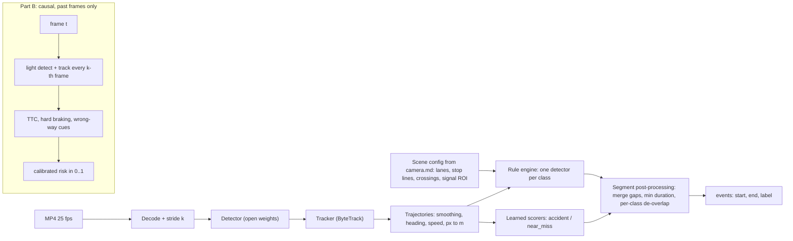

<!-- source: deep-research workflow wf_294a4b01-fc2, agent research:delivery -->

# Dimension: Public website, live demo, EDA and report (25% of the elimination score)

## 0. TL;DR

- **Why it matters.** Website = 25% of Elimination. The live demo alone is 0.25 × 30% = **7.5 points**. Sample-video visualisations are worth **5.0**, EDA **3.75**, approach and report **3.75**, team **2.5**, and design/UX/extras **2.5**. For comparison, all of Part B is 0.6 × 0.3 = 18 points. A robust demo is worth about 40% of a perfect Part B and is mostly engineering, not research.
- **2026 hosting changed.** Since about July 2026, Hugging Face (HF) requires a paid plan (PRO, $9/mo) to *create* Gradio or Docker Spaces on the free CPU Basic hardware. Free accounts can still host up to 2 **ZeroGPU** Gradio Spaces, but the account needs a verified email and must be more than 30 days old. Static Spaces stay free. Oracle's Always-Free ARM tier was also halved on 15 June 2026. Older blog posts about "free HF CPU Spaces" are out of date.
- **Recommended architecture.**
  - **Static site** on GitHub Pages. Every sample result is precomputed, so about 70% of the website rubric works with no backend at all.
  - **Demo backend:** a Gradio 6 app on an HF Space. The site calls it through a *version-pinned* `@gradio/client`, and the Space's own Gradio UI is the fallback link.
  - **Hardware:** best is HF PRO + "CPU Upgrade" (8 vCPU/32 GB, $0.03/h, never sleeps on paid hardware) during judging, about $9 + $0.72/day. The zero-budget option is a ZeroGPU Space with a CPU fallback path. The alternative is Modal ($30/month free credits, T4 at $0.000164/s, scale-to-zero).
  - **Failover:** run a second replica under another team member's account, and have the frontend fail over to it automatically.
- **Render overlays on the client** (canvas over `<video>`, synced with `requestVideoFrameCallback`) from JSON. Do not re-encode annotated video for the demo. When an MP4 is needed, encode H.264 with libx264 + `yuv420p` + `+faststart` using an ffmpeg binary. OpenCV's `mp4v` does not play in browsers.
- **Build one reusable "Player" component:** video + overlay + timeline (click to seek, GT vs prediction rows) + risk curve with metric-aware shading + event table. Use it on the Results, Demo and Dashboard pages.
- **EDA as "Finding → Decision" cards.** Every chart states which parameter or rule it set. That is what the rubric means by "findings that shaped solution".

---

## 1. Score maths and priorities

| Website rubric item | Weight in website | Elimination points | Main risk | Priority |
|---|---|---|---|---|
| Live demo (upload works, visualisation, no crash) | 30% | 7.5 | Backend asleep/down, crash on odd file, timeout | P0 |
| Sample-video visualisations (every sample; readable, correct timelines + risk curves) | 20% | 5.0 | Missing samples; site data inconsistent with `predictions_samples.json` | P0 |
| EDA (beyond frame counts; findings that shaped solution) | 15% | 3.75 | Generic charts without decisions | P1 |
| Approach & report (rebuildable; failures stated plainly) | 15% | 3.75 | Vague; no parameters; hiding failures | P1 |
| Team & portfolio | 10% | 2.5 | Forgotten until the last hour | P0 (cheap: about 1.5 h) |
| Design, UX, extras (clean, fast, phone, extra-credit items) | 10% | 2.5 | Broken mobile layout, slow pages | P1/P2 |

The team page gives the best return for the time (2.5 points for about 1.5 h). The demo gives the most points in absolute terms.

---

## 2. Hosting architecture (state as of September 2026)

### 2.1 Options

| Option | What you get (verified) | Fit for this project |
|---|---|---|
| **HF Space, CPU Basic** | 2 vCPU, 16 GB RAM, 50 GB ephemeral disk, free per hour. **Sleeps after 48 h** without traffic; a visit wakes it. Custom sleep time only on paid hardware. **Since July 2026, creating Gradio/Docker Spaces needs PRO ($9/mo)**. | Good once you pay for PRO |
| **HF Space, CPU Upgrade** | 8 vCPU, 32 GB, **$0.03/h**. Upgraded hardware never sleeps by default. | **Best value during judging**: 14 days ≈ $10 |
| **HF Space, T4 small** | 4 vCPU, 15 GB, 16 GB VRAM, $0.40/h (≈ $9.6/day) | Too expensive to keep on for weeks |
| **HF ZeroGPU (free tier)** | Free accounts can host up to 2 ZeroGPU Spaces (verified email, account > 30 days). Gradio SDK only. GPU is half an RTX Pro 6000 Blackwell (48 GB). Default 60 s per `@spaces.GPU` call, configurable. **Quota is charged to the visitor**: unauthenticated 2 min/day, free account 5 min/day, PRO 40 min/day. PyTorch 2.8+ only. | Workable at zero budget. You must catch quota errors and fall back to CPU inside the same Space. Downgrading to CPU Basic needs PRO (forum report). |
| **HF Static Space** | Free for everyone | Alternative host for the static site |
| **Modal (Starter)** | $30/month free compute (third-party sources say no card is needed). T4 at $0.000164/s. Scale-to-zero. Request bodies up to 4 GiB. **150 s HTTP timeout**, then a 303 redirect (up to 20 times). Recommended pattern: spawn + poll. | Strong free GPU backend. About $0.01 per 60 s demo job; $30 ≈ 51 T4-hours. More code than Gradio (you build your own job/progress API). |
| **GitHub Pages** | Site up to 1 GB, 100 GB/month soft bandwidth, 10 builds/h soft. Git blocks files > 100 MiB (warns at 50 MiB). | **Static site host (recommended)** |
| **Cloudflare Pages + R2** | Pages: 25 MiB max per file, 20,000 files (free). R2: 10 GB-month free, **free egress**. | Good if media grows past about 600 MB or single files exceed 90 MB |
| **Vercel Hobby** | Functions capped at **4.5 MB request/response body** and 300 s maximum duration. | Static frontend only; uploads cannot go through its functions |
| **Netlify Free** | Accounts created after 4 Sep 2025 get 300 credits/month (≈ 15 GB bandwidth), then a hard pause. | Fine for static; the pause risk is not worth it for video |
| **Render Free** | Spins down after 15 min idle, about 1 min to spin up, 750 h/month, very small instance | Not suitable for CV inference |
| **Google Cloud Run** | Free tier 180k vCPU-s, 360k GiB-s, 2M requests/month. 32 MiB HTTP/1 request limit. Needs a billing account. | Possible, but the upload limit and cold starts need workarounds |
| **Oracle Always Free** | A1 ARM **halved to 2 OCPU / 12 GB from 15 June 2026**. Idle instances can be reclaimed. Capacity is hard to get. | Too much ops risk for a hackathon |
| **Streamlit Community Cloud** | About 2.7 GB RAM, sleeps after 12 h without traffic | Weaker than HF; skip |

### 2.2 Recommended topology

```
[GitHub Pages: static site]  ── all sample results, EDA, report, team (no backend dependency)
      │  (Demo page only)
      ├── @gradio/client@<pinned> ──► HF Space A (Gradio 6, primary)   ── api_name="/analyze", "/ping"
      ├── on failure/timeout ───────► HF Space B (replica under 2nd member's account)
      └── on both failing ──────────► "Try a sample" (instant, precomputed) + link to Space UI
Media (sample videos, clips) ─► same Pages repo if total < ~600 MB and every file < 90 MB, else HF dataset repo or R2
```

**Hardware decision rule for Space A:**

1. If anyone on the team can pay about $9 plus usage: buy **PRO**. Develop on CPU Basic. Switch to **CPU Upgrade** from the submission deadline until judging ends. It never sleeps, has 8 vCPU, and costs ≈ $0.72/day. PRO also gives "protected" visibility (the app is public but the source is private) while you develop.
2. If the budget is zero: a **ZeroGPU** Space on the oldest member account (> 30 days). Keep the model on `cuda` at module level (ZeroGPU requirement) and wrap only inference in `@spaces.GPU(duration=90)`. Decode outside the GPU function so only model time counts against the visitor's 2-minute quota: about 5–10 s of GPU per 2-minute clip (estimate), so a judge can run it many times. On a quota/GPU error, retry the same pipeline on CPU in-process (verify on day 1 that the ZeroGPU host CPU is usable).
3. If neither works, or as the GPU fallback: **Modal** FastAPI endpoint, `POST /jobs` → `spawn`, `GET /jobs/{id}` → progress/result (fits the 150 s HTTP limit).

**Replica:** push the same Space repo to a second account (each free account can host 2 ZeroGPU Spaces). The frontend tries A with a 20 s connect timeout, then B.

### 2.3 Keeping it online during judging

- **Freeze:** tag `site-v1` and `space-v1` 48 h before the deadline. After that, change nothing that is not a hotfix. Pin every version: `gradio==6.x.y` (6.27.0 is the latest, released 11 Sep 2026), `@gradio/client@x.y.z` and `echarts@x.y.z` on the CDN. **Never load "latest" from a CDN.**
- **Wake-up:** when the Demo page loads, call `Client.connect(space, {status_callback})`. `status_callback` reports `sleeping | building | running | error | stopped`. Show a status pill ("Backend waking up, about 1–2 min").
- **Keep-alive** (CPU Basic/ZeroGPU sleep after 48 h): a GitHub Actions cron every **6 h** that calls a cheap `/ping` endpoint.
  - **Do not ping every 2 min.** A Space pinged every 2 minutes was paused and flagged as abusive in May 2026.
  - Paid CPU Upgrade needs no keep-alive.
- **Monitoring:** UptimeRobot free (50 monitors, 5-min minimum interval). Point it at the static site. Monitor the Space at a 30–60 min interval, with email alerts to all three members.
- **Weights inside the image:** bake them into the Space repo (Xet/LFS) or download at *build* time, never on first request.
- **Warm start:** load the model and run one dummy inference at import time, so the first judge does not pay about 10 s of JIT/ORT initialisation.

---

## 3. Live demo (7.5 points): design and hardening

### 3.1 UX flow

1. Upload box: "MP4/MOV/AVI/MKV, ≤ 200 MB, ≤ 3 min (longer clips: first 3 min analysed)". Add **"Try sample #1/#2"** buttons. They load precomputed results instantly and are always available.
2. Client-side pre-check: `file.size`, and `duration` read from a hidden `<video>` on `loadedmetadata` (if the browser cannot decode the file, skip the check and let the server decide).
3. Progress: an indeterminate "Uploading N MB…" (fetch has no upload progress), then stage + percent from Gradio `progress_data`: `Decoding → Detecting (412/1000 frames) → Tracking → Rules → Risk (Part B) → Packaging`, with queue position and ETA from status events.
4. Results: the same Player component as the Results page (see §4), playing the **user's local file** via `URL.createObjectURL(file)`. Overlays come from the returned JSON, so there is no second download or re-encode.
5. Downloads: `events.json` in the exact competition format, `tracks.json`, a risk CSV, and optionally "Render annotated MP4" on demand.
6. Footer: processing time and hardware, e.g. "120 s clip processed in 71 s on 2 vCPU; config: YOLO26n@640, stride 3". Also: "your upload is deleted after processing".

### 3.2 Validation and graceful errors (server-side, before any heavy work)

| Check | Rule | Behaviour |
|---|---|---|
| Size | `launch(max_file_size="200mb")` + frontend check | Friendly message |
| Container/stream | `ffprobe` (timeout 20 s): at least one video stream, codec decodable | "Not a readable video" + "Try a sample" button |
| Duration | > 180 s | **Trim** to the first 180 s (`ffmpeg -t 180 -c copy`) and warn; do not reject |
| Resolution | > 1920 px wide, or portrait | Downscale inside the decode pipe (`-vf scale=1280:-2`) |
| VFR/odd fps | Use PTS timestamps, never frame index × fps | Correct `t_sec` |
| Camera mismatch | Compare the upload's median background (160×90 grey) with the reference background: NCC or ORB-homography inliers | Below threshold → **generic mode** (see §3.5) with a banner |
| Hard timeout | 8 min wall clock per job | Abort, return partial results + message |
| Any exception | `try/except` → `raise gr.Error("…")` | Never a raw traceback; log the stack server-side |
| Cleanup | `finally: os.remove(...)` | Privacy + disk |

Use **`gr.File(file_types=[".mp4",".mov",".avi",".mkv"])`** as input, not `gr.Video`. The Video component tries to convert non-browser-playable files to MP4, which burns CPU before your code even runs. Use `demo.queue(max_size=8, default_concurrency_limit=1)` (the default concurrency is 1; `max_size` stops endless queues). Expose `api_name="analyze"` and `api_name="ping"`.

### 3.3 CPU inference configuration and latency (for a 2-minute, 25 fps clip = 3000 frames)

Anchor figures from Ultralytics docs, measured at 640 px on "Intel Xeon CPU @ 2.00 GHz" with ONNX (core count not stated):

- YOLO26n: 38.9 ms/frame, mAP 40.9
- YOLO26s: 87.2 ms
- YOLO11n: 56.1 ms

YOLO26 (January 2026) is NMS-free and aimed at CPU. The licence is AGPL-3.0, which is fine for a public Space because the source is public. The other research agents cover the Apache-2.0 alternatives.

Estimated totals (my assumptions: 4–8 ms per frame for 1080p software decode, detector time scaled for the hardware; **measure on day 1**):

| Config | Inferences | Estimated total |
|---|---|---|
| 2 vCPU, YOLO26n@640, stride 3 | 1000 | ~60–125 s |
| 2 vCPU, YOLO26n@480, stride 3 | 1000 | ~40–85 s |
| 2 vCPU, YOLO26n@640, stride 5 | 600 | ~45–90 s |
| 8 vCPU (CPU Upgrade), YOLO26n@640, stride 3 | 1000 | ~30–65 s |
| 8 vCPU, YOLO26s@640, stride 3 | 1000 | ~50–105 s |
| ZeroGPU / T4 (GPU), YOLO26s@960, stride 2 | 1500 | ~25–50 s (decode-bound) |

Practical settings:

- Export to ONNX (`format=onnx, imgsz=640, simplify=True`) **and** OpenVINO (`format=openvino`), then benchmark both on the Space. OpenVINO usually wins on Intel CPUs and ONNX Runtime on AMD. Log `lscpu` in the Space startup logs to see which CPU you actually have.
- Set `intra_op_num_threads = CPU_CORES` (HF sets `CPU_CORES`). Decode in a producer thread with a bounded queue.
- Decode with an ffmpeg subprocess (`-vf scale=1280:-2 -f rawvideo -pix_fmt bgr24 -`), which is faster than OpenCV for downscaling. Keep only every k-th frame.
- **Run the real `solution.py` pipeline** with a `DEMO_FAST=1` flag (smaller model, bigger stride), and state the difference on the page. Credibility matters: judges will compare the demo to the reported approach.
- Also run the RiskEstimator over every frame in the demo, feeding frames in order (causal), so the risk curve appears there too.

### 3.4 Returning results: JSON plus client-side overlay (not re-encoded video)

Response payload:

```json
{"meta":{"w":1920,"h":1080,"fps":25,"duration":120.0,"camera_match":0.83,"mode":"scene","timing_s":71.2,"config":"yolo26n@640/s3"},
 "events":[[12.4,18.9,"accident"],[40.0,43.5,"red_light"]],
 "events_ext":[{"s":12.4,"e":18.9,"label":"accident","conf":0.71,"tracks":[17,23]}],
 "risk":{"hz":5,"v":[0.01,0.01,0.02]},
 "tracks":{"t":[0.0,0.12],"b":[[[17,2,812,433,96,54]],[[17,2,818,436,96,54]]]},
 "zones":{"stop_lines":[[[x,y],[x,y]]],"crossings":[[[x,y]]]},
 "warnings":["Video trimmed to 180 s"]}
```

Size: 5 min at stride 2 with about 15 objects per frame ≈ 1.5 MB raw, about 0.4 MB gzipped (estimate). Use integers and short keys.

**Overlay sync** (Baseline since Oct 2024; `metadata.mediaTime` is the presented frame's timestamp):

```js
const cvs = overlay, ctx = cvs.getContext('2d');
function draw(_, meta) {
  const t = meta ? meta.mediaTime : video.currentTime;
  const i = bisect(tracks.t, t);                 // nearest sampled frame <= t
  resizeCanvasToVideo(cvs, video);              // clientWidth*devicePixelRatio, handle object-fit letterbox
  ctx.clearRect(0,0,cvs.width,cvs.height);
  drawZones(ctx, zones); drawBoxes(ctx, tracks.b[i], scaleX, scaleY); drawTrails(ctx, i);
  drawActiveEventBanner(ctx, events.filter(e => e[0] <= t && t < e[1]));
  (video.requestVideoFrameCallback ? video.requestVideoFrameCallback(draw) : requestAnimationFrame(() => draw()));
}
video.requestVideoFrameCallback ? video.requestVideoFrameCallback(draw) : requestAnimationFrame(() => draw());
```

Keep the canvas *on top of* the `<video>`. Never draw the video into the canvas: that avoids cross-origin canvas tainting when media is served from another domain.

**When you do need an MP4** (published sample videos, per-class clips, an optional "download annotated video" button): OpenCV pip wheels write `mp4v`, which browsers will not play. Pipe frames into an ffmpeg binary (apt `ffmpeg` in the Space, or the `imageio-ffmpeg` wheel, which bundles ffmpeg and defaults to libx264 for .mp4):

```
ffmpeg -y -f rawvideo -pix_fmt bgr24 -s 1280x720 -r 25 -i - \
  -c:v libx264 -preset veryfast -crf 26 -pix_fmt yuv420p -profile:v high -movflags +faststart -an out.mp4
```

If the uploaded file will not play in the visitor's browser (the `<video>` fires `error`, or it is HEVC in Firefox), the server returns an H.264 480p preview made the same way (`-vf scale=-2:480`).

### 3.5 Generic mode (camera-mismatch safety net)

Judges may upload a clip from the test camera (the likely case) or any traffic clip. Rules that depend on hard-coded lanes, stop lines or crossings would then produce nonsense or crash.

- If the camera-match score is below a threshold tuned on the samples (e.g. NCC < 0.5), turn off the scene-dependent classes: red_light, stop_line, wrong_way, illegal turns, solid_line_crossing, jaywalking/failure_to_yield.
- Keep the scene-agnostic ones: accident/near_miss (TTC, interactions), stopped_vehicle (without queue zones), congestion (global speed), road_obstacle (background change), fire_smoke.
- Show a banner saying so.

This turns a likely failure into visible good engineering judgement.

### 3.6 Pre-judging test matrix (all must return results or a friendly message, never a crash)

1 s clip · 0-event clip · exactly 120 s · 5 min (trim path) · 4K · portrait phone video · HEVC · VFR phone video · 30/60 fps · night clip · corrupted/truncated MP4 · `.txt` renamed to `.mp4` · two concurrent uploads (queue) · upload while the Space is asleep (wake path) · mobile Safari + Android Chrome · the two replicas.

### 3.7 Backend skeleton (Gradio 6)

```python
import gradio as gr, json, os, subprocess, time
from src.pipeline import analyze_video   # same code path as solution.detect_events + RiskEstimator
def probe(p):
    r = subprocess.run(["ffprobe","-v","error","-show_entries","format=duration:stream=codec_type,codec_name,width,height,avg_frame_rate","-of","json",p],
                       capture_output=True, text=True, timeout=20)
    info = json.loads(r.stdout or "{}")
    if not any(s.get("codec_type")=="video" for s in info.get("streams",[])): raise gr.Error("This file has no readable video stream.")
    return info
def run(file, progress=gr.Progress()):
    t0 = time.time(); path = file if isinstance(file, str) else file.name
    try:
        info = probe(path)
        return analyze_video(path, info, fast=True, max_sec=180, deadline_s=480,
                             on_progress=lambda f, msg: progress(f, desc=msg))
    except gr.Error: raise
    except Exception:
        import traceback; traceback.print_exc()
        raise gr.Error("Processing failed on this file. Try another clip or one of our samples.")
    finally:
        try: os.remove(path)
        except OSError: pass
with gr.Blocks(title="Traffic events demo") as demo:
    f = gr.File(file_types=[".mp4",".mov",".avi",".mkv"]); out = gr.JSON()
    gr.Button("Analyze").click(run, f, out, api_name="analyze")
    gr.Button(visible=False).click(lambda: "ok", None, gr.Textbox(visible=False), api_name="ping")
demo.queue(max_size=8, default_concurrency_limit=1).launch(max_file_size="200mb", show_error=True)
```

Frontend call (pin the client version):

```js
import { Client, handle_file } from "https://cdn.jsdelivr.net/npm/@gradio/client@<PINNED>/dist/index.min.js";
const app = await Client.connect(SPACE_A, { events: ["status","data"], status_callback: s => pill(s.status) });
const job = app.submit("/analyze", [handle_file(file)]);
for await (const m of job) {
  if (m.type === "status") showProgress(m.stage, m.position, m.eta, m.progress_data); // progress_data: {index,length,unit,desc,progress}
  if (m.type === "data") renderPlayer(URL.createObjectURL(file), m.data[0]);
}
```

---

## 4. Sample-video visualisations (5 points): the Results page

**One page per sample, generated automatically**, so "every sample annotated" is guaranteed. One build script, `tools/build_site_data.py`, reads:

- `predictions_samples.json` (the exact file in the repo),
- your dev labels `dev_gt.json`,
- `evaluate.py` outputs,
- the tracks/zones dumps.

It writes `site/data/<video_id>/{meta,events_pred,events_gt,risk,tracks,metrics}.json`. Print the commit hash and the sha256 of `predictions_samples.json` in the page footer. The Code rubric checks that sample results match `predictions_samples.json`; the site then shows exactly the same numbers.

The Player component has:

1. **Video + canvas overlay**, with toggles for: boxes by class, track trails (last 2 s), zone polygons (lanes coloured by direction, stop lines, crossings), and active-event banners.
2. **Event timeline** (ECharts `custom` series or vis-timeline):
   - One row per class present, with twin sub-rows: **GT (outline)** and **Pred (filled)**.
   - Matched pairs get a green edge, false positives red dashed, false negatives grey.
   - Hover shows start, end, duration and IoU with the matched GT.
   - **Click seeks the video to `start − 1 s` and plays** (an explicit extra-credit item). A playhead line follows `currentTime`, throttled to about 4 Hz.
3. **Risk curve**, drawn so that someone who knows the metric sees it is correct:
   - y ∈ [0,1], with a dashed θ = 0.5 line.
   - Shaded **alarm runs** (score ≥ 0.5, merged when the gap is < 2 s).
   - Red vertical lines at dev-GT accident starts `s`.
   - Light-red band `[s−5, s)` (AP positives) and lighter band `[s−10, s)` (alarm window W).
   - Grey hatch on ignored frames (inside accidents, and `[s−5, e]` around near misses).
   - Per-video Part B stats: AP, alarms, time-to-accident (TTA).
4. **Event table** with class, start, end, duration, confidence and track ids; clicking a row seeks the video.
5. **Keyboard:** Space plays/pauses; J/L jump to the previous/next event; ←/→ step ±1 s.

**Per-class gallery.** For each of the 14 classes, 1–3 clips from `start−2 s` to `end+2 s` (≤ 8 s each), 640 px wide, H.264 CRF 30, `muted loop playsinline preload="none"` with a WebP poster. For classes absent from the samples, write "not observed in samples" plainly. Do not fake examples.

**Failure cases section** (at least 4, each with a clip, what went wrong, why, and the planned fix). Typical ones: an ID switch under occlusion creating a false wrong_way; a queued vehicle flagged as stopped_vehicle; late accident start because of smoothing (hurts IoU 0.7); night glare causing missed pedestrians.

**Media budget** (estimate for static CCTV at 720p H.264 CRF 26–28 ≈ 0.5–1.5 Mbps, i.e. about 4–11 MB/min). Five 5-minute samples come to about 100–280 MB, which is fine on GitHub Pages. Switch to an HF dataset repo or R2 if the total goes above about 600 MB or any file above 90 MB (GitHub blocks files over 100 MiB). Transcode samples once to H.264 even if the originals are HEVC.

---

## 5. EDA plan (3.75 points): "Finding → Decision" cards

Each card has a chart, one sentence of finding, one sentence of **decision** (a parameter or rule it set), and a link to the script. Render heavy maps in Python (matplotlib → WebP over the median background plate) and the key interactive ones in ECharts.

| # | Analysis | How | Decision it drives |
|---|---|---|---|
| 1 | Container audit | ffprobe: resolution, avg vs r fps, duration, codec, bitrate, GOP, PTS gaps (VFR/dropped frames), OpenCV frame-count mismatch | Use PTS-based `t_sec`; seeking/stride strategy; runtime budget |
| 2 | Camera stability | Phase-correlation shift of frames vs frame 0 over time (expect < 1 px) | Confirms static polygons from camera.md are safe |
| 3 | Clean background plate | Temporal median of about 200 frames | Canvas for every map; baseline for road_obstacle (new static blobs) and camera-match check |
| 4 | Lighting | Mean luma per second, histogram, day/dusk/night label, glare | Confidence thresholds per lighting; augmentation choice |
| 5 | Object counts over time by class | Stacked area, 1 s bins | Density ranges; congestion candidates |
| 6 | Size vs image row (perspective) | Box height vs y; share of objects < 20 px | imgsz (640 vs 960) or ROI crop; px→m scale from lane width |
| 7 | Detector confidence | Histograms per class, split near/far | Per-class confidence thresholds |
| 8 | Motion heatmap | MOG2 foreground accumulation, or track-point density | Carriageway mask; check against camera.md |
| 9 | **Direction field** | Circular-mean heading per 32 px cell, HSV-coloured quiver; direction entropy per cell | wrong_way rule: heading more than 120° off the cell's dominant direction for ≥ 1.5 s; high-entropy cells = turn zones excluded |
| 10 | Trajectories + origin–destination (OD) matrix | Tracks coloured by heading; entry/exit zone clustering | Allowed-movement set → illegal_turn / illegal_u_turn = rare or forbidden OD pairs |
| 11 | Speed per lane over time | px/s → approx m/s | Thresholds for "stopped" and "crawling" (congestion) |
| 12 | Dwell-time map | Where objects stay still ≥ 3 s / ≥ 10 s | Queue zones at signals vs elsewhere → stopped_vehicle excludes queue zones |
| 13 | Pedestrian hotspots | Foot-point heatmap with crossing polygons overlaid | jaywalking zones; failure_to_yield crossing geometry |
| 14 | Signal phase (if the light is visible) | HSV state of a light ROI over time, cycle-length histogram; else infer phase from stop-line flow | red_light / stop_line logic |
| 15 | Frame-stride ablation | Track fragmentation/ID switches + runtime vs stride 1/2/3/5 | Choose stride (and the demo stride) |
| 16 | Interaction statistics | Distribution of min TTC between track pairs, TTC < 1.5 s events per minute | Part B threshold calibration; false-alarm budget |
| 17 | Dev-label statistics + inter-annotator agreement | Class counts and duration distributions; two members label the same video and you compute IoU | min-duration/merge-gap post-processing; realistic ceiling at τ = 0.7 |

Items 9, 12, 16 and 17 give the strongest "shaped the solution" story.

---

## 6. Extra-credit items (cheap wins, all named in the spec)

1. **Ablation table (about 3 h once the dev set exists).** Columns: config · Score A · F1@0.3/0.5/0.7 · Score B · runtime (× real-time on T4) · note. Rows: detector n/s/m; imgsz 640/960; stride 1/2/3/5; tracker ByteTrack / BoT-SORT; post-processing on/off. Add a **boundary-shift sensitivity** row (shift predicted boundaries ±0.5/1/2 s and report F1@0.7). All numbers come from `evaluate.py --gt dev_gt.json`.
2. **Error analysis (about 3 h).**
   - Per-class TP/FP/FN at each τ.
   - Histogram of start and end offsets for matched pairs.
   - Temporal "confusion": for each GT segment, the class of the predicted segment with the most overlap.
   - A clickable list of false negatives that jumps to the timestamp.
3. **Operator dashboard (about 4 h).** KPIs (events per hour by class, normalised by duration), events by lane/zone, event locations over the background plate, an alarm feed with thumbnails. Plus a **"live replay" mode**: play a sample with a risk gauge and alarm pop-ups driven by the precomputed Part B curve. That curve is causal by construction, so the replay is honest. Part A events appear at `end_sec` in replay.
4. **Webcam/live demo (about 3–5 h, P2).** Either a Gradio webcam stream (`streaming=True`) in a *separate* Space or queue so it cannot starve uploads, or onnxruntime-web (WebGPU with WASM fallback) in the browser. Label it "detection + tracking preview; event rules need the competition scene layout".
5. **Interactive charts** come for free with ECharts. Click-to-seek is covered by the Player.
6. **Optional:** an interactive zone editor (draw polygons on the first frame so generic mode can enable lane rules). High "wow", about 6 h.

---

## 7. Approach and report pages (3.75 points)

**Approach page** (a reader must be able to rebuild the pipeline):

- A Mermaid diagram.
- A models/datasets table with licences.
- "Learned vs rule-based" for each class.
- One **rule card per class**: inputs, the logic in 3–5 lines, thresholds with the EDA card that set them, how start and end are defined to match the annotator conventions, and known failure modes.
- A parameters table (detector, imgsz, conf, stride, tracker params, merge gap, min duration, TTC thresholds, calibration).
- Exact commands.



Mermaid is MIT-licensed and renders client-side. GitHub also renders it in the README, so the same diagram can serve both. The diagram must show Part B as independent of Part A, since the rules forbid reusing future-frame Part A output.

**Report page (one page):**

1. TL;DR: 3 bullets with dev-set numbers (Score A, Score B, runtime × real-time).
2. Pipeline (link to the diagram).
3. What worked, each with a metric delta from the ablations.
4. What did not work, **with numbers** (e.g. "VLM-based accident verification: +0.02 F1, 4× runtime, dropped").
5. Known failure modes (link to the failure clips).
6. Runtime and budget: T4 time per video vs the 3× limit, and the margin.
7. What next.
8. Reproducibility: seeds, determinism check (two runs, diff), commit/tag, how weights are obtained.

The rubric rewards "failures stated plainly", so do not hide them.

---

## 8. Team page (2.5 points, about 1.5 h, do it early)

- A card per member: name, photo (optional), role, 2-line bio, GitHub, LinkedIn, portfolio, and 2–3 previous projects with links.
- A **"who did what" matrix**: rows = components (detector/training, tracking and rules, Part B, dev labels, EDA, website/demo, report), columns = members, cells = lead / support. This matches both the README requirement and the rubric.
- A contact line and hackathon handle.

---

## 9. Privacy and content rights

- The rule: "no personal data of people visible in footage beyond what the video itself shows". Showing the organisers' frames as they are is within that rule. Adding identity-level data is not. Therefore:
  - no licence-plate OCR,
  - no face recognition or re-identification,
  - no enlarged face/plate crops in galleries (blur any crop zoomed ≥ 2×),
  - track IDs are ephemeral and never linked to a person or vehicle.
- Optional goodwill step: blur the top 20% of each `person` box in *published* clips (cheap, no face model needed). Uzbekistan's personal-data law (ZRU-547, 2019) treats facial images as biometric data that needs consent, which is another reason not to add identifying detail.
- Demo uploads: processed in a temp directory, deleted in `finally`, never logged or shown to other visitors. State this on the Demo page.
- **Ask in the hackathon channel** whether full sample videos may be published on a public site. The rubric implies yes ("annotated versions of every sample video"), but the rights rule says "only content you have rights to".
- Competitive timing (a consideration, not a rule): the site and Space are public. Consider publishing dev labels and the full approach close to the deadline, and use PRO "protected" Space visibility during development.

---

## 10. Design, mobile and performance checklist

- Nav labels mirror the spec's required sections so judges can tick them off: **Team · Approach · EDA · Results · Demo · Report · Links**.
- Home: a 15–20 s looping annotated clip (muted, `playsinline`, poster), 3 key numbers, and a "Try the demo" call to action.
- Lighthouse (mobile) Performance ≥ 90 on Home. LCP < 2.5 s. Home < 1.5 MB excluding video. Lazy-load charts with IntersectionObserver. Videos use `preload="none"` or `"metadata"` with posters.
- H.264 High/Main, `yuv420p`, `+faststart`, ≤ 720p. JSON kept compact (GitHub Pages serves text compressed).
- The canvas overlay scales with `devicePixelRatio` and handles the `object-fit: contain` letterbox. Charts call `resize()` on container resize. The timeline supports touch pan and zoom.
- Class colours by family, plus text labels, so meaning never depends on colour alone:
  - collisions (accident, near_miss): reds/oranges
  - signal and line violations: purples
  - manoeuvre violations: blues
  - pedestrian classes: greens
  - flow and hazards (stopped_vehicle, congestion, road_obstacle, fire_smoke): browns/greys
- Light and dark themes; tap targets ≥ 44 px; no console errors.
- Also: a 404 page, favicon, and OpenGraph image (link previews in the hackathon chat).
- Test on iOS Safari (autoplay needs `muted` + `playsinline`), Android Chrome, desktop Firefox and Chrome.

---

## 11. Site map and tech stack

**Site map:**

- `/` Home
- `/results/` index with per-sample thumbnails and metrics, then `/results/<video_id>/` (the Player)
- `/gallery/` (per-class examples + failure cases)
- `/eda/`
- `/approach/` (diagram, rule cards, params)
- `/ablations/` and `/errors/`
- `/dashboard/` (operator view + live replay)
- `/demo/`
- `/report/`
- `/team/`
- `/links/`: repo at the submission tag, weights, `predictions_samples.json` raw link, README, dev labels (at deadline), Space link

**Stack:**

- **Astro** (static output, Markdown/MDX for approach and report, one TypeScript "Player" island), deployed with the official GitHub Pages Action.
- **Apache ECharts** (Apache-2.0) for all charts: timeline via the custom series, risk curve, heatmaps, bars. One library keeps the look consistent. vis-timeline (Apache-2.0/MIT) is an alternative for the timeline.
- **Mermaid** (MIT) for the diagram.
- **@gradio/client**, pinned, for the demo.
- Python scripts in `tools/` generate all data and images.

If no one on the team has web experience, **Quarto** is a lower-effort alternative: Python notebooks render straight into EDA and report pages, with Mermaid and Observable JS built in. Embed the Player as a raw HTML/JS include.

---

## 12. Build plan (about 50–60 person-hours in total for this dimension)

| Phase | Task | Effort | Priority |
|---|---|---|---|
| Day 1 | Site skeleton + nav + deploy to Pages; Space "hello" with `/ping`; decide hardware (PRO / ZeroGPU / Modal); UptimeRobot; check account ages and payment | 4 h | P0 (finds hosting blockers early) |
| Day 1 | Team page | 1.5 h | P0 |
| Week 1 | `tools/build_site_data.py` + transcodes + posters | 5 h | P0 |
| Week 1 | Player (overlay, timeline with click-to-seek, risk curve with metric shading, table, shortcuts) | 10 h | P0 |
| Week 1–2 | Demo backend (validation, progress, queue, timeouts, generic mode, cleanup) + frontend (upload, progress, reuse Player, replica failover) | 10 h | P0 |
| Week 2 | EDA scripts and cards (items 1–17; start with 1, 3, 5, 8, 9, 12, 16) | 10 h | P1 |
| Week 2 | Approach page (diagram, rule cards, params) + Report | 5 h | P1 |
| After dev labels | Ablations + error analysis pages | 6 h | P1 |
| After dev labels | Gallery + failure cases | 3 h | P1 |
| Stretch | Dashboard + live replay | 4 h | P2 |
| Stretch | Webcam preview | 4 h | P2 |
| T−72 h | Test matrix (§3.6), Lighthouse, mobile pass, content proofreading | 4 h | P0 |
| T−48 h | Freeze tags; switch the Space to CPU Upgrade (or confirm ZeroGPU quota behaviour); 6-hour keep-alive cron on; all members get alert emails | 1 h | P0 |

Suggested ownership: one member owns the website and demo at about 50% of their time. A second member owns EDA and dev labels, which feed the error analysis. The third owns the pipeline and runtime numbers used in the report.

---

## 13. Cross-cutting implications for the other workstreams

- The pipeline should support `detect_events(path, fast=True, on_progress=cb)` and dump tracks, zones and per-event track ids. The site and demo depend on these hooks. Add them from the start, since they cost nothing later.
- Dev labels (strongly encouraged by the organisers) feed four website items: GT-vs-prediction timelines, risk-curve bands, ablations and error analysis. Label early. Two members labelling one shared video also gives the inter-annotator IoU for the EDA.
- Keep Part B's RiskEstimator free of Part A outputs. The website's Part B visualisation and the live replay both rely on it being causal.
- Runtime measurements for the report (× real-time on T4, margin vs the 3× budget) also serve the Code rubric's "engineering judgement" item. Measure them once and reuse them.


## Top recommendations
- Use a static site on GitHub Pages with every sample result precomputed, plus a Gradio 6 demo backend on a Hugging Face Space called through a version-pinned @gradio/client. The Space's own UI is the fallback link and a replica Space under a second account handles failover.
- Backend hardware: if $9 can be spent, buy HF PRO and run the Space on CPU Upgrade (8 vCPU/32 GB, $0.03/h, never sleeps) during judging. Otherwise use a free ZeroGPU Space with an in-process CPU fallback, or Modal ($30/month credits, spawn + poll). Settle this on day 1: HF paywalled new Gradio/Docker CPU Spaces in July 2026.
- Harden the demo: gr.File input (not gr.Video), a 200 MB cap, ffprobe validation, trim clips longer than 180 s instead of rejecting them, queue(max_size=8, concurrency 1), an 8-minute hard timeout, friendly gr.Error messages, always-on 'Try a sample' buttons, and deletion of uploads. Run the 16-case test matrix before judging.
- Add a camera-mismatch check that switches to 'generic mode' (scene-agnostic classes only, with a banner) so a random traffic clip from a judge never produces nonsense or a crash.
- Render overlays client-side on a canvas synced with requestVideoFrameCallback, from compact JSON tracks (about 0.4 MB gzipped per 5 minutes). When an MP4 is needed, encode H.264 with ffmpeg/libx264, yuv420p and +faststart; never publish OpenCV mp4v files.
- Build one Player component (video + overlay, GT-vs-prediction timeline with click-to-seek, risk curve with θ line, alarm runs, [s−5,s) and [s−10,s) bands and ignored-frame hatching, event table, keyboard shortcuts). Reuse it on Results, Demo and Dashboard pages, and generate one page per sample automatically from predictions_samples.json via tools/build_site_data.py, stamping the commit hash and sha256 in the footer.
- Write the EDA as 'Finding → Decision' cards. Prioritise the direction field (wrong_way), dwell map (stopped_vehicle vs queues), TTC distribution (Part B calibration), stride ablation and inter-annotator IoU (boundary ceiling at τ=0.7).
- Deliver the spec's extra-credit items with real numbers from the dev labels: ablation table incl. a boundary-shift sensitivity row, error analysis (per-class F1 at each τ, boundary offset histograms, temporal confusion), operator dashboard with a causal live-replay risk gauge, and an optional webcam preview.
- Do the team page on day 1 (2.5 points for about 1.5 h), including a who-did-what matrix. Structure the report as TL;DR, pipeline, what worked, what did not (with numbers), failure modes, runtime vs budget, next steps and reproducibility, with the Mermaid diagram shared between the site and the README.
- Operations: pin all versions and freeze tags 48 h before the deadline. Keep-alive cron every 6 h, never every few minutes (a Space pinged every 2 min was flagged). UptimeRobot alerts to all members. Weights baked into the Space. No plate OCR, face crops or storage of uploads, and ask the organizers whether full sample videos may be published.


## Open questions
- What are the submission deadline and the length of the judging window? These decide the cost of keeping a paid CPU Upgrade Space running (about $0.72/day) and when to freeze.
- Are teams allowed to publish the organizers' full sample videos on a public website? The rubric implies yes, but the content-rights rule says 'only content you have rights to'. Ask in the hackathon channel.
- Will judges test the demo with a video from the competition camera or any traffic clip? This decides how much the generic-mode fallback matters.
- Can any team member pay for HF PRO ($9/month) with a card that works internationally, and is any member's HF account older than 30 days with a verified email (needed for free ZeroGPU hosting)?
- What are the codec, bitrate, resolution and length of the sample videos? These determine the transcoding needs, media hosting (Pages vs HF dataset/R2) and demo CPU latency.
- Does camera.md say the traffic signal is visible? This decides whether the EDA signal-phase card and the red_light/stop_line visualisations can use observed light state.
- Does the ZeroGPU host CPU give enough cores for an in-process CPU fallback when a visitor's GPU quota runs out? This must be measured on day 1.
- Should the full approach and dev labels be published before the deadline, given that other teams can see them? Or should the full content go live only near submission, using PRO 'protected' Space visibility during development?


## Key claims (as submitted for verification)
- Since about July 2026, creating Gradio or Docker Spaces on Hugging Face requires a paid plan (PRO for personal accounts); Static Spaces stay free; free personal accounts in good standing can host up to 2 ZeroGPU Gradio Spaces. — https://huggingface.co/docs/hub/spaces-overview ; https://discuss.huggingface.co/t/docker-sdk-now-marked-as-paid-when-creating-a-new-space/177580 ; https://discuss.huggingface.co/t/new-free-accounts-cannot-create-cpu-basic-gradio-spaces-only-zerogpu-available/177629
- HF PRO costs $9/month and includes hosting ZeroGPU, Gradio and Docker Spaces. — https://huggingface.co/pricing
- HF CPU Basic = 2 vCPU / 16 GB RAM / 50 GB ephemeral disk, free per hour; it sleeps after 48 h of inactivity and a visit wakes it; custom sleep time requires paid hardware; CPU Upgrade = 8 vCPU / 32 GB at $0.03/h; T4 small = $0.40/h; upgraded Spaces never sleep by default. — https://huggingface.co/docs/hub/spaces-gpus ; https://huggingface.co/docs/huggingface_hub/main/en/guides/manage-spaces
- ZeroGPU: Gradio SDK only; default size is half an NVIDIA RTX Pro 6000 Blackwell (48 GB); default 60 s per @spaces.GPU call (configurable); daily visitor quotas are 2 min (unauthenticated), 5 min (free), 40 min (PRO); hosting on a free account requires a verified email and an account older than 30 days; PyTorch 2.8+ supported. — https://huggingface.co/docs/hub/spaces-zerogpu
- A Space pinged every 2 minutes for keep-alive was paused and flagged as abusive (May 2026 forum report), so keep-alive pings should be infrequent. — https://discuss.huggingface.co/t/keepalive-ping-get-health-ready-every-2-minutes/176238
- Modal Starter includes $30/month free compute; a T4 costs $0.000164/s; web function request bodies can be up to 4 GiB; web requests have a 150 s timeout with a 303 redirect (up to 20 times), and the recommended pattern for long jobs is spawn + poll. — https://modal.com/pricing ; https://modal.com/docs/guide/webhooks ; https://modal.com/docs/guide/webhook-timeouts
- Vercel Functions have a 4.5 MB request/response body limit and a 300 s maximum duration on Hobby, so video uploads cannot go through Vercel functions. — https://vercel.com/docs/functions/limitations
- GitHub Pages: published site up to 1 GB, 100 GB/month soft bandwidth, 10 builds/hour soft limit; GitHub blocks files larger than 100 MiB and warns above 50 MiB. — https://docs.github.com/en/pages/getting-started-with-github-pages/github-pages-limits ; https://docs.github.com/en/repositories/working-with-files/managing-large-files/about-large-files-on-github
- Cloudflare Pages free plan: 25 MiB max per file, 20,000 files; R2 free tier: 10 GB-month storage with free egress. — https://developers.cloudflare.com/pages/platform/limits/ ; https://developers.cloudflare.com/r2/pricing/
- Render free web services spin down after 15 min without traffic and take about 1 minute to spin up; 750 free instance hours per month. — https://render.com/docs/free
- Oracle Always Free Ampere A1 allowance was halved from 4 OCPU/24 GB to 2 OCPU/12 GB, effective 15 June 2026. — https://www.infoq.com/news/2026/07/oracle-cloud-free-tier-limits/
- YOLO26 (January 2026) CPU ONNX latency at 640 px: n = 38.9 ms, s = 87.2 ms (Ultralytics, Intel Xeon @ 2.00 GHz); YOLO11n = 56.1 ms; Ultralytics models are AGPL-3.0 or Enterprise licensed. — https://docs.ultralytics.com/models/yolo26/ ; https://docs.ultralytics.com/models/yolo11/
- Gradio's latest release is 6.27.0 (11 Sep 2026); launch() has max_file_size; queue default_concurrency_limit defaults to 1 and max_size defaults to None; the Video component tries to convert non-browser-playable video to MP4. — https://pypi.org/project/gradio/ ; https://www.gradio.app/docs/gradio/blocks ; https://www.gradio.app/guides/setting-up-a-demo-for-maximum-performance ; https://www.gradio.app/docs/gradio/video
- The @gradio/client JS status_callback reports Space status (sleeping/running/building/error/stopped), and status events include progress_data {progress,index,length,unit,desc} from gr.Progress. — https://www.gradio.app/docs/js-client
- requestVideoFrameCallback has been Baseline since October 2024 and gives mediaTime (the presented frame's timestamp), suitable for syncing canvas overlays. — https://developer.mozilla.org/en-US/docs/Web/API/HTMLVideoElement/requestVideoFrameCallback
- MP4 files written by OpenCV with the mp4v codec do not play in browsers; H.264 (libx264, yuv420p, +faststart) is needed; imageio-ffmpeg wheels bundle an ffmpeg binary and default to libx264 for .mp4. — https://rockyshikoku.medium.com/use-h264-codec-with-cv2-videowriter-e00145ded181 ; https://imageio.readthedocs.io/en/stable/_autosummary/imageio.plugins.ffmpeg.html ; https://github.com/imageio/imageio-ffmpeg
- Streamlit Community Cloud apps sleep after 12 hours without traffic and get about 2.7 GB RAM. — https://docs.streamlit.io/deploy/streamlit-community-cloud/manage-your-app
- Netlify Free (accounts created after 4 Sep 2025) uses 300 credits/month, about 15 GB of bandwidth, with a hard pause when exhausted. — https://netli.fyi/blog/netlify-free-plan-limits-2026
- UptimeRobot's free plan offers 50 monitors at a 5-minute interval. — https://uptimerobot.com/pricing/
- Website rubric maps to elimination points as: live demo 7.5, sample visualisations 5.0, EDA 3.75, approach/report 3.75, team 2.5, design/extras 2.5; all of Part B is 18. — spec (0.25 x rubric weights; 0.6 x 0.3 for Part B)
